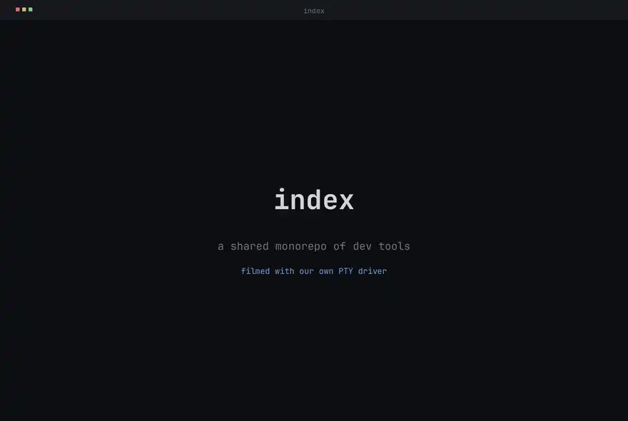

<p align="center">
  
</p>

<p align="center">
  <a href="https://antithesis.com/"></a>
  <!-- OpenSSF Scorecard badge hidden until the rolling Code-Review score
       and CII Best Practices badge catch up; surface it once both move. -->
  <!-- <a href="https://scorecard.dev/viewer/?uri=github.com/indexable-inc/index"></a> -->
</p>

<p align="center">
  <picture>
    <source media="(prefers-color-scheme: dark)"  srcset="docs/demo-dark.webp">
    <source media="(prefers-color-scheme: light)" srcset="docs/demo-light.webp">
    
  </picture>
</p>

<p align="center">
  <a href="https://ix.dev">ix.dev</a>
</p>

# Index

`index` is a shared, open-source monorepo of developer tools that anyone can
modify. The bet: one repo everyone can edit is the fastest way for all of us to
move. Add something useful, and everyone gets it.

A few things already here:

- **Semantic code search** ([`search`](packages/search/)) that
  finds code by meaning, not just exact strings.
- A [PTY driver](packages/tui/) that lets code **drive any interactive terminal
  program** (gdb, vim, REPLs) like a human typing into it.
- **Agent loops** and a Python [`mcp`](packages/mcp/) server that hands these
  primitives to an LLM, no install step.
- Ready-to-run [OCI images](images/) and reusable [NixOS modules](modules/), the
  layer [ix](https://ix.dev) publishes on top of its closed-source VM primitives.

To explore, you could point Claude at this repo and ask whether anything here is
useful for you.

The clip above is not a screen recording. It is generated by
[`reel`](packages/reel/), which drives a real shell through the repo's own
[PTY driver](packages/tui/), rasterizes the styled grid with a flat palette, and
encodes an animated WebP. Regenerate it any time:

```sh
nix run .#reel          # writes docs/demo-dark.webp and docs/demo-light.webp
```

## Quick Check

```sh
nix flake show          # list every package, module, and check
nix run .#lint          # nixfmt, statix, deadnix, ast-grep
nix build .#minecraft   # realize one image closure
```

## Layout

- [`packages/`](packages/) repo-owned tools (search, PTY driver, agent loops, MCP server, the `reel` demo recorder).
- [`images/`](images/) runnable NixOS systems packaged as OCI archives.
- [`modules/`](modules/) opt-in NixOS service modules, auto-discovered.
- [`lib/`](lib/) shared helper and builder API.
- [`examples/`](examples/) standalone consumer fleets.

## Feedback

Bug reports and enhancement requests go to [GitHub Issues](https://github.com/indexable-inc/index/issues). Security reports follow [SECURITY.md](SECURITY.md). Code changes land through pull requests against the `main` branch; see [CONTRIBUTING.md](CONTRIBUTING.md) for local setup, coding standards, and commit conventions.

## Contributor Notes

See [AGENTS.md](AGENTS.md) and [CONTRIBUTING.md](CONTRIBUTING.md) when you're ready to dig in.
