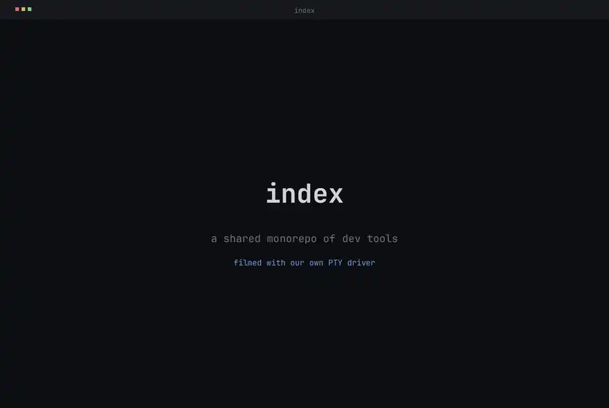

<p align="center">
  
</p>

<p align="center">
  <a href="https://antithesis.com/"></a>
  <!-- OpenSSF Scorecard badge hidden until the rolling Code-Review score
       and CII Best Practices badge catch up; surface it once both move. -->
  <!-- <a href="https://scorecard.dev/viewer/?uri=github.com/indexable-inc/index"></a> -->
</p>

<p align="center">
  <picture>
    <source media="(prefers-color-scheme: dark)"  srcset="doc/assets/demo-dark.avif"  type="image/avif">
    <source media="(prefers-color-scheme: light)" srcset="doc/assets/demo-light.avif" type="image/avif">
    <source media="(prefers-color-scheme: dark)"  srcset="doc/assets/demo-dark.webp">
    <source media="(prefers-color-scheme: light)" srcset="doc/assets/demo-light.webp">
    
  </picture>
</p>

<p align="center">
  <a href="https://ix.dev">ix.dev</a>
</p>

# Index

`index` is a shared, open-source monorepo of developer tools that anyone can
modify. The bet: one repo everyone can edit is the fastest way for all of us to
move. Add something useful, and everyone gets it.

It is one Nix flake holding ~45 packages (mostly Rust, with Python, Elixir,
TypeScript, and Svelte where they fit), a corpus of NixOS modules, fleet
examples, and the agent infrastructure that ties them together. Most packages have
a from-source page under [`doc/`](doc/index.md). To explore, point Claude at
this repo and ask whether anything here is useful for you.

## What's inside

### Agent infrastructure

The harness, governance, and tuning loop that runs coding agents (Claude Code and
Codex) across the fleet under one set of rules. The house system prompt is
[`system-prompt.nix`](packages/agent/system-prompt.nix), an ordered set of named,
reviewable bindings rather than a text blob, so behavior changes land as PR diffs.

| Package | What it does |
| --- | --- |
| [`claude-code`](packages/agent/claude-code/) / [`codex`](packages/agent/codex/) | Agent CLIs wrapped with the shared house prompt, MCP servers, and hooks baked in |
| [`policy`](packages/agent/policy/) | One source of tool-access rules for both wrappers (deny force-merge, block superseded builtins) |
| [`system-prompt-eval`](packages/agent/system-prompt-eval/) | Spawns sandboxed `claude -p` rollouts, scores them with an LLM judge, commits the scores |
| [`claude-hooks`](doc/claude-hooks/overview.md) | Lifecycle hooks as one Rust binary; every hook fails open and silent, so a broken hook never blocks a session |
| [`subagent-cache`](packages/agent/subagent-cache/) | Memoizes read-only investigations across the team, validated by Postgres recall + a Haiku judge + file-freshness hashing |
| [`symphony`](packages/agent/symphony/) | Elixir/OTP runtime orchestrating multi-repo Codex sessions from a `.sym` DSL, each in its own git worktree |
| [`distiller`](packages/agent/distiller/) | Turns raw session transcripts into searchable, reusable lessons |
| [`pi-harnesses`](packages/agent/pi-harnesses/) | Fixed agent postures: sandboxed engine, beam-search executor, skeptical prosecutor |
| [`claude-stories`](packages/agent/claude-stories/) | A status-line row of teammate avatars, peer-discovered over Tailscale with no central server |

### A Nix build system rebuilt for speed

| Package | What it does |
| --- | --- |
| [`nix-cargo-unit`](packages/nix/nix-cargo-unit/) | Renders the Cargo workspace as one content-addressed derivation per rustc unit, not per crate |
| [`snix`](packages/nix/snix/) | A Rust reimplementation of Nix, built here with cargo-unit (~1100 crate builds collapse into one incremental graph) |
| [`nix-fast-build`](packages/nix/nix-fast-build/) + [`nix-eval-jobs`](packages/nix/nix-eval-jobs/) | Patched to correctly skip already-realized CA outputs (an ~85s cache-check floor for ~1450 units becomes ~0.1s) |
| [`oci-image-builder`](packages/nix/oci-image-builder/) | Splits image "describe" from "materialize" and shards per-layer tarring, so rebuilds stay fast and deterministic |
| [`nix-web-monitor`](packages/nix/nix-web-monitor/) | Streams Nix's internal JSON build log into a live browser dashboard while the build runs in your terminal |
| [`blast-radius`](packages/blast-radius/) | Reports how many derivations a PR would rebuild, and why |
| [`indexbench`](packages/indexbench/) | Gates macro-benchmark and allocation-count regressions in CI |

### Code intelligence and search

| Package | What it does |
| --- | --- |
| [`search`](packages/search/search/) | Semantic code search by meaning; content-addressed, so identical files across branches share one embedding |
| [`astlog`](packages/code/astlog/) | Datalog over tree-sitter syntax trees (matches as relations, joins as rules); gates `nix run .#lint` |
| [`scipql`](packages/code/scipql/) | The same idea over a SCIP semantic index, so a rename never touches an unrelated same-named symbol |

### Terminal automation

| Package | What it does |
| --- | --- |
| [`tui`](packages/tui/tui/) | A PTY driver: drive any interactive program (gdb, vim, REPLs) and read back a rendered screen, not raw escape codes. Python + Node bindings |
| [`reel`](packages/tui/reel/) | Records a terminal demo through the PTY driver and encodes it to animated AVIF/WebP (see below) |
| [`run`](packages/tui/run/) | Records a command under a terminal session, keeping agent logs small |
| [`dashboard`](packages/dashboard/) | A live grid of running terminals in the browser over a Loro CRDT and SSE |

The demo at the top of this README is not a screen recording. [`reel`](packages/tui/reel/)
drives a real shell through the PTY driver, rasterizes the styled grid with a flat
palette and an embedded monospace face, and encodes a 60fps animated AVIF (WebP
fallback). AV1's inter-frame compression keeps it around 140 KB. Regenerate it any
time with `nix run .#reel`.

### Agent-facing primitives

A Python [`mcp`](packages/mcp/) server hands all of the above to an LLM with no
install step. Its one general `python_exec` tool runs on a single shared,
persistent IPython kernel: namespace persists across calls, work can background
past the foreground budget, and sessions checkpoint to disk. Bundled modules
expose search, the PTY driver, a `fleet` cluster API (Ray, Spark, SSH fan-out to
Polars frames), browser and screen control, and cloud integrations.

### VMs, modules, and fleet

The layer [ix](https://ix.dev) publishes on top of its closed-source VM primitives:
reusable, auto-discovered [NixOS modules](modules/) and declarative fleet helpers.

| Package | What it does |
| --- | --- |
| [`vmkit`](packages/vm/vmkit/) | Spawns guests on macOS Virtualization.framework or Linux libkrun from one binary |
| [`chrome-vm`](packages/vm/chrome-vm/) | Runs headless Chromium inside a real VM |
| [`ix-fleet`](packages/ix-fleet/) | Drives declarative multi-VM rollouts |
| [`dag-runner`](packages/dag-runner/) | Executes JSON task DAGs for parallel health checks |

## Quick check

```sh
nix flake show          # list every package, module, and check
nix run .#lint          # nixfmt, statix, deadnix, astlog (nix + rust)
nix build .#nginx-lifecycle-up   # realize one example fleet wrapper
nix run .#reel          # regenerate the demo above
```

## Layout

| Path | Contents |
| --- | --- |
| [`packages/`](packages/) | Repo-owned tools: agent stack, Nix build system, search, PTY driver, MCP server, `reel` |
| [`modules/`](modules/) | Opt-in NixOS service modules and profiles, auto-discovered |
| [`lib/`](lib/) | Shared helper and builder API (Rust workspace graph, `buildUvApplication`, Minecraft/NBT, agent integration) |
| [`doc/`](doc/index.md) | From-source documentation, one page per package |
| [`examples/`](examples/) | Standalone consumer fleets |
| [`skills/`](skills/) + [`agents/`](agents/) | Claude Code skills and subagent definitions, shipped to agents |
| [`rfcs/`](rfcs/) | Architecture decision records |

## Feedback

Bug reports and enhancement requests go to [GitHub Issues](https://github.com/indexable-inc/index/issues). Security reports follow [SECURITY.md](SECURITY.md). Code changes land through pull requests against the `main` branch; see [CONTRIBUTING.md](CONTRIBUTING.md) for local setup, coding standards, and commit conventions.

## Contributor notes

See [AGENTS.md](AGENTS.md) and [CONTRIBUTING.md](CONTRIBUTING.md) when you're ready to dig in.
