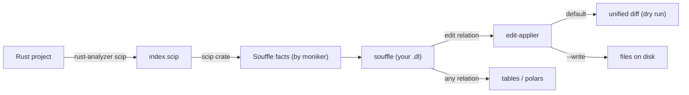

# scipql

`packages/scipql` runs Souffle Datalog plus find/replace over a SCIP semantic
index. Where [astlog](../astlog/overview.md) queries tree-sitter *syntax*,
scipql queries a *resolved* index: every occurrence carries its SCIP moniker, so
`net::Socket` and `mock::Socket` are distinct symbols and a rename touches only
the real definition and its references, never a same-named symbol elsewhere or a
field of the same name. The full design and grammar are in
[`packages/scipql/README.md`](../../packages/scipql/README.md).

## Member crates

| crate | id | role | flake output |
| --- | --- | --- | --- |
| `scipql/core` | `scipql-core` | index, lower to facts, run Souffle, apply edits | none |
| `scipql/cli` | `scipql` | the `scipql` binary, wrapped with toolchain + souffle | `scipql` |
| `scipql/py` | `scipql-py` | PyO3 bindings (`import scipql` in the ix-mcp kernel) | none |

All three are Rust workspace members; only `cli` is a flake/packageSet output.
`core` reuses [`edit-applier`](../edit-applier/overview.md) for the rewrite step
(`packages/scipql/core/Cargo.toml`) and depends on the `scip` and `protobuf`
crates to read a SCIP index.

## Pipeline (`core/src/lib.rs:1-14`)



`index` is the slow step (it loads the cargo workspace);
`query`/`fix`/`rename` run on an already-built `index.scip`.

## CLI surface (`cli/src/main.rs:17-65`)

- `index PROJECT [-o index.scip]`: run `rust-analyzer scip PROJECT --output`.
- `query INDEX PROGRAM [--root R]`: run the Souffle program, print every
  `.output` relation as TSV (one block per relation).
- `fix INDEX PROGRAM [--root R] [--write]`: apply the program's `edit` relation;
  prints the unified diff, `--write` updates files.
- `rename INDEX SELECTOR NEW_NAME [--root R] [--write]`: rename every occurrence
  whose moniker ends with `SELECTOR` (e.g. `net/Socket#`) to `NEW_NAME`. A
  generated `fix`.

`--root` defaults to the index's project root; byte offsets and on-disk writes
resolve relative document paths against it (`core/src/lib.rs:36-38`).

## core (`scipql-core`)

Modules (`core/src/lib.rs:21-26`): `index` (shell `rust-analyzer scip`),
`facts` (lower SCIP -> relations), `souffle` (run the engine), `rewrite` (apply
the `edit` relation), `rename` (generate a rename program), `error`. Public
entry points: `index`, `load_index`, `facts_from_index`, `query`, `fix`,
`rename`, plus the row types and `SCHEMA`/`EDIT_SCHEMA` constants
(`core/src/lib.rs:28-34`).

### Fact relations (`facts.rs:23-32`, `SCHEMA`)

Prepended to every query, so always in scope:

```
occurrence(symbol, path, start, end, role)   # role: definition | reference; byte offsets
symbol_info(symbol, kind, display_name)
document(path)
relationship(symbol, related, kind)          # implementation | type_definition | reference | definition
```

`symbol` is the SCIP moniker. A local symbol (`local 1`) is namespaced by its
document path so it stays unique across files (`facts.rs`). Byte offsets come
from each document's embedded UTF-8 text, or the file is read from `root` when a
document omits it.

### Writing a fix (`rewrite.rs:19-21`, `EDIT_SCHEMA`)

A `fix`/`rename` program must `.output` an `edit` relation; the schema is
prepended automatically:

```
.decl edit(path:symbol, start:number, end:number, replacement:symbol)
.output edit
```

`fix` confines edits to files the index documents, sorts and dedups them, checks
overlap, and applies via `edit-applier` (`rewrite.rs:42-104`). `rename` is just
a generated program that suffix-matches the moniker (`rename.rs`); for anything
more selective, write the `.dl` yourself.

### Running Souffle (`souffle.rs:46-68`)

`run` writes the facts as `.facts` TSV into a scratch dir, prepends the schema to
the user program, and shells out to `souffle`, reading back every `.output`
relation as `OutputRelation { name, columns, rows }`. The binary is resolved
from `SCIPQL_SOUFFLE` (an absolute path a wrapper bakes) or `souffle` on `PATH`
(`souffle.rs:58-62`); `index` resolves `rust-analyzer` from
`SCIPQL_RUST_ANALYZER` or `PATH` (`index.rs:22-24`).

## cli build (`cli/default.nix`)

The flake output is not the bare binary: `default.nix` wraps it with
`makeWrapper`, prefixing `PATH` with the repo's pinned nightly toolchain
(`cargo`, `rustc`, `rust-std`, `rust-src`, `rust-analyzer`, channel read from
[`rust-toolchain.toml`](../../rust-toolchain.toml)) and `souffle`, so `scipql
index` runs the exact rust-analyzer the repo builds against and `query`/`fix`/
`rename` find `souffle` with no ambient setup. The prefix (not suffix) ensures
the baked tools shadow any rustup shim.

## py (`scipql-py`)

PyO3 `cdylib` (`py/src/lib.rs`) returning polars frames: `scipql.facts`,
`scipql.query` (`{relation: DataFrame}`), `scipql.rename`/`scipql.fix` (diff,
`write=True` applies). The kernel bakes `souffle` via `SCIPQL_SOUFFLE`, so
query/fix/rename work in the kernel; `index` needs rust-analyzer and is run from
the `scipql` CLI instead (README "Python"). Rust today (via `rust-analyzer
scip`); the facts/query/edit layers are language-agnostic.
