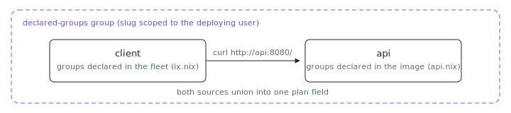

<p align="center"></p>

# Declared groups

Should a VM's group membership live in the image or in the fleet? Both work,
and this two-VM fleet shows each source. The `api` image sets
`ix.networking.groups = [ "declared-groups" ]` in its own module, so any fleet
deploying that image joins the deployer's `declared-groups` network; the
`client` joins through a fleet-level `nodes.client.groups` entry on a
group-agnostic image. Both sources union into the same plan field.

## Run

```sh
# From the index repo root.
nix run .#declared-groups-up
nix run .#declared-groups-health
```

The fleet wrapper get-or-creates the `declared-groups` group under your
account, adds both VMs, then runs the health checks: the client curls the api
over the private group network. Need the repo first?
`git clone https://github.com/indexable-inc/index`.

## Verify manually

```sh
ix group members declared-groups
ix shell client -- curl -fsS http://api:8080/
```

## Shape

- [`ix.nix`](ix.nix) declares the fleet; note `api` has no
  fleet-level `groups` entry.
- [`api.nix`](api.nix) carries the group in the image
  (`ix.networking.groups`) and exposes port 8080 to group members.
- [`client.nix`](client.nix) joins via the fleet-level `groups` and checks
  that `http://api:8080/` answers over the private network.

## Where the slugs live

Group slugs are scoped to the deploying user (`UNIQUE (owner_id, slug)` on
the server), so a common name like `declared-groups` in a published image
never collides with another user's group of the same name. Slugs are
`[a-z0-9_-]`, max 63 chars (the DNS label limit); the fleet eval rejects
anything else before any RPC runs.
