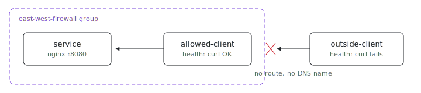

<p align="center"></p>

# East-west firewall

How do you prove one VM can reach a service and another cannot? Put the
boundary where ix already has one: the east-west group. The HTTP service and
`allowed-client` share a group, so the client gets a private route and DNS
name; `outside-client` is left out, and its health check passes only when the
same URL fails.

## Run

```sh
# From the index repo root.
nix run .#east-west-firewall-up
nix run .#east-west-firewall-health
```

The fleet wrapper creates the `east-west-firewall` group, adds `service` and
`allowed-client`, then runs the health checks. Need the repo first?
`git clone https://github.com/indexable-inc/index`.

## Verify manually

```sh
ix group members east-west-firewall
ix shell allowed-client -- curl -fsS http://service:8080/
ix shell outside-client -- curl -fsS --connect-timeout 2 http://service:8080/
```

The last command should exit non-zero. The group gives `allowed-client` a
private path to `service`; `outside-client` has no east-west route or DNS name
for that VM.

## Shape

- [`ix.nix`](ix.nix) declares the fleet and places only `service` and
  `allowed-client` in the east-west group.
- [`service.nix`](service.nix) runs nginx on port 8080 and opens that port in
  the guest firewall.
- [`allowed-client.nix`](allowed-client.nix) checks that `http://service:8080/`
  answers over the private group.
- [`outside-client.nix`](outside-client.nix) checks that the same URL fails
  from a VM outside the group.

## Tradeoffs

ix groups are symmetric: every member can reach every other member on the
private network. For directional policy, run the listener on the service VM and
leave client-side sockets closed, or add a gateway VM that owns the stricter
rule.

The NixOS firewall still opens port 8080 on `service`. Group membership decides
which VMs have a private path to the host; nftables decides which ports are
accepted after traffic arrives.
