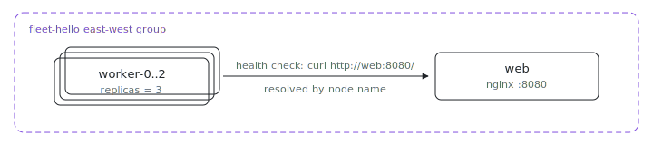

<p align="center"></p>

# Fleet hello

What does a Kubernetes Service plus a three-replica Deployment look like as
one Nix file? This is the smallest multi-node fleet: one `web` node serving a
static page and three `worker` replicas that resolve it by name with
`ix.endpointOf nodes.web "http"` and curl it as their health check. The
generated up wrapper reports healthy only once every worker can reach the web
node.

## Run

```sh
# From the index repo root.
nix run .#fleet-hello-up
```

Need the repo first? `git clone https://github.com/indexable-inc/index`.

## Shape

- [`ix.nix`](ix.nix) defines the fleet: one `web` node and a `worker` node
  with `replicas = 3`, all in one east-west group, with `dependsOn` so the
  web node boots first.
- [`web.nix`](web.nix) runs nginx and declares `ix.networking.expose.http`,
  which opens the firewall, registers the port claim, and names the endpoint
  workers resolve.
- [`worker.nix`](worker.nix) resolves that endpoint and curls it as its
  health check.

## Verify

```sh
ix shell worker-0 -- curl --fail http://web:8080/
```

Replicas are numbered `worker-0` through `worker-2`; each reaches `web` by
its node name over the east-west network.

## Scale

Worker count is one line: raise `worker.replicas` in [`ix.nix`](ix.nix).
Nothing else changes; new replicas join the group and pick up the same
health check.
