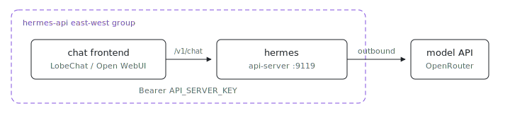

<p align="center"></p>

# Hermes API Server

Can a chat frontend treat a full agent as just another OpenAI endpoint? This is the [Hermes operator VM](../agent/) exposing the OpenAI-compatible `hermes api-server` on port `9119`: chat frontends on sibling VMs (LobeChat, Open WebUI, LibreChat, or anything that speaks `/v1/chat/completions`) point their OpenAI base URL at this node and get the full agent (tools, memory, persona) behind a plain chat-completions endpoint.

Unlike every other hermes preset this one is inbound: the node claims TCP `9119` via `ix.networking.expose.hermes-api`, which registers the port claim, opens the in-guest firewall, and makes the listener discoverable to siblings. Reachability is scoped by the east-west group: only VMs in the `hermes-api` group have a route or a DNS name to it. Nothing here is public; there is no `deployment.ipv4` and no L7 proxy.

## Shape

- [`ix.nix`](ix.nix) wraps the node as a one-node fleet in the `hermes-api` east-west group.
- [`api-server.nix`](api-server.nix) sets `_module.args.hermes.apiServer = true` (plus the port) and adds an HTTP readiness check against the listener.
- The `apiServer` toggle lives in `ix.hermes.profile`: it sets the gateway's `API_SERVER_ENABLED` / `API_SERVER_HOST=0.0.0.0` / `API_SERVER_PORT` env knobs, claims the port, and wires the env file carrying `API_SERVER_KEY` into the daemon.

## Run

```sh
# From the index repo root.
nix run .#hermes-api-server-up
```

Need the repo first? `git clone https://github.com/indexable-inc/index`.

Store the env-file secret before launch. `API_SERVER_KEY` is the bearer token your frontends will present; generate a long random one:

```sh
ix secret set hermes_env <<EOF
OPENROUTER_API_KEY=sk-or-...
API_SERVER_KEY=$(openssl rand -hex 32)
EOF
nix run .#hermes-api-server-up
```

Smoke-test from inside the VM:

```sh
ix shell hermes -- curl -s http://127.0.0.1:9119/v1/models \
  -H "Authorization: Bearer $API_SERVER_KEY"
```

## Point a frontend at it

Run your frontend in a VM that joins the same `hermes-api` group (any node with `groups = [ "hermes-api" ]` in its fleet spec resolves the agent as `hermes`):

- **LobeChat / LibreChat / generic OpenAI client**: base URL `http://hermes:9119/v1`, API key = your `API_SERVER_KEY`, model name as advertised by `/v1/models`.
- **Open WebUI**: Admin Settings -> Connections -> OpenAI API, URL `http://hermes:9119/v1`, key = `API_SERVER_KEY`.

The model list is a facade: whatever model id the frontend selects, the request lands on the one configured agent (its real model routing stays `_module.args.hermes.modelDefault` / `modelBaseUrl`).

## Notes

- Do not skip `API_SERVER_KEY`. The listener is east-west-scoped, but every VM in the group would otherwise get an unauthenticated agent with root in this VM.
- The agent is single-tenant: all callers share one session state, one memory store, one persona. For per-team personas, run one node per persona and group frontends accordingly.
- Everything in the [hermes-agent README](../agent/README.md) about secrets handling, provider swaps, and the trust model applies unchanged.
