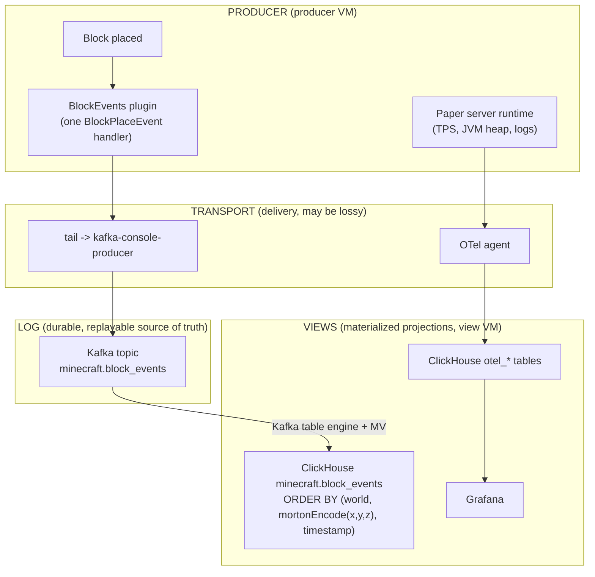

# Minecraft Blocks

Watch a single block placement flow from a Minecraft server to a 3D spatial
query. A player places a block, the placement becomes a durable fact in a log,
the log materializes into a ClickHouse table ordered by a space-filling curve,
and a bounding-box query over that table scans only the storage it needs.

This example is a working tour of the data architecture: a producer, one
durable log, and a view derived from that log. It also shows the contrast that
the architecture turns on: a block placement is a domain fact and travels the
log path, while the server's own telemetry travels a separate collector path
into the same database.

## Run

```sh
nix run .#minecraft-blocks-up
```

That brings up three VMs: `log` (the Kafka broker), `view` (ClickHouse, the
OTel collector, and Grafana), and `producer` (the Paper server with the
block-events plugin). Grafana is on port `3000` through the example's L7 proxy.

Query the spatial view from inside the view VM:

```sh
ix shell view -- mc-blocks total
ix shell view -- mc-blocks top-players
ix shell view -- mc-blocks box overworld 0 0 0 16 320 16
ix shell view -- mc-blocks heatmap overworld
```

The `box` arguments above span the full overworld height (`y` 0 to 320) on
purpose: it is an illustrative query you would actually run, not the integration
check's box. The integration check uses one canonical box defined in `box.json`
(see [Validation](#validation)), so the asserted in-box count can never drift
from the fixture data.

You do not need a running server to see the pipeline end to end. A committed
fixture of block-placement records (the same shape the plugin writes) drives the
whole log-to-view path offline (see [Validation](#validation)).

## The three layers



There are two legs, and keeping them apart is the point.

TRANSPORT is how facts arrive. It is a delivery choice and is allowed to be
lossy. Here it is a file tail piped into a Kafka producer. It is not the source
of truth.

LOG is the one durable, append-only, replayable source of truth. Here it is the
`minecraft.block_events` Kafka topic. Everything downstream derives from it and
is rebuildable by replaying it, and that replay is idempotent (see [Idempotent
replay](#idempotent-replay)), so re-running it never corrupts a view.

VIEWS are projections of the log, one per query pattern. Here the view is a
ClickHouse table tuned for spatial range queries. The same log could feed other
views without touching the producer.

## Domain facts versus telemetry

A block placement is a domain fact: structured data you aggregate, count, and
range-query later. Domain facts go through the log so they are durable and
replayable, and they land in a view shaped for the questions you ask of them.

The server's own signals (tick rate, JVM heap, lag, logs) are telemetry. Those
go through the OpenTelemetry collector into the `otel_*` tables, the same path
every other service in the fleet uses. The diagram shows both legs side by side
because the architecture only works when you put each kind of data on the right
one. A block-place is not telemetry, so it never goes through the collector.

Both legs land in one ClickHouse. The `view` node runs the shared
`services.ix-observability` stack (ClickHouse, collector, Grafana) and adds the
`minecraft` database on that same server, so telemetry and block facts share a
database without a second ClickHouse.

## Why ClickHouse and not Mixedbread

Block placements are facts to aggregate and range-query (counts per player, a
bounding box, a per-chunk heatmap), so the view is a columnar table in
ClickHouse, not a vector index. There is nothing here to search semantically.

The log makes that a per-view choice, not a fork in the road. The same
`minecraft.block_events` log could also feed a Mixedbread view if you wanted
text search over, say, the contents of written books or command signs. One log,
many views: you add the view you need and replay the log into it.

## The space-filling curve

This is how far the spatial view can go. The view's sorting key linearizes the
three coordinates with a Z-order (Morton) curve, and per-axis minmax skip
indexes turn that ordering into real granule pruning:

```sql
ENGINE = ReplacingMergeTree
ORDER BY (world, mortonEncode((1, 1, 1), toUInt32(x + 1048576), toUInt32(y + 1048576), toUInt32(z + 1048576)), timestamp)
-- plus, on the same table:
INDEX idx_x x TYPE minmax GRANULARITY 1,
INDEX idx_y y TYPE minmax GRANULARITY 1,
INDEX idx_z z TYPE minmax GRANULARITY 1
```

The engine is `ReplacingMergeTree`, not plain `MergeTree`, and that is what
makes the replay above idempotent; the [Idempotent replay](#idempotent-replay)
section explains why the `ORDER BY` tuple is a valid dedup key.

`mortonEncode` interleaves the bits of the three axes into one integer. Points
that are close in 3D space get close curve values, so they sort next to each
other on disk and end up in the same granules (the blocks ClickHouse reads as a
unit). Sorting by `world` first keeps each world a contiguous run; `timestamp`
last orders rows within a curve cell.

The ordering alone does not prune a bounding-box query, and this is the subtle
part. The bounding box filters on raw `x`, `y`, `z`, but the sorting key is
`mortonEncode(x, y, z)`, which is not monotonic in any single axis. ClickHouse
therefore cannot turn `x >= 0 AND x < 16` into a range over the sort key; the
primary index prunes only by `world`.

What does the pruning is the per-axis minmax skip indexes. Each granule stores
the `[min, max]` of `x`, of `y`, and of `z` for its rows. A box query skips any
granule whose per-axis range cannot intersect the box. The Z-order ordering is
what makes this effective: because spatially close rows share a granule, each
granule's per-axis box stays tight, so distant granules are dropped cleanly.
Ordering keeps the boxes tight; the skip indexes do the dropping. The
[integration check](#validation) asserts this with `EXPLAIN indexes = 1`: the box
query selects strictly fewer granules after the skip indexes than the primary
index alone.

Two details matter, and both are why the offset constant exists.

Minecraft coordinates are signed (negative coordinates are legal), but
`mortonEncode` takes unsigned integers. Each axis is shifted into an unsigned
range by adding a fixed offset before encoding and subtracting it after
decoding. The offset lives once in `schema.nix` and is applied identically by
the table, the loader, and the round-trip check.

Three axes interleaved into a 64-bit curve value give each axis 21 bits, so each
shifted coordinate must fit in `[0, 2^21)`. The offset is `2^20`, which centers
a roughly plus-or-minus one million block window on the curve. That covers any
normal build area. To cover the full plus-or-minus 30 million block range, a
production table partitions by region first and Morton-encodes within each
bounded partition, the same idea applied per partition.

## Idempotent replay

"Rebuildable by replaying the log" is only true if replaying the same record
twice does not change the answer. That property is built into the view here, so
restart re-sends and view rebuilds do not corrupt counts.

The transport is at-least-once. The shipper re-sends the whole file from the top
on restart, and the broker can re-deliver, so a record can reach the view more
than once. Rather than try to make the transport exactly-once (hard and not the
point), the view is made idempotent, and at-least-once transport into an
idempotent view is effectively-once end to end.

What makes the view idempotent is the table engine and its key. The
`block_events` table is a `ReplacingMergeTree` ordered by `(world,
mortonEncode(x, y, z), timestamp)`. That tuple is the identity of a placement: a
single world cell cannot be placed twice at the same millisecond, so the tuple
uniquely identifies the logical fact. `ReplacingMergeTree` collapses rows that
share the full sorting key down to one, and a replayed record is byte-identical
to the original (same coordinates, same player, same timestamp), so the
duplicate folds back into the one canonical row. No version column is needed:
there is no newer copy to prefer, the copies are identical.

Reads use `FINAL` so counts are exact at query time. Dedup in
`ReplacingMergeTree` happens during background merges, which may not have run
yet, so `SELECT count() FROM block_events FINAL` forces the merge-time dedup at
read and returns the deduplicated count immediately. The `mc-blocks` query tool
and the integration check both read with `FINAL` for this reason.

The [integration check](#validation) proves the property: it loads the fixture
twice (simulating the restart re-send) and asserts with `FINAL` that the total
and the bounding-box count are unchanged, not doubled.

## Scaling up

The runnable substrate here is Apache Kafka in KRaft mode, the broker this
nixpkgs packages. Redpanda is the intended production substrate: it speaks the
Kafka API, so the producer and the ClickHouse Kafka table engine are unchanged,
and this nixpkgs currently ships only the Redpanda client (`rpk`), not the
broker. The log is the same shape either way.

The payoff at scale comes from materializing the log as a table that many views
derive from. With Redpanda Iceberg Topics, the broker writes the topic out as an
Iceberg table as records arrive. That Iceberg table then feeds many views from
the one log:

- ClickHouse for the spatial and aggregate queries shown here,
- DuckDB for ad hoc analysis straight off the Iceberg files,
- a dedicated spatial index if a workload needs one.

Each view is a projection you can rebuild by replaying the log, so adding or
reshaping a view never touches the producer and never risks the source of truth.

### Rebuilding a view from the log

To rebuild the view, replay the whole log into a fresh table. Because the view
is idempotent (see [Idempotent replay](#idempotent-replay)), the replay is safe
even when it overlaps records the table already holds: duplicates collapse back
into one row, so a rebuild can never double a count.

One mechanical detail to know: the ClickHouse Kafka table engine reads with a
fixed consumer group (`clickhouse-minecraft`), and Kafka stores the committed
offset per group on the broker, not in the view. So if you recreate the
`block_events` table without touching the group, the materialized view resumes
from the committed offset instead of replaying from the start. To replay the
whole log, reset the group's offsets (`kafka-consumer-groups.sh --reset-offsets
--to-earliest`) or consume under a fresh group name before recreating the table.
This is just about where the read resumes, not about correctness: whatever the
replay re-delivers, the `ReplacingMergeTree` dedups. A production deployment
makes the rebuild explicit (a new group per rebuild, or a snapshot to restore
from); this example keeps the single fixed group for simplicity.

## Shape

- `schema.nix` is the one source of truth for the event: the topic name, the
  Morton offset, the granule size, the skip indexes, and the ClickHouse DDL all
  derive from the field list, so the log, the table, and the queries cannot
  drift. The plugin writes the same shape by hand, so it is the one writer to
  keep in lockstep with this file.
- `log.nix` runs the Kafka broker and creates the topic.
- `view.nix` runs the shared observability ClickHouse and adds the spatial
  view, a Kafka table engine reading the topic, and a materialized view that
  copies consumed rows into the spatial table.
- `producer.nix` runs Paper with the block-events plugin, ships its records to
  the topic, and forwards the server's telemetry (collected from the journal) to
  the collector.
- `packages.nix` builds the plugin jar and the integration check.
- `plugin/` is the Paper plugin: one `BlockPlaceEvent` handler that writes one
  JSON Lines record per placement. It compiles against the real Paper API jar
  (pinned in `plugin/api-deps.json` to the same build the server runs), so the
  class kinds and method descriptors match the runtime by construction. It
  derives a stable dimension name ("overworld" / "nether" / "the_end") from the
  world's environment, not its on-disk folder name, so a placement matches the
  schema regardless of the server's `level-name`.
- `fixtures.jsonl` is a committed set of block-placement records (the shape the
  plugin writes), produced by `generate-fixtures.py`, so the pipeline is testable
  without a server. The layout is sized to demonstrate skip-index pruning: a
  dense in-box cluster plus thousands of far-flung placements across many
  granules.
- `box.json` is the single definition of the example's bounding box, one
  half-open interval per axis. The Nix schema, the integration-check predicate,
  and `generate-fixtures.py` all read it, so the in-box region and the query
  predicate cannot drift: the asserted in-box count is always whatever this one
  box selects from the fixture.

## Validation

The integration check runs the whole log-to-view path offline. It loads the
committed `fixtures.jsonl` records into a ClickHouse `local` table built from the
same schema (same Morton order, same offset, same skip indexes, same granule),
loads them a second time to simulate the restart re-send, then asserts four
things:

- replay is idempotent: with `FINAL`, the total after the double load equals the
  single-load row count, not double it (`idempotent_total` in the result file),
- the exact in-box count for the bounding-box query (also with `FINAL`, so the
  double load does not inflate it),
- that the per-axis skip indexes genuinely prune (via `EXPLAIN indexes = 1`, the
  box query selects strictly fewer granules after the skip indexes than the
  primary index alone),
- the Morton round-trip recovers the original signed coordinates, including a
  negative one.

```sh
nix build .#checks.x86_64-linux.eval
```

The eval aggregate also evaluates the fleet's config assertions (the KRaft
broker, the shared ClickHouse, the spatial view, both producer legs) and builds
the plugin jar against the real Paper API.
