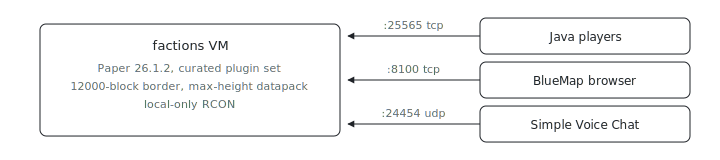

<p align="center"></p>

# Factions Server

What does a production-shaped factions server look like as one Nix file? This
standalone consumer example defines a single Paper `26.1.2` node with a curated
plugin set (factions, economy, audit, map, voice, scripting), a `12000` block
world border, a 4064-block max-height datapack, BlueMap on TCP `8100`, Simple
Voice Chat on UDP `24454`, and local-only RCON for managed reloads. Customize
real player UUIDs and spawn/claim policy before using it with real players.

## Run

```sh
# From the index repo root.
nix run .#minecraft-factions-up
```

Need the repo first? `git clone https://github.com/indexable-inc/index`.

## Shape

- [`minecraft.nix`](minecraft.nix) wires the Minecraft service.
- [`plugins.nix`](plugins.nix) selects factions, economy, audit, map, voice, and
  scripting plugins from the generated catalog.
- [`world.nix`](world.nix) owns the seed and border constants.
- [`world-height.nix`](world-height.nix) contains the generated datapack.
- [`bukkit.nix`](bukkit.nix), [`paper.nix`](paper.nix), and
  [`spigot.nix`](spigot.nix) hold loader config files.

The world border is applied after startup through local RCON. RCON stays off the
firewall by default; ix uses it to apply the border and reload managed Paper
plugins during a switch.
