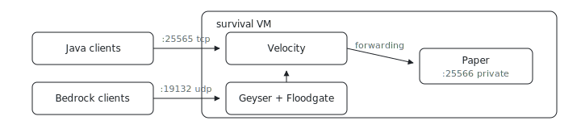

<p align="center"></p>

# Survival Server

Can Java and Bedrock players share one world from a single VM? This is one ix
fleet node running a [Paper](https://papermc.io/software/paper) survival
backend behind [Velocity](https://papermc.io/software/velocity), with
[Geyser](https://geysermc.org/) and
[Floodgate](https://geysermc.org/wiki/floodgate/) on the proxy so both client
families land in the same world. The backend port stays private to the image
firewall; only the proxy listeners are public.

## Run

```sh
# From the index repo root.
nix run .#minecraft-survival-up
```

Need the repo first? `git clone https://github.com/indexable-inc/index`.

## Shape

[`minecraft.nix`](minecraft.nix) wires four listeners and keeps the backend
Paper port private to the image firewall:

- Velocity accepts Java clients on TCP `25565`.
- Geyser accepts Bedrock clients on UDP `19132`.
- Paper listens on TCP `25566` for local proxy traffic.
- RCON stays local for PlugManX reloads.

Velocity modern forwarding is enabled in `velocity.toml` and in
`paper-global.yml`. The checked-in forwarding secret is an example value. Replace
it before real players join, especially if the backend port is reachable from
another VM or a manual firewall edit.

## Bad Fit If

Use separate fleet nodes when you want several public survival servers all on
the natural Java port. One image can host a proxy plus one backend cleanly; a
network wants topology once the backends become independently scaled worlds.
