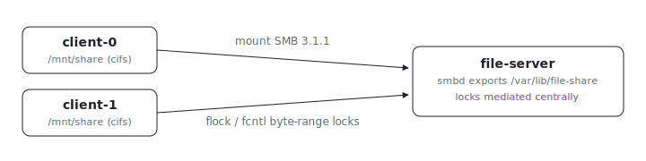

<p align="center"></p>

# Multi-client file sharing

Ever had two VMs clobber the same file because their locks never saw each
other? This fleet shares one directory across ix VMs over SMB 3.1.1 with
locking that actually coordinates: a `file-server` node exports
`/var/lib/file-share`, two client replicas mount it at `/mnt/share`, and
`smbd` mediates every `flock()` and `fcntl` byte-range lock centrally, so a
lock taken on `client-0` blocks `client-1`.

## Run

```sh
# From the index repo root.
nix run .#multi-client-file-sharing-up
```

`nix run .#multi-client-file-sharing-health` re-runs the health checks (smbd
active, CIFS mounted on both clients). Get the repo with
`git clone https://github.com/indexable-inc/index`.

## Shape

- [`ix.nix`](ix.nix) defines the fleet: one server node and two client
  replicas with `dependsOn` so the server is up first.
- [`server.nix`](server.nix) configures Samba with the locking knobs
  (`strict locking`, `posix locking`, `kernel oplocks = no`,
  `strict sync = yes`) that keep two clients honest about each other's writes.
- [`client.nix`](client.nix) declares the CIFS mount with `vers=3.1.1` and
  leaves `nobrl` absent so byte-range locks stay enabled.

## Verify cross-client locking

Hold an exclusive `flock` on a file from one client:

```sh
ix shell client-0 -- flock -x /mnt/share/lockfile -c 'sleep 60'
```

From a second host shell, try to grab the same lock from the other client
non-blocking:

```sh
ix shell client-1 -- flock -nx /mnt/share/lockfile -c 'echo got-it'
```

The second invocation exits with status 1 until the first releases. Swap
`flock` for `python -c 'import fcntl; fcntl.lockf(...)'` to exercise the same
path via `fcntl` byte-range locks.

## Tradeoffs

- The share is **guest-writable** so the generated up wrapper works without
  secrets plumbing. Real deployments should drop `guest ok = yes` from
  [`server.nix`](server.nix), add a Samba user with `smbpasswd`, and pass
  `credentials=` to the CIFS mount through a systemd `LoadCredential` (the
  same shape [`python/daily-scraper`](../../python/daily-scraper) uses for
  AWS keys).
- ix VMs share the host `linux-ix` kernel, so the SMB server has to be
  userspace `smbd` rather than in-kernel `ksmbd`. The client side still rides
  on `cifs.ko` from the host kernel.
- `strict sync = yes` plus `actimeo=1` trade some throughput for prompt
  cross-client visibility. Append-only or single-writer workloads can relax
  both.
