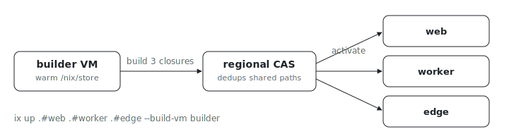

<p align="center"></p>

# NixOS switch: many VMs, one build VM

How do you rebuild a fleet of NixOS VMs without N cold builds, and without
routing every closure through your laptop? This example switches three VMs in
a single command, building every closure on one shared build-time VM: the
source uploads once, each closure builds on the warm builder, and the
activations fan out to their VMs through regional CAS. It is the
colmena-style "build once, push many" loop as a first-class `ix up`.

## Run

```sh
# 1. Bring up the build VM once.
ix up .#builder

# 2. Build all three app VMs on that builder and switch each in place.
ix up .#web .#worker .#edge --build-vm builder
```

The second command creates `web`, `worker`, and `edge` from `ix/base` if they
do not exist, builds their closures on `builder`, and activates each on its
own VM. Re-run it to converge them, the same contract as
`nixos-rebuild switch`.

## Why one build VM

`builder` keeps a warm `/nix/store`, so the first closure pays the full build
and the rest only build their own delta. The built closures travel builder to
target through regional CAS, which deduplicates the shared system paths, so
the bytes on the wire for `worker` and `edge` are a fraction of a full
closure. You get fleet rebuilds without N cold builds and without routing
closures through your laptop.

## The loop

1. Edit a configuration in [`ix.nix`](ix.nix): change a VM's package list.
2. Run the multi-VM `ix up` again. Only the changed closures rebuild on the
   builder; unchanged VMs are a no-op.
3. `ix shell web -- rg --version` (or `worker -- jq`, `edge -- hello`)
   confirms the new closure is live.

## Rules

- Multiple targets require `--build-vm`: one build-time VM is what makes this
  one operation instead of N. The build VM must already exist (step 1).
- Each target names its own configuration (`.#web`), so `--name` is not used
  with multiple targets.
- The builder and every target must share a region (CAS chunks are
  region-scoped). A cross-region target is a typed error, not a silent
  fallback.
- A failed target is reported on its own; its siblings still switch.

## Shape

- [`flake.nix`](flake.nix) is the entrypoint; unlike the `mkFleet` examples
  it exposes raw `nixosConfigurations` (`builder`, `web`, `worker`, `edge`).
- [`ix.nix`](ix.nix) builds those systems; each target differs only by its
  sentinel package.
- [`configuration.nix`](configuration.nix) is the shared NixOS module every
  VM switches onto. It imports `virtualisation/docker-image.nix` so the
  system evaluates against the `ix/base` image without a bootloader.

## Fork it

Copy this directory, add or rename configurations in [`ix.nix`](ix.nix), and
point `--build-vm` at your own builder VM. The `index` flake input pulls
`github:indexable-inc/index` for you; no admin rights are needed.
