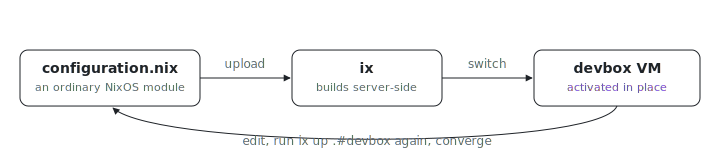

<p align="center"></p>

# NixOS switch

Want `nixos-rebuild switch` for a VM in the cloud, without building on your
laptop or shipping closures over your uplink? `ix up .#devbox` uploads this
source tree to ix, builds the NixOS closure server-side, and activates it on
the running VM in place. Re-running converges the VM to the current
configuration, the same contract as `nixos-rebuild switch`.

## Run

```sh
# From this directory.
ix up .#devbox
```

The first run creates `devbox` from `ix/base:latest` and activates this
configuration on it. From a clone of the index repo root,
`nix run .#nixos-switch-up` brings up the same fleet through the generated
wrapper.

## The loop

1. Edit [`configuration.nix`](configuration.nix): add a package to
   `environment.systemPackages` (try `pkgs.ripgrep`).
2. Run `ix up .#devbox` again. ix uploads the change, builds the new closure,
   and switches the running VM to it.
3. `ix shell devbox` and confirm the new package is on `PATH`.

The VM keeps running across switches: only its system generation changes,
nothing is recreated.

## Shape

- [`flake.nix`](flake.nix) is the native `ix up` entrypoint. It exposes
  `nixosConfigurations.devbox`, which `ix up .#devbox` resolves to the NixOS
  system closure.
- [`ix.nix`](ix.nix) keeps the one-node fleet definition reused by the repo
  example wrappers.
- [`configuration.nix`](configuration.nix) is the NixOS module you edit.

## Fork it

Copy this directory into your own repo and keep `flake.nix` as the
entrypoint; its `index` input pulls `github:indexable-inc/index` for you. The
switch path needs no admin rights: it builds and activates your own system
onto your own VM.

## Scope

This builds on the target VM itself, the `ix up` default. Building several
VMs on one shared builder VM is what [`switch-multi`](../switch-multi)
demonstrates with `--build-vm`.
