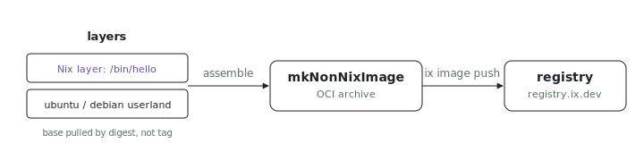

<p align="center"></p>

# Non-NixOS OCI images

Need an image that is plain Ubuntu or Debian inside, with Nix-built tools
layered on top? These examples build OCI images on a non-Nix base with
`index.lib.mkNonNixImage`: the base distro's own userland stays as the rootfs
(so `/bin/bash`, `apt`, and the FHS are all present) and Nix store paths ride
along as extra layers. This is the path a plain-distro image takes, outside
the NixOS module/fleet path.

## Build

```sh
# From the index repo root.
nix build .#non-nix-ubuntu
nix build .#non-nix-debian
```

Each result is a standard OCI archive, so
`ix image push <name> registry.ix.dev/...` works on it directly. Get the repo
with `git clone https://github.com/indexable-inc/index`.

## Not fleets

The other entries under `examples/` are NixOS fleets driven by `mkFleet`,
each exposing generated `<name>-up` / `<name>-health` wrapper packages. The
[`ubuntu`](ubuntu/) and [`debian`](debian/) directories here return images
instead of fleet plans, so example fleet discovery skips them; they surface
as the opt-in `non-nix-*` packages above instead.

## How it differs from `mkImage`

`mkImage` builds a NixOS system closure: systemd as PID 1, `/init` as the
entrypoint, the closure as the rootfs. `mkNonNixImage` keeps the base image's
own userland as the rootfs and adds Nix store paths as extra layers. There is
no systemd, no `/init`; the entrypoint is whatever the base or your `config`
provides.

## Reproducibility

The base is pulled by digest via `dockerTools.pullImage`, not by tag, so the
build does not depend on what `ubuntu:24.04` points at today. Each example
keeps its digest and fetch hash in a sibling `pins.json`. To bump a base:

```sh
nix run nixpkgs#nix-prefetch-docker -- --os linux --arch amd64 \
  --image-name ubuntu --image-tag 24.04
```

Copy the `imageDigest` and `hash` it prints into `pins.json`.
