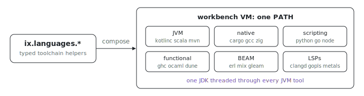

<p align="center"></p>

# Polyglot dev VM

Want one VM where `cargo`, `kotlinc`, `gleam`, `dune`, and `tsc` are already
on PATH, with their language servers next to them? This fleet builds a single
`workbench` node from the [`ix.languages.*`](../../../lib/languages/)
helpers. The point is how the helpers compose: one JDK is resolved once and
threaded through every JVM tool, the language servers travel with their
compilers, and the `ix.profiles.jvm` runtime keeps `JAVA_HOME` aligned with
whatever `java` and `javac` end up on PATH.

## Run

```sh
# From the index repo root.
nix run .#polyglot-dev-up
ix shell workbench
```

Get the repo with `git clone https://github.com/indexable-inc/index`.

## Shape

- [`tools.nix`](tools.nix) resolves every helper and assembles
  `environment.systemPackages`. Languages are grouped by family (`jvm`,
  `native`, `scripting`, `functional`, `beam`), so adding or removing one is
  a single attribute edit.
- [`ix.nix`](ix.nix) wraps it as a one-node fleet (`workbench`).

## What's on PATH

- **JVM**: OpenJDK 25 (Temurin) plus `kotlinc`, `scala`, `mvn`, `gradle`.
- **Native**: stable `rustc`/`cargo`/`clippy`/`rustfmt`, `gcc`, `cmake`,
  `ninja`, `zig`.
- **Scripting**: `python` (3.14), `go`, Node 24, `bun`, `deno`, `tsc`.
- **Functional**: `ghc`, `cabal`, `ocaml`, `dune`.
- **BEAM**: `erl`/`erlc`, `iex`/`mix`, `gleam`.
- **Language servers**: `clangd`, `gopls`, `haskell-language-server`,
  `jdtls`, `typescript-language-server`, `kotlin-language-server`,
  `ocamllsp`, `metals`, `zls`.

The JDK is resolved once and passed into `scala.compiler`, `java.maven`,
`java.gradle`, `scala.languageServer`, and the `ix.profiles.jvm` runtime, so
`JAVA_HOME`, the Maven launcher, and the JDK Metals parses sources against
all point at one store path.

## Bad fit if

- You want a small image. This pulls every supported language closure into
  one VM: expect the OCI archive to land around 6-10 GB, with `ghc`, the
  Scala+Metals pair, and the JDK family as the heavy hitters.
- You want pinned exact-minor versions of everything. Most helpers here
  accept a `version` argument (`go.toolchain`, `node`, `python.interpreter`,
  `haskell.compiler`, `zig.toolchain`, `cpp.compiler`); this example takes
  the floating defaults on purpose, because picking one minor per language is
  the consumer's job.
- You want devenv-style declarative bundles (auto-LSP-on, auto-PATH,
  auto-env). This example is the explicit-helper-composition shape: every
  package on PATH appears in [`tools.nix`](tools.nix).

## Swap languages

Each family in [`tools.nix`](tools.nix) is its own `let` binding. Drop the
ones you don't need by removing their `builtins.attrValues ...` line from the
`environment.systemPackages` list; the toolchains they reference fall out of
the closure on the next build.
