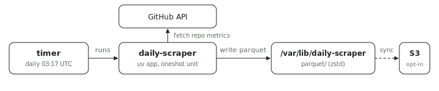

<p align="center"></p>

# Daily Python scraper

How do you run an ordinary Python script once a day on a VM, with packaging,
scheduling, and credentials all handled? This example packages a uv project
with [`ix.buildUvApplication`](../../../lib/build/uv-application.nix), runs
it as a hardened `systemd` oneshot on a persistent daily timer, writes
Parquet under `/var/lib/daily-scraper/parquet`, and can sync the result to
S3. The Python stays ordinary Python; the ix-specific parts are
[`package.nix`](package.nix) and [`service.nix`](service.nix).

## Run

```sh
# From the index repo root.
nix run .#python-daily-scraper-up
```

Get the repo with `git clone https://github.com/indexable-inc/index`.

## Shape

- [`pyproject.toml`](pyproject.toml), [`uv.lock`](uv.lock), and [`src/`](src/)
  are the Python project.
- [`ix.nix`](ix.nix) defines one ix fleet node.
- [`service.nix`](service.nix) owns the concrete service config, hardening,
  timer, and optional S3 sync.
- [`package.nix`](package.nix) packages the uv project as a store executable.

## S3 output

The example leaves S3 sync disabled. [`service.nix`](service.nix) reads a
`dailyScraper` module argument, so a fleet can enable S3 without forking the
service module. Store the env file with `ix secret set daily_scraper_aws_env`,
then have the fleet attach it as a runtime file:

```nix
{
  deployment.secrets.daily_scraper_aws_env = {
    file = "daily-scraper/aws.env";
    owner = "root";
    mode = "0400";
  };

  nodes.scraper.modules = [
    (
      { ... }:
      {
        _module.args.dailyScraper.s3 = {
          uri = "s3://andrew-scraper-output/github";
          deleteRemoved = true;
          awsEnvironmentFile = "/run/secrets/daily-scraper/aws.env";
        };
      }
    )
  ];
};
```

The AWS file is read at service start through `LoadCredential`, so the keys
stay out of the Nix store. Its contents use systemd `EnvironmentFile` syntax:

```ini
AWS_ACCESS_KEY_ID=...
AWS_SECRET_ACCESS_KEY=...
AWS_REGION=us-east-1
```

## Swap in your script

Keep [`service.nix`](service.nix) and [`package.nix`](package.nix), then
replace the Python module and dependencies. The service already handles timer
catch-up, durable VM state, journald logs, and an S3 sync step that runs only
after the scraper succeeds.
