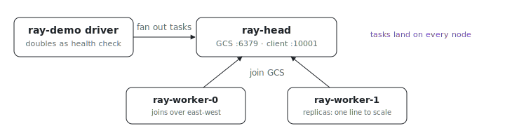

<p align="center"></p>

# Ray cluster

What does it take to run a real multi-node [Ray](https://docs.ray.io) cluster
on VMs you can actually firewall? This fleet runs one `ray-head` (the Ray
GCS) and two `ray-worker` replicas that join it over the east-west network. A
driver packaged with
[`ix.buildUvApplication`](../../../lib/build/uv-application.nix) attaches to
the head, fans `@ray.remote` tasks across the cluster, and reports which node
ran each one. The driver doubles as the head's health check, so the fleet
does not report healthy until every worker has joined.

The Python stays ordinary Ray. The ix-specific parts are
[`head.nix`](head.nix), [`worker.nix`](worker.nix), and the shared
[`cluster-node.nix`](cluster-node.nix).

## Run

```sh
# From the index repo root.
nix run .#ray-cluster-up
```

Get the repo with `git clone https://github.com/indexable-inc/index`.

## Shape

- [`pyproject.toml`](pyproject.toml), [`uv.lock`](uv.lock), and [`src/`](src/)
  are the Ray driver (`ray-demo`).
- [`ix.nix`](ix.nix) defines the fleet: one head and two worker replicas, all
  in one east-west group. Workers retry their Ray startup until the head is
  reachable, so the fleet can boot the whole cluster together while the
  head's health check waits for every node to join.
- [`cluster-node.nix`](cluster-node.nix) owns one Ray node: the package, the
  pinned ports, the `nix-ld` loader environment, and the hardened
  long-running service. Head and worker differ only by their `ray start`
  flags.
- [`head.nix`](head.nix) adds `--head`, opens the GCS and client ports, and
  declares the cluster health check.
- [`worker.nix`](worker.nix) points `ray start --address` at the head.

## Verify

Inspect the cluster from the head:

```sh
ix shell ray-head -- ray status
```

Run the distributed demo by hand and require all three nodes to be present:

```sh
ix shell ray-head -- ray-demo --min-nodes 3
```

It prints a per-node task count and exits non-zero unless the cluster has at
least `--min-nodes` alive nodes. Both `ray` and `ray-demo` default to the
head's address (`RAY_ADDRESS`), so no `--address` flag is needed on a cluster
node.

## Scale

Worker count is one line. Raise `ray-worker.replicas` in [`ix.nix`](ix.nix);
the head's health check waits for the new total because it counts fleet nodes
rather than hard-coding three.

## Ports

Ray's default random high-port range cannot be firewalled, so the inter-node
ports are pinned and opened explicitly: GCS `6379` and the Ray Client server
`10001` on the head, the node manager `6380`, object manager `6381`, and the
worker range `10002-10031` on every node. Widen the worker range in
[`cluster-node.nix`](cluster-node.nix) for clusters that run many concurrent
tasks per node. Each node binds Ray to its east-west IP (read from the
routing table, since these VMs have no internet egress to autodetect
against), and workers reach the head by its `ray-head` hostname. Ray's
node-local agents (dashboard, metrics, runtime-env) stay on their defaults
and unexposed, since nothing crosses nodes to reach them here.

## Known limitations

- **No authentication.** Ray's GCS and Client server trust anything that
  reaches the port. The east-west group is the only boundary; do not attach a
  north-south (internet-facing) address to these nodes without a gateway in
  front. Ray treats task submission as arbitrary code execution.
- **Unpatched wheel binaries via `nix-ld`.** Ray ships prebuilt `raylet` and
  `gcs_server` ELF binaries that expect an FHS dynamic linker. They run
  because the ix base image enables `programs.nix-ld`; the services set
  `NIX_LD` and `NIX_LD_LIBRARY_PATH` so the stub linker finds libstdc++ and
  friends. An image built with `programs.nix-ld.enable = false` will not
  start Ray.
- **Single head.** The head's GCS is a single point of failure. Ray's GCS
  fault tolerance (an external Redis) is out of scope for this example.
- **Core Ray, no dashboard.** The dashboard needs the `ray[default]` extras.
  Add that to [`pyproject.toml`](pyproject.toml), drop
  `--include-dashboard false` from [`head.nix`](head.nix), then open and
  claim the dashboard port `8265`.
- **Ephemeral session state.** Ray's session lives in `/run/ray` (a short
  path keeps its sockets under the `AF_UNIX` limit) and is cleared on reboot,
  which is the intended lifecycle for a worker that rejoins from scratch.
