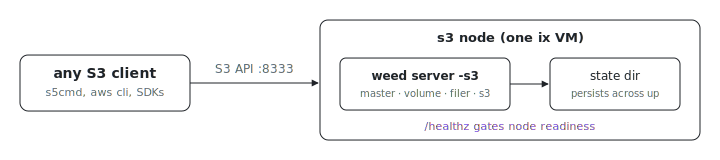

<p align="center"></p>

# S3 storage

Need an S3 endpoint for a demo or a test suite without an AWS account? This
example runs a single-node, S3-compatible object store in one ix VM, backed
by [SeaweedFS](https://github.com/seaweedfs/seaweedfs): the
[`services.ix-seaweedfs`](../../../modules/services/seaweedfs/) module runs
one `weed server -s3` process (master, volume, filer, and S3 gateway in one
binary) and opens only the S3 port in the firewall. Point any S3 client at
port `8333` and read/write buckets.

## Run

```sh
# From the index repo root.
nix run .#s3-storage-up
```

The node holds object data, so it persists across `up` runs instead of being
recreated. The module also publishes a `/healthz` readiness check on the S3
port, so ix reports the node healthy only once the gateway is actually
serving. Get the repo with `git clone https://github.com/indexable-inc/index`.

## Smoke test

Shell into the node and run a round-trip with the bundled
[`s5cmd`](https://github.com/peak/s5cmd). The demo endpoint and credentials
are exported as environment variables (`S3_ENDPOINT_URL`,
`AWS_ACCESS_KEY_ID`, `AWS_SECRET_ACCESS_KEY`), so the commands need no flags:

```sh
s5cmd mb s3://demo-bucket
echo "hello from ix" > /tmp/hello.txt
s5cmd cp /tmp/hello.txt s3://demo-bucket/hello.txt
s5cmd cat s3://demo-bucket/hello.txt   # -> hello from ix
s5cmd ls s3://demo-bucket/
```

Create the bucket with `mb` before the first write; SeaweedFS does not
auto-create buckets on PUT.

## Credentials

This example bakes a demo access/secret key pair into the image on purpose so
it runs with no setup. The keys are `ix-demo-access-key` /
`ix-demo-secret-key`, defined in [`service.nix`](service.nix).

For anything real, drop the demo config and point the module at a runtime
secret file so keys never enter the Nix store:

```nix
services.ix-seaweedfs = {
  enable = true;
  configFile = "/run/secrets/seaweedfs-s3.json";
};
```

The file is SeaweedFS's S3 identities format: an `identities` array of
`{ name, credentials: [{ accessKey, secretKey }], actions }`. Running with no
`configFile` requires setting `allowAnonymous = true`, since an
unauthenticated S3 endpoint is otherwise refused at evaluation.

## Bad fit if

- **You need replication or HA.** This is one node with one copy of the data.
  SeaweedFS scales out, but that is a multi-node deployment this example does
  not cover.
- **You need the full AWS S3 feature set.** Core object, bucket, and
  multipart operations work; lifecycle, versioning, and object-lock support
  is partial.
- **The data must survive node loss.** Object data lives in the node's state
  directory; back it up or snapshot the VM.
