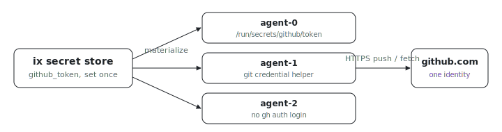

<p align="center"></p>

# Synced GitHub auth

How do you give a whole fleet of agent VMs one GitHub identity without
running `gh auth login` on each box? The fleet declares a single token; every
node wires `git` to use it through a credential helper that reads the secret
file on demand. Adding a replica needs no extra auth step.

## Run

```sh
# From the index repo root.
nix run .#synced-github-auth-up
```

Get the repo with `git clone https://github.com/indexable-inc/index`.

## Shape

- [`ix.nix`](ix.nix) defines the fleet: three `agent` replicas and a
  `deployment.secrets.github_token` attachment that delivers the stored value
  as `/run/secrets/github/token`.
- [`agent.nix`](agent.nix) installs a `git` credential helper that reads the
  token from that runtime path on demand.

## How the token reaches git

Store the value once with `ix secret set github_token`. The fleet declaration
maps that account key to `/run/secrets/github/token` for every node. Only the
key and target path enter the fleet plan; the token bytes stay in the ix
secret store and are materialized when the VM is created.

[`agent.nix`](agent.nix) registers a credential helper in `/etc/gitconfig`
scoped to `https://github.com`. When `git` needs a credential it runs the
helper, which reads the file and prints `username=x-access-token` plus the
token. The token is never exported into any process environment and is read
only at the moment `git` asks. The helper also parses the request `git` feeds
it and emits the token only when the host is `github.com` over `https`, so it
cannot hand the token to another host even if invoked outside its config
scope. A `url.insteadOf` rule rewrites both `git@github.com:` and
`ssh://git@github.com/` remotes to HTTPS so SSH-style clones use the same
token.

The helper is deliberately silent when the file is missing: it exits `0` with
no output, so a node boots and anonymous fetches work even before a token is
delivered. The [health check](agent.nix) asserts the wiring (helper resolved,
executable, and exits `0` while emitting nothing for a request it should not
answer) rather than asserting a specific token came back, so it passes in CI
where no real token exists.

## The `gh` CLI

`gh` ignores git's credential helper; it reads `GH_TOKEN` (or
`GITHUB_TOKEN`). This example does not export it globally, because an
exported token is visible in that process's `/proc/<pid>/environ`, is
inherited by every descendant process, and can land in a core dump. To
authenticate `gh` in a shell, point it at the same file:

```sh
export GH_TOKEN="$(cat /run/secrets/github/token)"
```

## Why not just share the host `~/.config`?

A tempting shortcut is to mount the operator's whole `~/.config` (or
`~/.config/gh`) into every VM over a shared folder, so `gh` and `git` pick up
the host's existing login. For a single local dev VM driven by
[`packages/vm/vmkit`](../../../packages/vm/vmkit) over virtio-fs it can be
reasonable. As a fleet primitive it has sharp edges:

- It shares far more than a token. `~/.config` holds unrelated app state,
  other services' credentials, and host-specific paths that mean nothing in a
  guest. The blast radius of a compromised VM becomes "everything in the
  operator's config dir."
- The host token is usually a broad personal credential. Per-VM scoped tokens
  (a fine-grained PAT or a GitHub App installation token) cannot be expressed
  by copying one shared file.
- Remote fleet VMs have no host filesystem to share in the first place.

Declaring one scoped secret and consuming it per node keeps the surface to a
single credential with a single owner. Whether ix should also offer a
config-sync primitive for the local dev-VM case is an open design question:
[#465](https://github.com/indexable-inc/index/issues/465).

## Bad fit if

- You need per-repo or per-agent GitHub identities on the same node. One
  system credential helper answers for all of `github.com`; split identities
  want per-user config or separate nodes.
- You want `gh` authenticated for non-interactive services. Wire `GH_TOKEN`
  into that unit through `LoadCredential` from the same file rather than the
  global environment.
