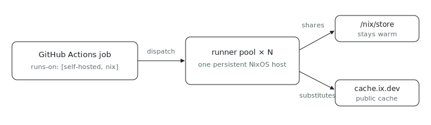

<p align="center"></p>

# ci-runner

Tired of every CI job rebuilding the world from a cold store on a throwaway cloud VM? `services.ci-runner` registers a small static pool of self-hosted GitHub Actions runners on a persistent NixOS host. The point is cache locality: jobs share the host's `/nix/store` and the cache.ix.dev public substituter, so a `nix build .#...` step substitutes warm artifacts instead of rebuilding.

This is the simple counterpart to the [`ix`](https://github.com/indexable-inc/ix)
repo's webhook dispatcher, which mints just-in-time ephemeral runners per job.
Here the runners are a fixed pool that re-register themselves, with no webhook
service and no per-job VM.

## Use it

The flake exposes the module as `nixosModules.ci-runner`; inside this repo's own
host configs it is auto-discovered, so no import line is needed there. From
another flake:

```nix
{
  inputs.index.url = "github:indexable-inc/index";
  # in a NixOS host configuration:
  imports = [ inputs.index.nixosModules.ci-runner ];
}
```

Then configure it on the host:

```nix
{
  services.ci-runner = {
    enable = true;
    url = "https://github.com/indexable-inc/index";
    tokenFile = "/run/secrets/ci-runner/token";  # one line, a fine-grained PAT
    count = 4;                                     # job concurrency
  };
}
```

`tokenFile` must hold a fine-grained PAT with read and write access to the
repository's self-hosted runners. A one-hour registration token does not work
because ephemeral runners mint a new registration on every restart.

The module wraps NixOS [`services.github-runners`][upstream] and adds the
cache.ix.dev substituter and its trusted keys to `nix.settings`, plus `git`,
`gh`, and the host's Nix on each job's PATH.

## Opt a workflow in

Set `runs-on` to `self-hosted` plus the configured `labels` (default `nix`):

```yaml
jobs:
  build:
    runs-on: [self-hosted, nix]
```

The checked-in workflows still target `ubuntu-latest`; switch one only once a
runner host is actually deployed, or the required `check` gate will hang waiting
for a runner that does not exist.

## Options

| Option      | Default                | Purpose                                      |
| ----------- | ---------------------- | -------------------------------------------- |
| `url`       | (required)             | Repo or org URL the runners register against |
| `tokenFile` | (required)             | One-line file holding a fine-grained PAT     |
| `count`     | `2`                    | Number of parallel single-job runners        |
| `labels`    | `[ "nix" ]`            | Extra `runs-on` labels                        |
| `ephemeral` | `true`                 | Single-use runners; store cache still warm   |
| `packages`  | `[ ]`                  | Extra tools on each job's PATH               |

## Bad fit if

- You need per-job VM isolation against a hostile workflow. A persistent host
  shares one kernel and one store across jobs; use the ix dispatcher's
  VM-per-job model for that boundary.
- You only run a handful of cheap jobs a month. GitHub-hosted `ubuntu-latest`
  is simpler when the cold-store rebuild cost is not the bottleneck.

[upstream]: https://search.nixos.org/options?query=services.github-runners
