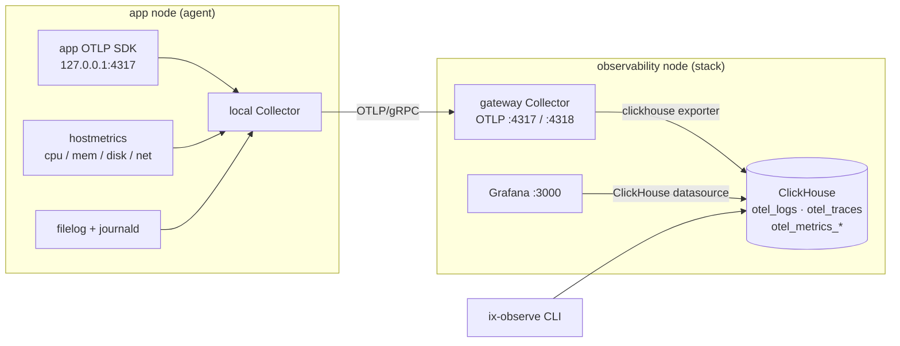
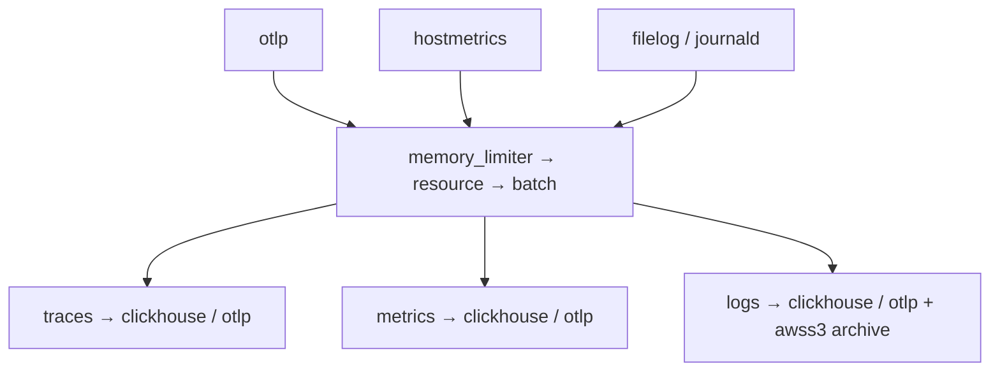
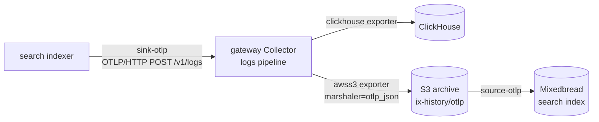

# ix Observability

`services.ix-observability` is a self-hosted [OpenTelemetry](https://opentelemetry.io/)
pipeline for an ix fleet. One module, one Collector, two jobs:

1. **Monitoring**: every service emits traces, metrics, and logs. They land in
   [ClickHouse](https://clickhouse.com/) and render in [Grafana](https://grafana.com/).
2. **Ingestion bus** ([RFC 0004](../../../rfcs/0004-otel-ingestion-bus.html)): the
   search indexer ships its document corpus through the *same* Collector, which
   archives it to S3 so the search index can read it back. A new corpus consumer
   is a new Collector exporter, not new code in every producer.

The Collector is the one moving part everything else hangs off. Read the two
diagrams and the rest follows.

## Monitoring flow

Each application node runs a local Collector (the **agent**). It forwards to one
gateway node (the **stack**) over OTLP/gRPC. The gateway writes to ClickHouse;
Grafana and the `ix-observe` CLI read from it.



## How telemetry flows through the Collector

The generated [`opentelemetry-collector`](default.nix) config has three stages.

- **Receivers** take signals in: `otlp` (gRPC `4317`, HTTP `4318`) always; plus
  `hostmetrics`, `filelog/app`, and `journald` on an agent.
- **Processors** run in order on every pipeline: `memory_limiter` (backpressure),
  `resource` (stamps `service.namespace=ix`, `deployment.environment`,
  `ix.collector.node`, and your `resourceAttributes` without overwriting
  signal-supplied values), then `batch`.
- **Exporters** send signals out: `clickhouse` (on the stack), `otlp` (forward
  east-west to another collector), and `awss3` (the archive, logs only).

Three pipelines wire them together:



Only the **logs** pipeline carries the extra `awss3` archive exporter; traces and
metrics stay on the ClickHouse/forward exporters.

## Ingestion bus (RFC 0004)

The search corpus reuses this exact pipeline. The indexer emits each document as
an OTLP **log record** (`sink-otlp`); the Collector fans it out to ClickHouse
(for Grafana) and to an S3 archive as OTLP/JSON; `source-otlp` lists that archive
and reconstructs the documents into Mixedbread.



Why route a corpus through a telemetry collector? Because the fan-out is free:
adding a consumer (a new store, a new warehouse) is one more exporter on the
Collector, not a new sink compiled into every producer. The bus is append-only;
downstream consumers dedup by `content_hash`, and `source-otlp` only turns a log
record into a document when it carries the `external_id` attribute a corpus
record always has, so a stray app log on the bus is skipped, not mis-ingested.

The archive is off by default. Turn it on with `collector.archive.enable` (see
[Configure it](#configure-it)).

## Two roles

The module is the same everywhere; two flags decide what a node runs.

| | `agent` | `stack` |
|---|---|---|
| Runs a Collector | yes (local, loopback) | yes (gateway, `0.0.0.0`) |
| Collects host metrics / app logs | yes | no |
| Runs ClickHouse + Grafana | no | yes |
| Default exporter | forwards OTLP to the gateway | writes ClickHouse |

`enable = true` turns on both for a single-node setup. For a fleet, run `stack`
on one observability node and `agent` on each app node pointed at it.

## Where the data lands

- **ClickHouse** (`otel` database): `otel_logs`, `otel_traces`, and
  `otel_metrics_*`. Native SQL on `9000`, HTTP on `8123`. Retention is the
  `clickhouse.ttl` default of `168h` (7 days).
- **S3 archive** (when enabled): OTLP/JSON objects under `ix-history/otlp`, in
  the same `ExportLogsServiceRequest` shape `sink-otlp` emits.
- **Grafana** on `3000`, with the ClickHouse datasource and the
  [`overview`](_dashboards/overview.nix) dashboard provisioned.

Ports are claimed through `ix.networking.portClaims` and only opened in the guest
firewall when the matching `openFirewall` flag is set.

## Querying

The stack installs `ix-observe`, a nushell helper that queries ClickHouse as
`JSONEachRow`:

```sh
ix shell observability -- ix-observe logs --limit 20    # recent logs
ix shell observability -- ix-observe errors             # error-status spans
ix shell observability -- ix-observe slow-spans         # slowest spans
ix shell observability -- ix-observe trace <trace-id>   # one trace, ordered
ix shell observability -- ix-observe sql "SELECT ..."   # arbitrary SQL
```

## Configure it

Single node, everything local:

```nix
{ services.ix-observability.enable = true; }
```

Fleet: one gateway, many agents (the [observability-stack example](../../../examples/observability-stack/)
wires exactly this):

```nix
# observability node
{ services.ix-observability.stack.enable = true; }

# each app node
{
  services.ix-observability.agent = {
    enable = true;
    endpoint = "observability:4317";
    filelog.paths = [ "/var/log/my-service/*.log" ];
  };
  services.ix-observability.resourceAttributes."ix.app" = "my-service";
}
```

Turn on the S3 corpus archive (RFC 0004) on the gateway:

```nix
{
  services.ix-observability.collector.archive = {
    enable = true;
    bucket = "ix-history";
    endpoint = "http://127.0.0.1:9010"; # null targets AWS S3
  };
}
```

Point your application's OpenTelemetry SDK at `127.0.0.1:4317`; the local
Collector handles batching, resource labels, and the remote write. Every option
above is declared in [`default.nix`](default.nix).

---

<sub>Written with Claude (Opus 4.8).</sub>
