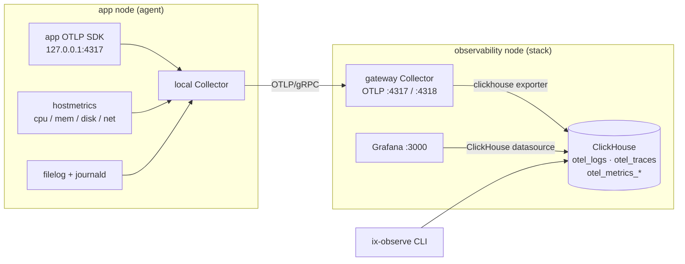
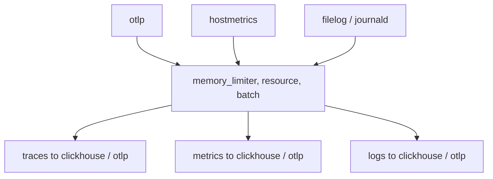

# ix Observability

`services.ix-observability` is a self-hosted [OpenTelemetry](https://opentelemetry.io/)
pipeline for an ix fleet. One module, one Collector, one job:

**Monitoring**: every service emits traces, metrics, and logs. They land in
[ClickHouse](https://clickhouse.com/) and render in [Grafana](https://grafana.com/).

This is telemetry only. The search corpus used to ride this same Collector (RFC
0004), but it moved to its own Parquet-log pipeline (issue #736, the
`source-parquet` + `sink-parquet` crates): an append-only Parquet log on object
storage as the source of truth, with the Mixedbread index as a materialized view
replayed from it. OTel is back to what it is good at.

The Collector is the one moving part everything else hangs off. Read the two
diagrams and the rest follows.

## Monitoring flow

Each application node runs a local Collector (the **agent**). It forwards to one
gateway node (the **stack**) over OTLP/gRPC. The gateway writes to ClickHouse;
Grafana and the `ix-observe` CLI read from it.



## How telemetry flows through the Collector

The generated [`opentelemetry-collector`](default.nix) config has three stages.

- **Receivers** take signals in: `otlp` (gRPC `4317`, HTTP `4318`) always; plus
  `hostmetrics`, `filelog/app`, and `journald` on an agent.
- **Processors** run in order on every pipeline: `memory_limiter` (backpressure),
  `resource` (stamps `service.namespace=ix`, `deployment.environment`,
  `ix.collector.node`, and your `resourceAttributes` without overwriting
  signal-supplied values), then `batch`.
- **Exporters** send signals out: `clickhouse` (on the stack) and `otlp` (forward
  east-west to another collector).

Three pipelines wire them together:



All three pipelines share the same exporters: ClickHouse on the stack, the `otlp`
forward on an agent.

## Two roles

The module is the same everywhere; two flags decide what a node runs.

| | `agent` | `stack` |
|---|---|---|
| Runs a Collector | yes (local, loopback) | yes (gateway, `0.0.0.0`) |
| Collects host metrics / app logs | yes | no |
| Runs ClickHouse + Grafana | no | yes |
| Default exporter | forwards OTLP to the gateway | writes ClickHouse |

`enable = true` turns on both for a single-node setup. For a fleet, run `stack`
on one observability node and `agent` on each app node pointed at it.

## Where the data lands

- **ClickHouse** (`otel` database): `otel_logs`, `otel_traces`, and
  `otel_metrics_*`. Native SQL on `9000`, HTTP on `8123`. Retention is the
  `clickhouse.ttl` default of `168h` (7 days).
- **Grafana** on `3000`, with the ClickHouse datasource and the
  [`overview`](_dashboards/overview.nix) dashboard provisioned.

Ports are claimed through `ix.networking.portClaims` and only opened in the guest
firewall when the matching `openFirewall` flag is set.

## Querying

The stack installs `ix-observe`, a nushell helper that queries ClickHouse as
`JSONEachRow`:

```sh
ix shell observability -- ix-observe logs --limit 20    # recent logs
ix shell observability -- ix-observe errors             # error-status spans
ix shell observability -- ix-observe slow-spans         # slowest spans
ix shell observability -- ix-observe trace <trace-id>   # one trace, ordered
ix shell observability -- ix-observe sql "SELECT ..."   # arbitrary SQL
```

## Configure it

Single node, everything local:

```nix
{ services.ix-observability.enable = true; }
```

Fleet: one gateway, many agents (the [observability-stack example](../../../examples/observability-stack/)
wires exactly this):

```nix
# observability node
{ services.ix-observability.stack.enable = true; }

# each app node
{
  services.ix-observability.agent = {
    enable = true;
    endpoint = "observability:4317";
    filelog.paths = [ "/var/log/my-service/*.log" ];
  };
  services.ix-observability.resourceAttributes."ix.app" = "my-service";
}
```

Point your application's OpenTelemetry SDK at `127.0.0.1:4317`; the local
Collector handles batching, resource labels, and the remote write. Every option
above is declared in [`default.nix`](default.nix).

---

<sub>Written with Claude (Opus 4.8).</sub>
