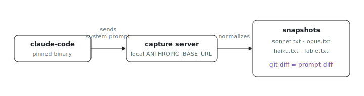

<p align="center"></p>

# Claude Code stock system prompts

What exactly changed in Claude Code's system prompt between two releases? These
are stock upstream `system` snapshots, one `.txt` per model alias, captured
through the real pinned binary talking to a local `ANTHROPIC_BASE_URL` capture
server. Diff two revisions of a file and you are diffing the prompt itself.

Snapshots intentionally exclude the per-run `x-anthropic-billing-header` block
and normalize extraction temp paths, so diffs show prompt changes only.

## Refresh

From the pinned Claude Code package:

```sh
nix run .#claude-code.updateScript -- --prompts-only
```

`models.json` is the source of truth for which model aliases are captured.

The command assumes a clone: `git clone https://github.com/indexable-inc/index`.
