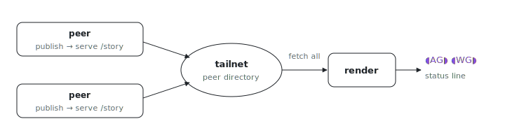

<p align="center"></p>

# claude-stories

What is everyone else's Claude session working on right now? claude-stories is
Instagram-style "stories" for [Claude Code](https://code.claude.com): a
status-line row of your teammates' avatars and what each is working on, fetched
peer-to-peer over your Tailscale tailnet with no central server. Inspired by
Ben Awad's [vscode-stories](https://github.com/benawad/vscode-stories).

```
📸 STORIES  ◖+◗  ◖AG◗  ◖WG◗  ◖HA◗
```

Each avatar is two half-circle glyphs around the author's initials, colored
along the Instagram story gradient, and is a clickable link to their repo.
Claude Code strips Kitty graphics sequences from status-line output
([anthropics/claude-code#39024](https://github.com/anthropics/claude-code/issues/39024)),
so real profile photos are not possible there; text-art rings are the faithful
substitute.

## How it works

Three commands, no central server:

- `claude-stories publish` reads the current git repo (name, branch, latest
  commit subject, author identity) and writes a story to a small state file.
- `claude-stories serve` exposes that file at `GET /story` over HTTP.
- `claude-stories render` discovers peers, fetches everyone's `/story`
  concurrently, drops anything older than 24h, and prints the avatar row.

Discovery defaults to the **Tailscale tailnet**: `tailscale status --json` is
already an authenticated, NAT-traversed directory of every online device, so it
doubles as the peer list. No DHT, no bootstrap nodes, no OAuth. Set
`CLAUDE_STORIES_PEERS=host[:port],...` to use an explicit list instead
(testing, or running off a tailnet).

## Install

```sh
nix run github:indexable-inc/index#claude-stories -- --help
```

As a Rust binary via cargo:

```sh
cargo install --git https://github.com/indexable-inc/index claude-stories
```

## Wiring it into Claude Code

Status line, in `~/.claude/settings.json`:

```json
{
  "statusLine": { "type": "command", "command": "claude-stories render" }
}
```

Publish your own story whenever you start a session, via a `SessionStart` hook
in the same file:

```json
{
  "hooks": {
    "SessionStart": [
      { "hooks": [ { "type": "command", "command": "claude-stories publish" } ] }
    ]
  }
}
```

Run the server once per host (for example through
`homeModules.portable-services`, or any launchd/systemd user unit):

```
claude-stories serve
```

## Commands

| Command | Purpose |
| --- | --- |
| `claude-stories publish [--path DIR]` | Derive the current repo's story, write the state file. |
| `claude-stories serve [--port 4810] [--bind 0.0.0.0]` | Serve the published story at `/story`. |
| `claude-stories render [--port 4810]` | Status-line row of peers' fresh stories. |
| `claude-stories show [--path DIR]` | Print the current repo's story as JSON. |

## Known limitations

- **No real avatars in the status line.** Image escapes are stripped by Claude
  Code today; this renders initials in gradient rings instead.
- **Off-tailnet needs explicit peers.** Without Tailscale, discovery has nothing
  to enumerate, so set `CLAUDE_STORIES_PEERS`. A hosted rendezvous transport is
  a natural future addition for the public case.
- **`serve` binds `0.0.0.0` and is unauthenticated.** It serves low-sensitivity
  data (your latest commit subject) and relies entirely on your tailnet ACLs, so
  the same port is reachable from any other network the host is on. Firewall it
  to the Tailscale interface, or pass `--bind` your tailnet IP, on shared
  networks.
- **Your story is the last repo you published from**, not a live view of
  whatever directory each Claude session is in. Re-run `publish` (the hook does
  this) to update it.
