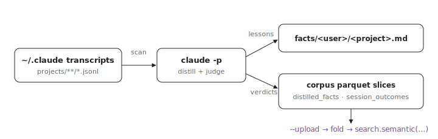

<p align="center"></p>

# distiller

Your agents keep relearning the same lessons: where does last week's hard-won
fix go? distiller reads local Claude Code transcripts and distills
**ReasoningBank-style lessons** into (a) human-readable facts markdown per
`(user, project)`, (b) a `source=distilled_facts` **corpus parquet slice**, and
(c) a `source=session_outcomes` slice with one LLM-judged **outcome verdict per
session**. The existing archive → Iceberg-lake → Mixedbread funnel publishes
both slices automatically: the leader fold ingests `(host, user, source)`
slices generically, so this needs zero Rust (see `packages/search/sink/parquet`
and ix `docs/history-archive.md`).

## What it does

1. Reads `~/.claude/projects/**/*.jsonl` for one user over a `--days` window,
   groups sessions by project (`cwd`), and extracts signals: the goal (first
   user message), user corrections, tool errors (`is_error` tool_results),
   success markers ("Pushed to main", tests passing), and the final assistant
   message.
2. Distills via headless `claude -p` (default model
   `claude-haiku-4-5-20251001`): strategy-level, itemized lessons from
   successes **and** failures (guardrails), each one self-contained with
   title, ≤120-word body, scope (`user:<name>` or `shared`), outcome label,
   and provenance (session ids, repo, date range).
3. The same `claude -p` call also **judges every session** it was shown:
   one verdict per session id with a label (`success` / `partial` /
   `failure` / `abandoned`) and a one-line reason; sessions the model skips
   fall back to the scan heuristics so the verdict set never has holes.
   Lessons whose evidence includes a failed session (the most valuable
   guardrails) carry `session_labels` + `failure_derived` in their meta.
4. Merges **incrementally** with the previous run's items: stable item ids,
   `add`/`update` operations only, unmentioned items survive verbatim, never
   wholesale regeneration (ACE's brevity-bias / context-collapse warning).
   State (items, seen sessions, verdicts) lives under
   `<out>/state/<user>/<project>.json`.
5. Writes `<out>/facts/<user>/<project>.md` and two parquet slices at
   `<out>/corpus/host=<h>/user=<u>/source=distilled_facts/` (lessons) and
   `.../source=session_outcomes/` (one row per judged session: body = reason
   + key stats; meta_json = label, turn count, duration, models used) with
   the exact 9-column contract (`external_id, source, content_hash, title,
   url, host, timestamp, body, meta_json`) + `_manifest.json` sorted-pairs
   sha256, then validates each slice by re-reading it with polars (schema,
   dtypes, per-row `sha256:<hex>` body hashes, manifest hash, metadata
   limits).
6. `--upload` puts the slices into the fleet MinIO archive
   (`http://127.0.0.1:9010`, bucket `ix-history`, prefix `corpus`); the
   leader's hourly fold + view reconcile then make them searchable
   (`search.semantic(..., source=["distilled_facts"])`, likewise
   `source=["session_outcomes"]`).

## Usage

```sh
nix run github:indexable-inc/index#distiller -- --days 7 --user andrew \
  --out /var/lib/ix-distiller \
  [--project index] [--model claude-haiku-4-5-20251001] \
  [--upload [--env-file /run/ix-secret-store/env/ix-indexer]]
```

The installed binary is `ix-distiller` with the same flags.

Updates come free with the contract: rewriting the slice with the current
desired item set folds each `external_id` to its newest `content_hash` on the
next fold. Vanished ids are NOT deleted; the lake fold is append/merge only,
so a row absent from a newer slice stays live (ENG-2696). Deletion takes an
explicit tombstone (the indexer's `--gc` path for export-complete sources).

## Tests

`nix build .#distiller` runs the import smoke test; passthru checks run
pytest over the parquet contract (schema, content/manifest hashes, tamper
rejection), the incremental merge (stable ids, update-not-rewrite, caps),
transcript signal extraction, and the outcome-labeling path (verdict
normalization + fallback, the session_outcomes slice, failure-derived
lesson marking, and an end-to-end run against a mocked `claude -p` that
keeps the `PROMPT_SENTINEL` anti-recursion filter honest).

Repo-local commands assume a clone:
`git clone https://github.com/indexable-inc/index`.
