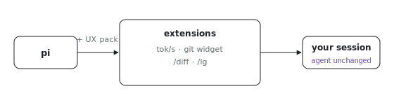

<p align="center"></p>

# pi-base

What do you want in every pi session regardless of the task? pi-base is pi with
a small base UX pack: quality-of-life extensions that are a plus for any setup,
with no behavior changes to the agent itself.

Adapted from [davis7dotsh/my-pi-setup](https://github.com/davis7dotsh/my-pi-setup)
(MIT, (c) 2026 Benjamin Davis).

## What you get

| Piece | Surface | What it does |
| --- | --- | --- |
| `tps-tracker` | footer status | live tokens/sec while streaming (estimated until official usage arrives), final per-run summary toast |
| `git-status-widget` | widget above editor | ` <branch> · N unstaged files`, refreshed every 2s and on input/tool activity |
| `turn-diff` | `/diff`, `/diff list`, `/diff clear` | tracks exactly which files the last agent run touched (git baseline diff + edit/write tool targets), toast at run end, picker to open one in `$PI_DIFF_EDITOR`/`$EDITOR` |
| `lg` | `/lg` | concise summary of unstaged changes with per-file +/- counts; queues as follow-up if the agent is busy |

## Run

```sh
ANTHROPIC_API_KEY=... nix run github:indexable-inc/index#pi-base -- "your task"
PI_HARNESS_MODEL=codex OPENAI_API_KEY=... nix run github:indexable-inc/index#pi-base
```

The extension files also land in `share/pi-base/`, so they can be symlinked
into `~/.pi/agent/extensions/` (e.g. via home-manager) to get the same UX in a
plain `pi` session.
