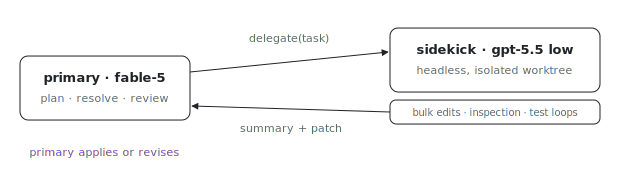

<p align="center"></p>

# pi-fusion

Why spend frontier-model turns on bulk inspection and mechanical edits?
pi-fusion runs a Pi primary agent that delegates bounded work to a cheaper
headless sidekick model, keeping the expensive model on planning,
ambiguity-resolution, monitoring, and final review.

## How it works

1. The primary session runs on the normal harness model alias, defaulting to
   `fable` (`fable-5`).
2. The primary delegates bounded work with
   `delegate({ task, acceptance?, mode?, timeoutSec? })`.
3. The sidekick runs as a headless Pi worker, defaulting to OpenAI `gpt-5.5`
   with `thinking=low`.
4. The sidekick works in an isolated git worktree off `HEAD`, returns a concise
   summary plus a patch, and the primary decides whether to apply or revise it.

The intended posture is Fusion-style: the primary should do planning,
ambiguity-resolution, monitoring, and final review; the sidekick should do bulk
inspection, mechanical edits, and test loops.

## Config

- `PI_HARNESS_MODEL` - primary model alias; defaults to `fable`.
- `PI_FUSION_SIDEKICK_MODEL` - sidekick model id; defaults to `gpt-5.5`.
- `PI_FUSION_SIDEKICK_PROVIDER` - sidekick provider; defaults to `openai`.
- `PI_FUSION_SIDEKICK_THINKING` - sidekick thinking level; defaults to `low`.
- `PI_FUSION_GOAL` - optional explicit goal; otherwise captured from the first
  user message.

Sonnet can be tried later without changing the harness:

```sh
PI_FUSION_SIDEKICK_PROVIDER=anthropic \
PI_FUSION_SIDEKICK_MODEL=sonnet-5 \
PI_FUSION_SIDEKICK_THINKING= \
nix run github:indexable-inc/index#pi-fusion -- "your task"
```

## Run

```sh
ANTHROPIC_API_KEY=... OPENAI_API_KEY=... nix run github:indexable-inc/index#pi-fusion -- "make the failing test pass"
```

## Current limit

This first cut delegates headless sidekick turns and keeps sidekick file
changes isolated until the primary applies the returned patch. It does not yet
keep a durable sidekick process with a cached long-lived context. The next step
is to replace `runner/sidekick.js` with a session runner while preserving the
same `delegate` tool contract.
