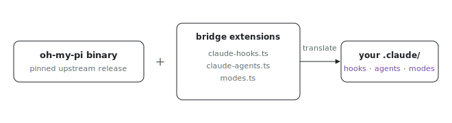

<p align="center"></p>

# omp

Want your Claude Code hooks and agents to keep working under a different
harness? This is the [oh-my-pi](https://github.com/can1357/oh-my-pi) (`omp`)
coding-agent setup: the pinned upstream release binary plus the extensions and
smoke test that make Claude Code assets work under it. Copied from the personal
nix repo (`flake/omp.nix`, `dots/omp/extensions/`, `scripts/omp/`); that repo
remains the deployed source, this is the shared home alongside the other
harnesses.

Unlike its siblings, `omp` is not built through `shared/mk-pi-harness.nix`: it
is upstream's own harness distribution (a self-contained `bun build --compile`
binary), packaged from the GitHub release because a from-source nix build needs
network inside the sandbox at three stages (bun dependency install, the
cross-target bun runtime download, the napi addon pipeline). See default.nix
for the bump procedure.

```sh
nix run github:indexable-inc/index#omp
```

## Layout

```
omp/
  default.nix                   # pinned release binary (autoPatchelf'd on Linux)
  extensions/
    claude-hooks.ts             # Claude Code hook protocol bridge (settings.json hooks run under omp)
    claude-agents.ts            # .claude/agents/*.md -> omp task-agent translation
    modes.ts                    # /mode: named modelRoles bundles from ~/.omp/agent/modes.json
  smoke/
    claude-hooks-smoke.sh       # end-to-end bridge smoke; run when bumping the pin
```

## Wiring

The extensions are user-level, not baked into the binary: symlink them into
`~/.omp/agent/extensions/` (the deployed home config does exactly that).
`modes.ts` additionally reads mode definitions from `~/.omp/agent/modes.json`,
a JSON object of `{ <name>: { description?, roles: { default, task, ... } } }`
with `provider/model[:thinking][,fallback...]` role syntax.

The smoke test needs a working `omp` with model credentials (it does real `-p`
runs), so it is a manual gate, not a nix check:

```sh
OMP=$(nix build .#omp --print-out-paths)/bin/omp \
  packages/agent/pi-harnesses/omp/smoke/claude-hooks-smoke.sh
```

The smoke command assumes a clone:
`git clone https://github.com/indexable-inc/index`.
