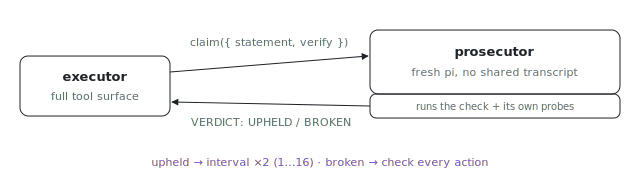

<p align="center"></p>

# pi-prosecutor

Who checks your agent's claims when it grades its own homework? pi-prosecutor
runs an executor under a skeptical supervisor with earned-trust check-ins: the
executor must periodically state a falsifiable claim, and a context-isolated
prosecutor verifies it against the real repo.

## How it works

1. The executor works normally with its full tool surface.
2. On an adaptive interval it is forced to stop and state one falsifiable
   claim: `claim({ statement, verify })`. Until it does, the `tool_call` gate
   blocks every other tool.
3. The claim is handed to a **prosecutor**: a fresh `pi --print --no-session`
   process on the same executor-class model (opus-4-8 / gpt-5.5 medium) with NO
   access to the executor's transcript. It runs the suggested check plus its
   own probes and returns `VERDICT: UPHELD` or `VERDICT: BROKEN <evidence>`.
   The asymmetry that matters is context isolation, not a weaker model.
4. Trust is earned: an upheld claim doubles the check-in interval (1 to 16); a
   broken claim snaps it back to every action and tells the executor to
   recover.

No shared context means the two agents cannot launder each other's
hallucinations: the supervisor only ever sees the claim and the repo.

## Pieces

- `extension/prosecutor.ts` - the gate, the `claim` tool, the trust loop.
- `shared/ext-lib/trust.js` - earned-trust interval state machine
  (unit-tested).
- `shared/ext-lib/child-agent.js` - spawns the isolated prosecutor.
- `shared/ext-lib/probes.js` - parses the verdict (fails closed on ambiguity).

## Config

- `PI_HARNESS_MODEL` - executor model alias (default `claude` = opus-4-8;
  `codex` = gpt-5.5 medium).
- `PI_PROSECUTOR_PROVIDER` / `PI_PROSECUTOR_MODEL` / `PI_PROSECUTOR_THINKING` -
  override the prosecutor model; defaults to the active executor model.
- `PI_PROSECUTOR_GOAL` - objective for the prosecutor to judge against; if
  unset, captured from the first user message.

## Run

```sh
ANTHROPIC_API_KEY=... nix run github:indexable-inc/index#pi-prosecutor -- "make the failing test in foo/ pass"
```
