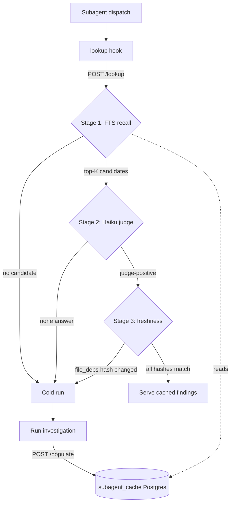

# subagent-cache

A small axum + Postgres daemon (lib `subagent_cache`, bin `subagent-cache`,
ENG-4665) that serves a repeated read-only subagent investigation from a prior
finding while every file that finding read is still byte-for-byte unchanged. It
is developer tooling for the Claude Code investigation subagents: tailnet-only,
fail-open, with no production data path. A daemon outage is invisible to
developers (silent cold run).

## How the cache works

A cache hit must clear three gates. The daemon owns the first two; the client
hook owns the third, because only the client can see its working tree.

1. **Stage 1 recall (daemon, `store::recall`).** Postgres full-text search ranks
   non-expired rows of the same `agent_type` and persona by
   `ts_rank(question_tsv, plainto_tsquery(...))`, returning the top-K above the
   recall floor, best-first.
2. **Stage 2 judge (daemon, `judge::judge`).** A single Haiku-class Anthropic
   Messages API call decides which recalled candidates genuinely answer the new
   question. Biased to exclude under doubt: a false miss costs a redundant cold
   run, a false hit serves a wrong answer, so any decode/parse failure is
   fail-closed.
3. **Stage 3 freshness (client hook).** The hook re-hashes each returned
   `file_deps` path against disk and re-checks the persona. A single changed
   hash drops the candidate to a cold run. The daemon never touches the
   filesystem, so `file_deps` hashes are opaque strings to it.

A finished cold investigation is upserted back via `POST /populate`, so the next
identical question can hit. The client hooks own all working-tree hashing and
speak the same xxh64 freshness language as the mgrep search index.

## HTTP API

axum router in `src/http.rs`, three routes:

- `POST /lookup` (`LookupRequest` -> `LookupResponse`): runs Stage 1 then Stage
  2, returns judge-positive candidates (id, findings, file_deps) for the client
  to validate. An empty list means run cold.
- `POST /populate` (`PopulateRequest` -> 204): upserts one finished
  investigation onto the `(agent_type, question, agent_def_hash)` key.
- `GET /healthz`: liveness.

Every error variant maps to a 500 with a generic body; the hook fails open, so
detail is for operators (logs), not the client. Lookups log to the
`subagent_cache.lookup` target with `recalled`/`judged`/`result` for hit-rate
measurement.

## Config

`Config` (`src/config.rs`), all CLI flags with env fallbacks:

| flag / env | default | meaning |
| --- | --- | --- |
| `--database-url` / `DATABASE_URL` | (required) | dedicated cache Postgres URL; carries the password, never on argv |
| `--bind` / `SUBAGENT_CACHE_BIND` | `127.0.0.1:8787` | HTTP bind address |
| `--diagnostics-addr` / `SUBAGENT_CACHE_DIAGNOSTICS` | none | service-init localhost health/allocator addr |
| `--recall-top-k` / `SUBAGENT_CACHE_TOP_K` | `3` | FTS candidates the judge may inspect |
| `--recall-floor` / `SUBAGENT_CACHE_RECALL_FLOOR` | `0.01` | minimum `ts_rank` to reach the judge |
| `--ttl-days` / `SUBAGENT_CACHE_TTL_DAYS` | `7` | TTL backstop: expiry after last populate even if no file changes |
| `--judge-api-base` / `SUBAGENT_CACHE_JUDGE_API_BASE` | `https://api.anthropic.com` | Messages API base |
| `--judge-model` / `SUBAGENT_CACHE_JUDGE_MODEL` | `claude-haiku-4-5` | judge model id |

`ANTHROPIC_API_KEY` is read once from the environment at startup (fail-fast,
never on argv). Recall floor and top-K are config on purpose: the design fixes
their shape but not their values, which must be tuned against measured hit and
false-hit rates.

## Storage

A dedicated `standalone` Postgres role and database `subagent_cache`,
deliberately separate from the user-facing database so a disposable dev-tooling
cache never shares a process with production data. The daemon applies
`schema.sql` idempotently on startup (`store::bootstrap`); it is not part of the
prod migration runner. One table, `subagent_cache`, with a generated
`question_tsv` column (gin-indexed for Stage-1 recall), a `(agent_type,
agent_def_hash, expires_at)` recall index, and a unique `(agent_type, question,
agent_def_hash)` key that `populate` upserts onto.

## Deploy

`modules/services/subagent-cache/default.nix`, option
`services.ix.subagentCache`. The daemon binds the node's tailscale address and
the port is opened on `tailscale0` only, so the hooks reach it over the trusted
tailnet with no nginx/TLS vhost. It co-locates with its standalone Postgres on
the role's owner host and reaches it over the host vrack address.
