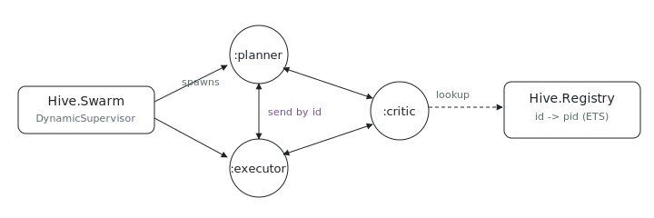

<p align="center"></p>

# Hive

Ever wanted a swarm of agent actors where any agent can message any other, with no edges to wire? Hive is a tiny, fully connected mesh of agent actors in Elixir: spawn agents at runtime and address them by a logical id, not a pid. It is an experimental personal package (moved out of a standalone checkout) that doubles as the reference user of the repo's Elixir type-discipline gate.

## Run it

```sh
nix run github:indexable-inc/index#hive   # spawns :planner/:executor/:critic, has them talk, prints inboxes
```

From a clone (`git clone https://github.com/indexable-inc/index`): `nix run .#hive`.

## The three pieces

```
Hive.Application          OTP supervision tree, starts the two below
├── Hive.Registry         id -> pid table (ETS-backed, concurrent reads)
└── Hive.Swarm            DynamicSupervisor: spawns one process per agent
        └── Hive.Agent    a GenServer; one actor per agent
```

- **`Hive.Agent`**: each agent is a GenServer holding its own inbox, registered
  under a logical `id` via a `:via` tuple so it is addressable by `id`, not pid.
- **`Hive.Registry`**: the `id -> pid` map; lookups read ETS directly and run
  concurrently, and an agent's entry is auto-removed when it crashes.
- **`Hive.Swarm`**: a `DynamicSupervisor`, so agents are spawned on demand and
  each is supervised independently (`:one_for_one`).

## Type discipline (Elixir 1.18 set-theoretic types)

This package is built with Elixir 1.18, whose set-theoretic gradual type checker
runs as part of `mix compile`. Two gates enforce the typed style:

1. **`mix compile --warnings-as-errors`**: the actual type check. It runs in the
   sandboxed `passthru.tests.elixir` derivation (wired into the repo's flake
   `checks` in `lib/per-system.nix`), so a type error fails CI. See
   [`default.nix`](./default.nix).
2. **`astlog-rules/elixir.astlog`**: a lint (run over every package's `lib/` by
   `nix run .#lint`) that *forces* the shape the checker can actually check:
   - every `defstruct` needs a `@type` (so struct fields are typed, not `dynamic`);
   - every public `def` needs an adjacent `@spec` (behaviour-callback `@impl`
     functions are exempt).

`Hive.Agent.State` is a typed struct, and every public function and callback
carries a `@spec`, so both gates pass. Try breaking it: change `state.inbox` to
`state.outbox` and `mix compile` reports a `typing violation` at that exact column.

## Type internals

See the module docs in [`elixir/lib/hive/agent.ex`](./elixir/lib/hive/agent.ex)
for how the typed struct, set-theoretic `@type`s (atom-singleton ids, tagged-tuple
envelopes, union return types), and guard narrowing combine.
