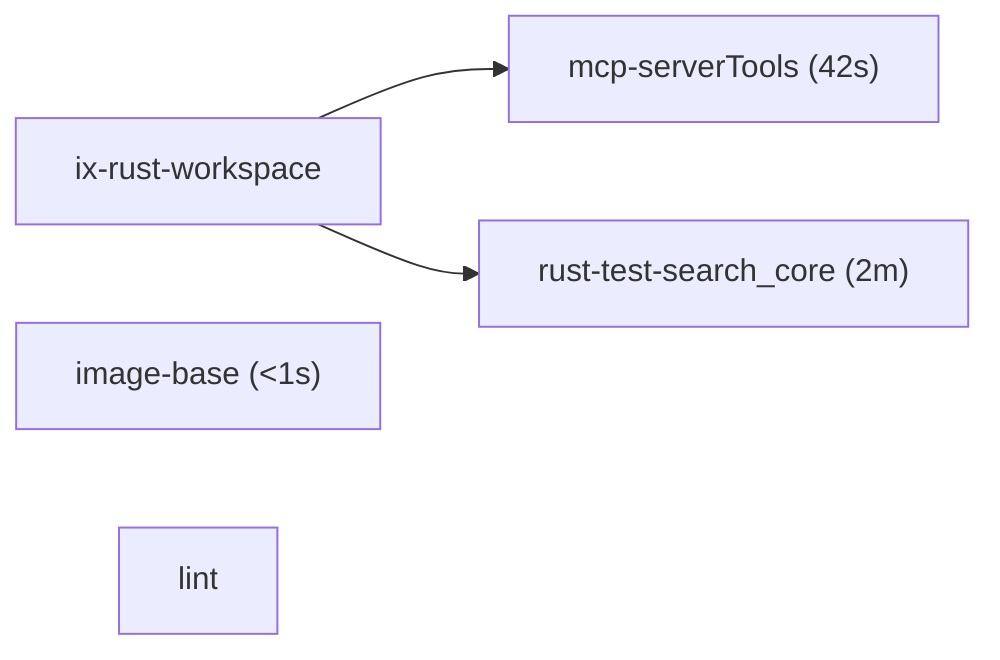

<!-- blast-radius -->
### Blast radius

`5` of `120` checks would rebuild between base `aaaaaaa` and head `bbbbbbb`.

1 added, 0 removed

changed checks (4)

- mcp-serverTools (42s)
- rust-test-search_core (2m)
- image-base (<1s)
- lint

