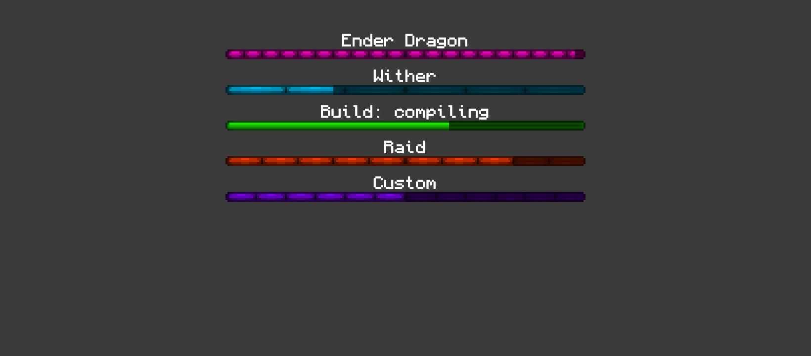

# Boss Bar Overlay

A transparent, always-on-top, click-through desktop overlay that draws
Minecraft boss bars across the top of your screen. The bars are driven entirely
by a single SQLite file: write rows into it from anything (a shell, a script, a
cron job, another program) and they appear on screen within ~200ms.

The bars are rendered from Minecraft's actual boss bar sprite textures, layered
the same way the game's `BossHealthOverlay` does (color background, color
progress clipped to the fill, then the notch overlay), so the result is a 1:1
match. It is a native [`winit`](https://github.com/rust-windowing/winit) +
[`wgpu`](https://github.com/gfx-rs/wgpu) app with no webview: the window is
transparent, always-on-top, and passes the mouse straight through, so the bars
float over whatever you're doing.



## Run

```sh
nix run .#bossbar-overlay
```

For local Rust development, fetch the Mojang art once (sprites + the Minecraft
TTF), then build with cargo:

```sh
cd app
bash scripts/fetch-assets.sh   # downloads into app/assets/, no-op once present
cargo run                      # the overlay
```

Each bar is its own small transparent, always-on-top, borderless window sized to
just that bar. Because there is no window except over a bar, the desktop stays
fully usable everywhere else: only the bars intercept the mouse. There is no
tray; quit it the way you quit any foreground process (Ctrl-C from the terminal,
or stop the service that runs it). `BOSSBAR_SCALE=3` (or `--scale 3`) enlarges
the bars.

The bars are interactive: hover one and it eases to fully opaque and gently
grows with a slow breathing pulse (the cursor becomes a grab hand), and you can
drag it anywhere on screen. Dragging uses the
platform's native window drag, and the drop location is saved to the bar's
`x`/`y` columns, so it stays put across restarts. Bars without a saved position
auto-stack in a top-center column. This works the same on macOS and Linux.

A bar can carry a longer `description`. When it does, hovering unfolds a flat
panel below the bar with the description wrapped to the bar's width, in the same
Minecraft font, with a one-pixel border tinted to the bar's color. Newlines in
the description start new paragraphs. The window only grows to fit the panel
while you hover, so the area below a bar stays click-through the rest of the
time; a bar with an empty description behaves exactly as before. See the
seeded Ender Dragon bar for an example.

Known limitations: some Linux tiling window managers force-place or tile
borderless windows, which can fight the free-drag placement. An auto-stacked
bar's open panel can overlap the bar stacked below it while you hover; pin bars
apart by dragging if that bothers you. A panel on a bar pinned near the bottom
of the screen unfolds off-screen.

To verify rendering without a window, render the current bars straight to a
transparent PNG:

```sh
nix run .#bossbar-overlay -- --snapshot out.png --scale 3 --size 760x620
```

The snapshot draws every described bar with its panel fully open, so it doubles
as a way to proof-read a description's wrapping without hovering.

## CLI

`./bossbar` is a small wrapper around the same database the overlay reads, so
you don't have to hand-write SQL. It works whether or not the app is running and
creates the schema on demand.

```sh
./bossbar add "Ender Dragon" --color pink --overlay notched_20 --progress 0.8 \
  --description "Destroy the End Crystals first or it heals back to full."
./bossbar set "Ender Dragon" --progress 0.5      # match by title ...
./bossbar set 1 --color red --visible 1          # ... or by id
./bossbar set 1 --description ''                 # clear the hover panel
./bossbar list
./bossbar rm "Ender Dragon"
./bossbar clear
./bossbar db                                     # print the database path
```

Or skip the wrapper and write SQL directly:

```sh
DB="$(./bossbar db)"
sqlite3 "$DB" "UPDATE bossbars SET progress = 0.5 WHERE title = 'Ender Dragon';"
```

## The data contract

The overlay reads one table. On first launch it creates the database and seeds
three example bars so you can see it working.

```sql
CREATE TABLE bossbars (
  id          INTEGER PRIMARY KEY,
  title       TEXT    NOT NULL DEFAULT '',   -- text shown above the bar
  description TEXT    NOT NULL DEFAULT '',   -- hover pop-down body (may wrap/paragraph)
  progress    REAL    NOT NULL DEFAULT 1.0,  -- fill fraction, 0.0 .. 1.0
  color       TEXT    NOT NULL DEFAULT 'purple',
  overlay     TEXT    NOT NULL DEFAULT 'progress',
  visible     INTEGER NOT NULL DEFAULT 1,    -- 0 hides the row
  position    INTEGER NOT NULL DEFAULT 0,    -- sort order in the auto column
  x           REAL,                          -- pinned location (logical points)
  y           REAL                           -- NULL/NULL = auto-stacked
);
```

- **color**: `pink`, `blue`, `red`, `green`, `yellow`, `purple`, `white`
  (Minecraft's seven boss bar colors). Unknown values fall back to `purple`.
- **overlay**: `progress` (smooth) or `notched_6` / `notched_10` / `notched_12`
  / `notched_20` (segmented), matching Minecraft's overlay styles.
- **description**: longer text shown in the panel that unfolds below the bar on
  hover. Empty (the default) means no panel. Lines wrap to the bar's width;
  newlines start new paragraphs.
- **x / y**: pinned screen location in logical points, written when you drag a
  bar. Leave both `NULL` (the default) to keep the bar in the auto-stacked
  top-center column ordered by `position`; setting them floats the bar free.

This mirrors Minecraft's own boss bar API, so the fields should feel familiar.

### Where the database lives

Default: `~/Library/Application Support/bossbar-overlay/bossbars.db` on macOS
(`$XDG_DATA_HOME/bossbar-overlay/bossbars.db` on Linux). The resolved path is
printed to stdout on launch and printed by `./bossbar db`. Override it with
`BOSSBAR_DB=/path/to.db`.

Any committed write bumps SQLite's `PRAGMA data_version`, which the app polls
four times a second to know when to re-read. The database runs in WAL mode so
your writers never block the overlay's reader.

## How it works

The app lives under `app/` as a standalone Rust crate (its own Cargo workspace,
off the repo's main graph):

- `app/src/db.rs` — opens the DB (bundled SQLite via `rusqlite`), polls
  `data_version` four times a second, and hands fresh bars to the UI thread on
  every change.
- `app/src/overlay.rs` — the winit event loop: one transparent, always-on-top,
  borderless window **per bar**, each sized to just that bar, so the desktop is
  click-through everywhere off a bar with no `set_cursor_hittest`. macOS runs as
  an `Accessory` app (no Dock icon). Hover fires native `CursorEntered`/`Left`
  (the bar grows; a described bar grows its window to make room for the panel and
  shrinks back once the hover eases out); pressing calls the native
  `Window::drag_window`. The watcher wakes the loop on every DB write.
- `app/src/render.rs` — the wgpu renderer: one textured-quad pipeline draws the
  same layer stack Minecraft uses, clipping the progress layers to the fill
  fraction with nearest sampling (crisp pixels). Titles and the description panel
  are drawn with [`glyphon`](https://github.com/grovesNL/glyphon) in a
  pixel-accurate Minecraft TTF
  ([tryashtar/minecraft-ttf](https://github.com/tryashtar/minecraft-ttf)), with
  the vanilla one-pixel drop shadow. The same pipeline draws the panel's flat
  fill and border via a 1x1 white texture tinted by a per-vertex color.
- `app/src/snapshot.rs` — runs the identical renderer headlessly into a PNG, so
  the transparent overlay can be verified from a file.

## Notes / limits

- There is no tray icon; quit the overlay like any foreground process
  (Ctrl-C, or via the service that runs it).
- Click-through relies on `set_cursor_hittest`, which some Wayland compositors
  do not implement; on those the window may capture clicks.
- The window covers the top ~45% of the **primary** monitor. Multi-monitor and
  per-monitor placement aren't handled yet.
- The boss bar textures and the Minecraft title TTF are Mojang-derived art and
  are **not** redistributed in this repo; they are fetched at build time (the
  Nix derivation, or `app/scripts/fetch-assets.sh` for local builds) for
  personal use. This project is not affiliated with or endorsed by Mojang.

Implemented with AI assistance (Claude, Opus 4.8).
