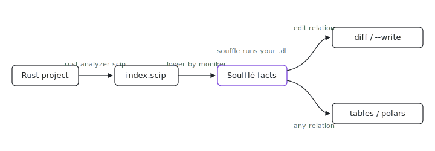

<p align="center"></p>

# scipql

Want to rename `net::Socket` without touching `mock::Socket`, or query your codebase by symbol identity instead of by string? scipql runs Soufflé datalog plus find/replace over a **SCIP semantic index**: every occurrence carries its SCIP **moniker**, so queries and rewrites operate on resolved identities, not text. Renaming one `Socket` never touches the other (or the struct's own `fd` field).

Where [`astlog`](../astlog) runs datalog over tree-sitter *syntax*, scipql runs
it over the *resolved* index rust-analyzer produces.

## Get it

```sh
nix run github:indexable-inc/index#scipql -- --help
```

The nix package wraps the repo's pinned Rust toolchain (rust-analyzer,
rust-src, cargo/rustc) and puts `souffle` on `PATH`. A bare
`cargo install --git https://github.com/indexable-inc/index scipql` builds the
same binary, but then `rust-analyzer` and `souffle` are yours to supply.
Source: `git clone https://github.com/indexable-inc/index`.

## Layout

- `core/` (`scipql-core`): index (run `rust-analyzer scip`), lower the SCIP
  index to Soufflé facts, run queries, and apply the `edit` relation via the
  shared [`edit-applier`](../edit-applier) crate.
- `cli/` (`scipql`): the `scipql` binary, wrapped with the repo's pinned Rust
  toolchain (rust-analyzer + rust-src + cargo/rustc) and `souffle` on `PATH`.
- `py/` (`scipql-py`): PyO3 bindings; `import scipql` in the ix-mcp kernel,
  returning polars frames.

## CLI

```sh
scipql index . -o index.scip                  # run rust-analyzer scip
scipql query index.scip rules.dl              # run Soufflé, print output relations
scipql fix index.scip rules.dl                # apply the edit relation (dry-run diff)
scipql fix index.scip rules.dl --write        # ...and write it
scipql rename index.scip 'net/Socket#' Stream # rename a symbol (dry-run)
scipql rename index.scip 'net/Socket#' Stream --write
```

`index` is the slow step (it loads the cargo workspace). `query`/`fix`/`rename`
run on an already-built `index.scip`.

## Fact relations

A query's program is prepended with this schema, so these are always in scope:

```
occurrence(symbol, path, start, end, role)   # role: definition | reference; start/end are byte offsets
symbol_info(symbol, kind, display_name)
document(path)
relationship(symbol, related, kind)          # kind: implementation | type_definition | reference | definition
```

`symbol` is the SCIP moniker (e.g. `rust-analyzer cargo mycrate 0.1.0 net/Socket#`).
Local symbols are namespaced by path so they stay unique across files.

### Writing a `fix`

A `fix`/`rename` program must `.output` an `edit` relation with byte-offset
columns (the schema is prepended automatically):

```
.decl edit(path:symbol, start:number, end:number, replacement:symbol)
.output edit
```

`rename` is just a generated `fix` that suffix-matches the moniker; for anything
more selective, write the `.dl` yourself: nothing is hidden.

## Python (ix-mcp kernel)

```python
import scipql
scipql.index("/path/to/crate", "index.scip")          # needs rust-analyzer (use the CLI in the kernel)
facts = scipql.facts("index.scip")                     # {relation: pl.DataFrame}
out = scipql.query("index.scip", rules)                # {relation: pl.DataFrame}
print(scipql.rename("index.scip", "net/Socket#", "Stream"))        # diff
scipql.rename("index.scip", "net/Socket#", "Stream", write=True)   # apply
```

The kernel bakes `souffle` (via `SCIPQL_SOUFFLE`), so `query`/`fix`/`rename`
work out of the box; `index` shells `rust-analyzer`, so run it from the `scipql`
CLI (which bakes the toolchain) rather than the kernel.

## Languages

Rust today (via `rust-analyzer scip`). The facts/query/edit layers are
language-agnostic: other SCIP indexers (`scip-typescript`, `scip-python`, ...)
plug in by adding an indexer command.
