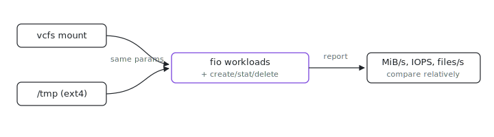

<p align="center"></p>

# Filesystem Bench

Is the filesystem your VM sees actually slower than plain ext4, and by how much? This is a small fio-based benchmark you run inside the VM against the real target path, then run again against `/tmp` or another disk-backed directory on the same VM. Same parameters, two numbers, one honest ratio.

## Run

```sh
nix run github:indexable-inc/index#bench-filesystem -- --target /path/to/vcfs
```

For a local checkout (`git clone https://github.com/indexable-inc/index`):

```sh
nix run .#bench-filesystem -- --target /path/to/vcfs
```

For a short sanity check:

```sh
nix run .#bench-filesystem -- --target /path/to/vcfs --quick
```

To compare two file systems, run the same command twice with different targets,
for example `/path/to/vcfs` and `/tmp` or another ext4-backed directory.

## Flags

| flag | default | meaning |
| --- | --- | --- |
| `--target DIR` | `$VCFS_BENCH_TARGET` | directory to benchmark (required one way or the other) |
| `--runtime N` | `8` | seconds per fio workload |
| `--ramp-time N` | `1` | fio ramp seconds excluded from stats |
| `--size S` | `256m` | file size per fio workload |
| `--files N` | `5000` | tiny files for the create/stat/delete phases |
| `--iodepth N` | `1` | fio iodepth (sync ioengine) |
| `--quick` | off | 2s runtime, 64m size, 1000 files |
| `--json` | off | machine-readable result on stdout |
| `--keep` | off | keep the scratch directory afterwards |

## Output

The benchmark reports:

- Sequential read and write throughput using 1 MiB blocks (with p99 latency).
- Random read and write IOPS using 4 KiB blocks (with p99 latency).
- Create, stat, and delete rates for many tiny files.

Use `--json` when collecting results:

```sh
nix run .#bench-filesystem -- --target /path/to/vcfs --json > vcfs.json
```

Treat this as a relative measurement: same VM, same benchmark parameters,
different target directories or different VCFS builds.
