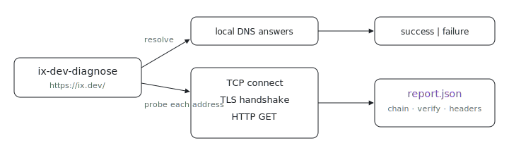

<p align="center"></p>

# ix-dev-diagnose

`https://ix.dev` works on your network but throws `SEC_ERROR_UNKNOWN_ISSUER` on someone else's, so how do you debug a network path you cannot see? `ix-dev-diagnose` probes `https://ix.dev/` from the caller's machine, prints a one-line `success` or `failure` verdict, and writes a JSON report you can send to support: everything needed to compare a working path against a broken one.

## Run it

```sh
nix run github:indexable-inc/index#ix-dev-diagnose
```

From a clone (`git clone https://github.com/indexable-inc/index`): `nix run .#ix-dev-diagnose`.

The command prints `success` or `failure` followed by the JSON file path. The
report includes local DNS answers, one TCP/TLS/HTTP probe per resolved address,
the certificate chain fingerprints and parsed issuer names, native and
Mozilla-root verification results, response headers, and a bounded base64 sample
of the response body.

## Options

- `--output <path>` chooses the report location.
- `--json --pretty` prints the JSON to stdout for another command to consume.
- Pass an explicit URL when the bad bytes are for a specific artifact, such as a
  CLI binary path.
- `--family ipv4|ipv6` restricts probes to one address family;
  `--connect-timeout-ms` / `--read-timeout-ms` bound each probe.
