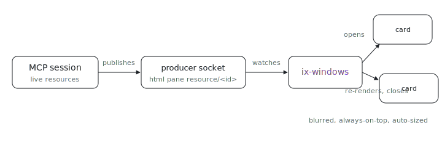

<p align="center"></p>

# ix-windows

What if every live MCP resource just floated on your desktop, exactly as big as its content? `ix-windows` renders each resource as its own chrome-less, blurred, always-on-top webview card: a window opens when a resource appears, re-renders in place on update, and closes when the resource closes or its producer disconnects.

It is a standalone consumer of the dashboard producer stream. The MCP already
publishes every resource onto the producer sockets as an `html` pane keyed
`resource/<id>` (see `packages/mcp`), so this process renders them with no change
to the MCP.

## Run it

```sh
nix run github:indexable-inc/index#ix-windows             # watch the default discovery dir
nix run github:indexable-inc/index#ix-windows -- --dir /tmp/ixw
```

From a clone (`git clone https://github.com/indexable-inc/index`): `nix run .#ix-windows`.

## Overlay, not tiles

Each window is a chrome-less, always-on-top card floating above the desktop. No
tiling, no layout manager.

- **Blur behind.** The `wry` webview is transparent and is painted on top of a
  native `NSVisualEffectView` (behind-window blur), so the overlay frosts
  whatever is behind it. The content lives in a faintly tinted, rounded `#ix-root`
  panel for legibility; the blur layer is rounded and shadowed to match.
- **Auto-size to content.** There is no fixed window size. A `ResizeObserver` in
  the page measures the rendered panel and posts its pixel size over `wry`'s IPC
  channel; the OS window is grown or shrunk to fit (clamped to the monitor work
  area), so a window is exactly as big as the HTML it holds and expands as the
  content grows.
- **Floating across spaces.** The window is always-on-top and joins all spaces /
  floats over fullscreen apps (`NSWindowCollectionBehavior`).
- **Move with Cmd+drag.** The card is borderless and runs content flush to its
  edge (no padding), so there is no chrome to grab. Hold **Cmd** and drag anywhere
  (even over content) to move it; an ordinary Cmd+click on content still works,
  and a drag on any bare background area moves it too. The window is not
  user-resizable: its size is owned by the content (auto-fit), so a manual resize
  would just fight the next content report.
- **Close, and stay closed.** Each card paints its own floating close button
  (top-right corner, faint until hovered). A closed resource is remembered
  **persistently** (keyed by producing session + resource id), so it does not
  reappear when the resource re-registers or when `ix-windows` restarts; useful
  when a session publishes a flood of resources you do not want to see. It only
  reappears if a *different* session (or the same one after a restart) publishes
  it. Dismissals are logged to `$XDG_STATE_HOME/ix-windows/dismissed` (else
  `~/.local/state/ix-windows/dismissed`); delete that file to start showing
  everything again.

## Prefer self-contained HTML

A resource's HTML is rendered inside a sandboxed, opaque-origin `<iframe>`
(`sandbox="allow-scripts"`, no `allow-same-origin`) loaded with no page origin, so
same-origin `fetch`, cookies, and storage are unavailable. Absolute HTTPS
scripts/styles may still load (subject to the browser and the remote server /
CORS), but they are a live network dependency, not an isolated pane, and an
ES-module `import` from a CDN was observed to fail under the opaque origin. For a
reproducible, offline overlay, **inline** your CSS/JS/data and pre-render anything
that needs a library: e.g. render a mermaid diagram to SVG server-side
(`kroki.io`, the `mermaid` CLI, ...) and embed the static `<svg>`, rather than
loading `mermaid.js` from a CDN.

## macOS

- **120Hz.** WebKit's private experimental flag
  `PreferPageRenderingUpdatesNear60FPSEnabled` is disabled so the webview renders
  at the display's full refresh rate (ProMotion).
