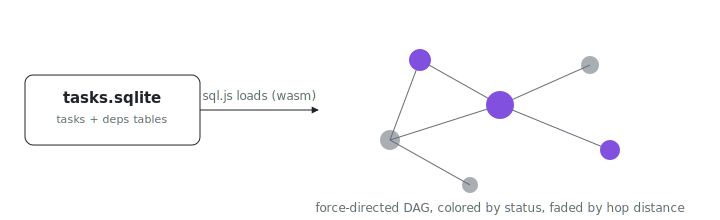

<p align="center"></p>

# Task Dependency Graph (standalone site)

What does a 100-task dependency DAG actually look like? This standalone site
renders one as an interactive force-directed graph in the Obsidian graph-view
style (`force-graph` + a d3 collision force), colored by status or category,
with hop-distance fading so the hierarchy pops out when you hover a node.

It **reads its data from a real SQLite file**: `public/tasks.sqlite`, loaded in the
browser via [sql.js](https://sql.js.org/) (WASM SQLite). That file is the single
source of truth and is generated by the first-class `tasks` Python helper bundled
into the ix-mcp interpreter:

```python
import tasks
tasks.seed("packages/mcp/task-graph/public/tasks.sqlite")  # 100-task DAG -> SQLite
tasks.load("...tasks.sqlite")                              # read it back
tasks.frame("...tasks.sqlite")                             # styled table in the dashboard
```

The schema (`tasks`, `deps` tables) lives in `tasks.SCHEMA`; the client mirrors the
model in `src/lib/types.ts` and reads it in `src/lib/db.ts`.

## Run separately

From `packages/mcp/task-graph` in a clone
(`git clone https://github.com/indexable-inc/index`):

```sh
npm install
npm run dev       # http://localhost:5173
npm run build     # type-check + production bundle in dist/
npm run preview   # serve the built bundle
```

## Interaction

- Color nodes by **status** (done / in-progress / ready / blocked, derived from
  whether dependencies are complete) or by **category**.
- Hover/select a node: connected tasks fade by **BFS hop-distance** (each ring
  dimmer), so the dependency hierarchy pops out.
- Arrows point from a dependency to the task that needs it. Layered DAG layout
  toggle. Two-finger trackpad scroll pans; pinch zooms.
- Search jumps to a node; the sidebar shows a task's dependencies and what it blocks.

## Regenerate the data

```sh
python3 -c 'import tasks; tasks.seed("public/tasks.sqlite")'
```
