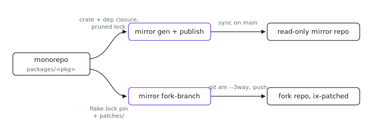

<p align="center"></p>

# mirror

How does one crate in a monorepo get its own GitHub repo that a stranger can clone and `cargo build`, without the repo drifting from the source? mirror generates opt-in standalone repos from this monorepo and keeps them equal to it in CI. Two products, one source-generation core:

- **Package mirrors**: a package under `packages/` opts in via its
  `package.nix` and gets a self-contained, read-only GitHub repo that a
  visitor can clone and `cargo build` without ever seeing the monorepo. The
  monorepo stays the single source of truth; CI keeps the mirror equal to it.
- **Fork branches**: a de-forked package (lib/fork-packages.nix) can opt into
  a real GitHub fork repo whose `ix-patched` branch is defined declaratively
  (the upstream base pinned in `flake.lock` plus the in-repo `patches/` series
  applied as commits), so opening an upstream PR is one push away.

Rust packages are what the generator understands today, but the interface
(the `mirror` manifest attr, `.#lib.mirrorPackages`, the sync workflow) is
language-neutral by design; another ecosystem adds a generator, not a new
pipeline.

## Run it

```sh
nix run github:indexable-inc/index#mirror -- --help
```

Every subcommand takes `--package packages/<path>` relative to a monorepo
checkout, so get one first: `git clone https://github.com/indexable-inc/index`.

## How a mirror is made

`mirror gen --package packages/<path> --out <dir>` produces the standalone
tree:

- The crate's own files sit at the output root. Its intra-workspace
  dependency closure (computed from the root manifest's
  `[workspace.dependencies]` path entries) goes under `crates/<name>/`, and a
  `[workspace]` table stitches them together; a true leaf crate stays a plain
  single-crate repo.
- Every `Cargo.toml` is rewritten standalone: `version.workspace = true` and
  friends become concrete values, `dep.workspace = true` becomes the concrete
  version with member feature additions merged (cargo's own inheritance
  semantics), internal deps become `path = "crates/<name>"`, `publish =
  false` is pinned, `license = "MIT"` is injected (the root LICENSE rides
  along), and the `[lints]` table is dropped (the workspace lint set names
  lints only the org's patched clippy knows). Comments survive; the rewrite is
  format-preserving.
- The `Cargo.lock` is **pruned, never re-resolved**: the subset of the root
  lock reachable from the mirrored crates, so a mirror builds against exactly
  the versions the monorepo builds against. `rust-toolchain.toml` is copied
  for the same reason. One nuance: the monorepo lock records feature-union
  dependency edges (an optional dep activated by *any* workspace member shows
  up on the shared entry), so the pruned lock is a version-exact **superset**:
  a mirror's first `cargo build` may drop entries the mirrored crate never
  activates, but it never changes a version and never touches the network for
  resolution.
- The README and changelog are generated, never hand-written per mirror
  (house style: the `creating-a-readme` skill, which the generator conforms
  to). A package with its own README leads the mirror with it verbatim --
  the skill already makes it open with an `assets/hero.svg` and a hook, and
  the assets ride along -- behind a banner naming the mirror a read-only
  generated artifact (exact monorepo tree link, issues/PRs to the monorepo);
  a derived Install section is appended only when the body has none
  (flake-exposed -> `nix run github:indexable-inc/index#<attr>`, binary ->
  `cargo install --git`, library -> a git-dependency snippet). A package
  without a README gets the whole skill shape synthesized from metadata: a
  generated `assets/hero.svg` (name, tagline, deterministic mark; dark/light
  via CSS `prefers-color-scheme` embedded in the SVG), a hook question and
  pitch from the declarative `mirror.description` (crate `[package]
  description` fallback), Install, and a minimal Use section. Every README
  ends with a one-line pointer to `CHANGELOG.md`. Pass `gen` `--mirror-json`
  (the rendered `.#lib.mirrorPackages`) to source the repo/description/flake
  attr; `publish` resolves it automatically.
- `CHANGELOG.md` is derived from the monorepo commits that touched the
  package path (`git log -- packages/<pkg>`): Keep a Changelog section
  names picked from conventional-commit prefixes, grouped by month (a
  mirror tracks the monorepo continuously; there are no versioned releases),
  every entry linking its monorepo commit. It needs full history, so the
  generator refuses a shallow clone and mirror-sync checks out with
  `fetch-depth: 0`.

`mirror publish --package packages/<path> [--create]` runs `gen` into a
scratch directory, clones the mirror repo, swaps its working tree for the
generated one, and commits **only when the tree actually changed**, as
`sync: indexable-inc/index@<sha>` with a `Source-Commit: <sha>` trailer, then
pushes `main`. Snapshot sync: one mirror commit per effective change, no
history filtering, cheap enough to run on every push to main. `--create`
creates the GitHub repo via `gh repo create` when it does not exist yet.

`mirror fork-branch --name <fork> [--push]` reads the fork mapping
(`.#lib.forkPackages`, or `--mapping <json>`), fetches the upstream repo at
the rev `flake.lock` pins for the fork's input, applies the `patches/` series
with `git am --3way` onto branch `ix-patched`, and, with `--push`, force
pushes that branch to the entry's `forkRepo`. Without `--push` it is a pure
verification that the series still applies. The branch is regenerated, never
merged into, so it is always a clean, properly rebased serialization of the
patch DAG.

## Adding a mirror

1. Add the attr to the package's `package.nix`:

   ```nix
   mirror = {
     repo = "indexable-inc/<name>";
     description = "One-line GitHub repo description";
     topics = ["rust" "cli"];
     # optional; defaults to the package's tree in this monorepo:
     # homepage = "https://example.dev";
   };
   ```

   `description` and `topics` are required: they are the mirror repo's public
   About sidebar, and `packages/registry.nix` fails evaluation without them
   (the repo-metadata check, `.github/workflows/repo-metadata.yml`, turns
   that into a red PR status). (`mirror publish` itself still falls back to
   the crate's `[package] description` when a hand-written manifest entry
   omits one, but registry entries must be explicit.) The package also needs
   a `README.md`: it becomes the mirror repo's front page (see
   CONTRIBUTING.md, READMEs). The entry surfaces in
   `nix eval --json '.#lib.mirrorPackages'`.

2. That's it. The mirror-sync workflow (`.github/workflows/mirror-sync.yml`)
   publishes on the next push to `main` touching `packages/**` (plus a daily
   cron and `workflow_dispatch`), creating the repo on first run. The
   repo-metadata workflow keeps the description/homepage/topics of every
   covered repo equal to the declared values on every push to `main`.

To maintain a fork repo for a de-forked package instead, add
`forkRepo = "indexable-inc/<name>";` to its entry in lib/fork-packages.nix.

## Permissions

The default `GITHUB_TOKEN` can neither create repositories nor push to any
repo other than this one, so mirror-sync mints `MIRROR_TOKEN` per run from
the org-owned **ix-mirror-sync GitHub App**, installed on the `indexable-inc`
org with

- Administration: **write** (create the mirror/fork repos on first publish),
- Contents: **write** (push `main` / `ix-patched`),
- Metadata: **read** (implicit baseline).

The app's client id lives in the `MIRROR_APP_CLIENT_ID` repository variable
and its private key in the `MIRROR_APP_PRIVATE_KEY` secret; `actions/create-github-app-token`
turns them into a short-lived installation token each run. Scoped, revocable,
and not tied to a person's account. Fallback if the app is ever unavailable:

- **A PAT.** Fine-grained, org-owned, all-repositories (new mirror
  repos must fall inside its scope) with Administration + Contents write; or
  a classic PAT with the `repo` scope (classic PATs can create org repos,
  fine-grained repo *creation* otherwise needs the App route). Stored
  directly as `MIRROR_TOKEN`.

If repos are pre-created by hand, Administration/creation rights can be
dropped and `--create` becomes a no-op safety valve; Contents: write is the
floor.
