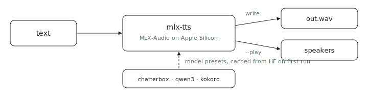

<p align="center"></p>

# mlx-tts

Want good text-to-speech that never leaves your Mac? `mlx-tts` runs TTS locally on the Apple Silicon GPU through [MLX-Audio](https://github.com/Blaizzy/mlx-audio). It defaults to the Chatterbox fp16 model because the request is quality first, not latency first, and it supports voice cloning from a reference clip.

First inference downloads the selected model into the normal Hugging Face cache.
Nix builds only package the CLI and never fetch model weights.

## Usage

```sh
# Quality-first default: Chatterbox.
nix run github:indexable-inc/index#mlx-tts -- "This voice is generated locally on Apple Silicon."

# Voice cloning with a reference clip.
nix run github:indexable-inc/index#mlx-tts -- "Read this in the reference voice." --ref-audio reference.wav --play

# Qwen3 preset when you want preset voices and language control.
nix run github:indexable-inc/index#mlx-tts -- --preset qwen3 --voice Aiden --lang-code English "A preset local voice."

# Pass through any MLX-Audio option after --.
nix run github:indexable-inc/index#mlx-tts -- "More diffusion steps." -- --ddpm_steps 50

# Show the upstream MLX-Audio options.
nix run github:indexable-inc/index#mlx-tts -- --upstream-help
```

Use `--model` to point at any MLX-Audio TTS model repo id or local model path.
From a clone (`git clone https://github.com/indexable-inc/index`): `nix run .#mlx-tts`.
