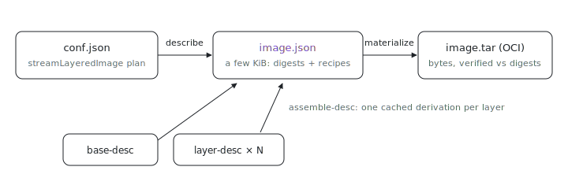

<p align="center"></p>

# oci-image-builder

Why re-tar a whole image closure when you only changed one store path? `oci-image-builder` turns a `streamLayeredImage` layer plan into an OCI image around a content-addressed description, `image.json`: the image is described cheaply (a few KiB of digests and regeneration recipes) and materialized into bytes only when needed (see #679).

## Run it

```sh
nix run github:indexable-inc/index#oci-image-builder -- --help
```

From a clone (`git clone https://github.com/indexable-inc/index`): `nix run .#oci-image-builder`.

## Modes

```
oci-image-builder            <conf.json> <out.tar>     # legacy one-shot: plan -> OCI tar
oci-image-builder describe   <conf.json> <image.json>  # plan -> description, no layer bytes
oci-image-builder materialize <image.json> <out.tar>   # description -> OCI tar

# Per-layer describe, sharded so each layer is its own cacheable derivation:
oci-image-builder base-desc     <base-archive.tar> <base.json>            # describe base layers
oci-image-builder layer-desc    --uid N --gid N --mtime T <layer.json> <store-path>...  # one store layer
oci-image-builder assemble-desc --base <base.json> <conf.json> <image.json> <layer.json>...  # stitch
```

`<conf.json>` is the `passthru.conf` that `dockerTools.streamLayeredImage`
produces. The legacy one-shot is `describe` then `materialize` in one pass and
stays the default so the NixOS image path is unchanged.

The efficiency flags (`--min-efficiency`, `--max-wasted-bytes`,
`--max-wasted-percent`, `--efficiency-top-paths`, `--skip-efficiency-check`)
apply to the legacy build, `describe`, and `materialize`. Base layers from a
`fromImage` are excluded from the analysis: they are pulled and immutable.

## Why describe vs materialize

The description records each layer's digest and how to regenerate it, not its
bytes. It is tiny (a few KiB) where the tar is the full image (tens of MiB and
up), so it is cheap to build and cache. Materialize regenerates each layer's
bytes deterministically and verifies them against the recorded digest, so a
description that no longer reproduces its bytes fails the build instead of
shipping a wrong image. The same description can later target a registry push
that uploads only missing layers, or a rootfs image, without rebuilding.

## Per-layer describe

`describe` hashes every layer in one process, so changing one store path re-tars
the whole closure. The sharded path splits that work so each layer is its own
content-addressed derivation:

```
conf.json --(IFD: read the layer partition)--> Nix
   base archive ----------> base-desc ----> base.json     (cached; base is pinned + immutable)
   store_layers[0] --------> layer-desc ---> layer0.json   \
   store_layers[1] --------> layer-desc ---> layer1.json    | one derivation each; a layer with
   ...                                                       | the same paths is the same derivation
   store_layers[N] --------> layer-desc ---> layerN.json   /  across images and rebuilds
                                   |
   base.json + layerK.json + conf ---> assemble-desc ----> image.json   (no bytes; pure stitch)
```

`assemble-desc` re-tars nothing: it reads the precomputed digests, computes the
customisation layer's digest from its prebuilt checksum, and merges the config.
Editing one store path re-tars only that layer; the rest, and the base, are cache
hits. Because the cross-layer efficiency analysis needs the layer bytes, which
this path does not keep, the efficiency policy is enforced at `materialize` time,
where the regenerated bytes already exist.

See `bench.sh` for the cold/warm benchmark that produced the numbers in #680.

## image.json schema

```jsonc
{
  "schema_version": 1,
  "architecture": "amd64",
  "created": "1970-01-01T00:00:01Z",
  "mtime": "1",                       // unix seconds, as a string
  "uid": "0",
  "gid": "0",
  "store_dir": "/nix/store",
  "config": { "Cmd": ["/bin/sh"] },   // OCI image config, base Env merged under final
  "layers": [
    // bottom of the stack first
    { "digest": "sha256:...", "diff_id": "sha256:...", "size": 1234,
      "kind": "base", "archive": "/nix/store/...-docker-image.tar", "member": "abc.tar" },
    { "digest": "sha256:...", "diff_id": "sha256:...", "size": 5678,
      "kind": "store", "paths": ["/nix/store/...-glibc-2.42"] },
    { "digest": "sha256:...", "diff_id": "sha256:...", "size": 90,
      "kind": "customisation", "dir": "/nix/store/...-customisation-layer" }
  ]
}
```

Layer `kind` selects how `materialize` regenerates the bytes:

- `store`: re-tar the listed Nix store paths (deterministic from the paths).
- `base`: copy the named member out of the base docker-archive.
- `customisation`: copy the prebuilt `layer.tar` from its derivation output.

For uncompressed tar layers the blob digest equals the diff id, which is why a
pulled base layer (skopeo writes them uncompressed) round-trips without a
separate compressed digest.
