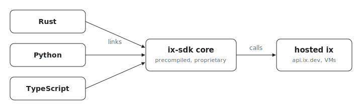

# ix SDK

Building on ix and wondering which SDK to grab? This directory is the public
source for all three. Each links or bundles the same precompiled, proprietary
`ix-sdk` core distributed by Indexable, so behavior is identical across
languages and each binding only adds ecosystem-native surface.

| SDK | Source | Get it |
| --- | --- | --- |
| Rust | [`rust/`](./rust) | the core crates; built via Nix, the other SDKs bind it |
| Python | [`python/`](./python) | `nix build .#ix-sdk-python` |
| TypeScript | [`typescript/`](./typescript) | `npm install @indexable/sdk` |

The Nix build assumes a clone: `git clone https://github.com/indexable-inc/index`.

## License

Everything under `sdk/` is proprietary and source-available, governed by
[`sdk/LICENSE`](./LICENSE) (the Indexable SDK License), NOT the repository-root
MIT license. The SDK license supersedes the root MIT for this directory and its
subdirectories, including the compiled components the SDK fetches or bundles. In
short: you may use the SDK to build applications that access the hosted ix
service, but you may not reverse-engineer, modify, redistribute, or use it to
build a competing service. See `sdk/LICENSE` for the full terms.
