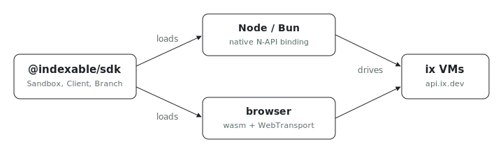

<p align="center"></p>

# @indexable/sdk

Want a disposable VM running your code from TypeScript in three lines? These
are the TypeScript bindings for ix: the package loads the native N-API binding
on Node.js and Bun, and the wasm/WebTransport binding in browsers, so the same
code drives sandboxes from a server or a web page.

## Install

```sh
npm install @indexable/sdk
```

Node.js >= 22 or Bun; browsers pick up the wasm build automatically.

## Usage

```ts
import { Sandbox } from '@indexable/sdk'

await using sbx = await Sandbox.python()
await using py = await sbx.repl('python')

await py.exec('x = 21')
const out = await py.exec('print(x * 2)')
console.log(out.output)
```

For lower-level VM control, use `Client` and `Branch` directly:

```ts
import { Client, Region } from '@indexable/sdk'

const token = process.env.IX_TOKEN
if (token === undefined) throw new Error('IX_TOKEN is required')

const ix = new Client({
	token,
	baseUrl: process.env.IX_API_BASE_URL ?? 'https://api.ix.dev'
})
await using vm = await ix.create('ubuntu:24.04', {
	region: Region.UsWest1,
	name: 'sdk-example'
})

const result = await vm.bashChecked({ script: 'uname -a' })
console.log(result.stdout)
```

The TypeScript layer is intentionally thin. Core behavior lives in the Rust SDK;
this package adds TypeScript-native surface area such as `await using`,
async iterators, overloads, and typed options.

## License

Proprietary and source-available, governed by the bundled `LICENSE` (the
Indexable SDK License), NOT the repository-root MIT license. See
[`../LICENSE`](../LICENSE).
