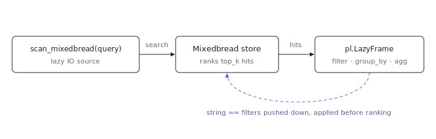

<p align="center"></p>

# polars-mixedbread

Ever wanted to `group_by` your search results? `polars-mixedbread` is a Polars
IO source backed by [Mixedbread](https://www.mixedbread.com) store search:
`scan_mixedbread(query, store=...)` returns a lazy `pl.LazyFrame` whose rows
are the hits of one search, with file metadata flattened into typed columns.
So you do in Polars everything Mixedbread does not, above all aggregation, and
your string-equality filters are pushed down server-side so the store ranks
only what matters.

```python
import polars as pl
from polars_mixedbread import scan_mixedbread

lf = scan_mixedbread("how does retry backoff work", store="index", top_k=500)
(
    lf.filter(pl.col("source") == "code")  # pushed down to Mixedbread
    .group_by("repo")                       # runs in Polars
    .agg(pl.len(), pl.col("score").mean())
    .sort("len", descending=True)
    .collect()
)
```

## Install

The wheel is consumed inside the nix env, not published: an `ix-mcp` Python
session imports it with no install step. To build it yourself:

```sh
git clone https://github.com/indexable-inc/index
nix build ./index#polars-mixedbread
```

## One unified API: filter in Polars, push down to Mixedbread

You filter with ordinary Polars expressions. The source parses the predicate and
pushes the parts that map to a Mixedbread metadata filter (string `==`/`!=` on a
metadata column, combined with `&` / `|` / `~`) server-side, so Mixedbread ranks
a smaller, more relevant set. Anything else (a `score` threshold, `is_in`, a
substring match) runs client-side in Polars.

The full predicate is always re-applied locally, so every returned row satisfies
it. But pushdown is not transparent, and that is the point of a search source: a
pushed filter is applied by Mixedbread *before* ranking and `top_k`, so you get
the `top_k` best hits *within* the filter. The same predicate written so it
cannot push (`pl.col("source").is_in(["code"])` instead of `== "code"`) filters
the `top_k` *after* ranking, so it can return a different set of rows. Both are
correct (every row matches); they differ in which candidates were ranked. Keep
filters in pushable form for the tightest relevance. `query` / `top_k` are not
predicates; they parameterize the search itself.

```python
# `source == "code"` goes to the server; `score > 0.9` is applied in Polars:
scan_mixedbread("auth", store="index", top_k=500).filter(
    (pl.col("source") == "code") & (pl.col("score") > 0.9)
)
```

## `top_k` is retrieval depth, not a row count

`top_k` is how many ranked hits the search returns: think of the source as
"`top_k` hits for `query`, as a table". It is not the final row count, and where
it sits relative to a filter depends on whether the filter pushed down:

- a **server-pushed** filter (string `==`/`!=`) is applied *before* `top_k`:
  Mixedbread filters, ranks, then returns `top_k`, so you get up to `top_k` of
  the filtered set (`filter(source=="code")` with `top_k=30` → 30 code rows).
- a **client-side** filter is applied *after* `top_k`: it trims the table, so it
  can leave fewer than `top_k` rows (`filter(score>0.8)` with `top_k=30` → 15).

For a final row cap use Polars' own `.head(n)` / `.limit(n)` (applied last).
`top_k` only controls how deep the search goes; raise it when a client-side
filter is discarding too much of the window.

For an output *floor* instead, pass `min_results=N`: when a client-side filter
trims the window below N rows, the source re-searches with a growing `top_k`
(doubling) until at least N rows survive or the store is exhausted. `max_top_k`
is a hard ceiling on search depth (a `min_results` above it is capped there;
raise `max_top_k` to go deeper). Combine with `.head(N)` for exactly N rows out
of an arbitrarily selective filter:

```python
# at least 20 high-score code rows, however deep the search has to go:
scan_mixedbread("auth", store="index", min_results=20).filter(
    (pl.col("source") == "code") & (pl.col("score") > 0.8)
).head(20)
```

## Columns

`text` (str), `score` (f64), `filename` (str), `start_line` (u32), `num_lines`
(u32), `metadata` (str, the raw JSON), plus one typed column per entry in
`metadata_columns`. The default surfaces the keys the `index` store carries:
`source`, `repo`, `path`, `title`. Point it at another store by passing the keys
that store uses:

```python
scan_mixedbread("...", store="my-store",
                metadata_columns={"author": pl.String, "year": pl.Int64})
```

Only string columns push down (string equality is unambiguous server-side); a
non-string column still filters and groups, just in Polars. The raw `metadata`
column is always present, so keys you did not declare stay reachable with
`pl.col("metadata").str.json_decode()`.

## Authentication

Mirrors the `search` surface: `MXBAI_API_KEY` if set, otherwise the token
written by `mgrep login`.

## How it is built

The Rust crate is a thin PyO3 binding that reuses the workspace `mixedbread`
client (HTTP, retry, auth, and the filter DSL) and returns hits as plain columnar
data. Flattening, predicate pushdown, projection, and the row limit live in the
Python wrapper, where the runtime Polars is, so there is no Rust/Python Polars
version coupling. Build the wheel with `nix build .#polars-mixedbread`.

## Bad fit if

You need a full table scan or store-wide aggregation. This is top-`k` retrieval:
a `group_by` aggregates only the retrieved window, not the whole store. Raise
`top_k` and lean on a pushed-down `filter` to keep that window relevant when you
need wider coverage.
