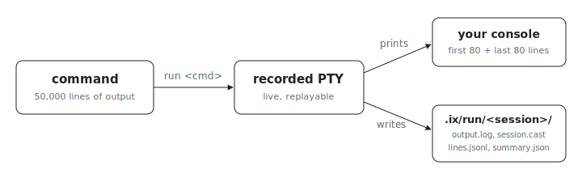

<p align="center"></p>

# run

Ever had an agent's context (or your scrollback) drowned by a build's 50,000
lines of output? `run` executes a command under a recorded terminal session
and keeps the console small by default: you see the first and last 80 lines,
while the full live stream, a replayable recording, and per-line JSONL land
under `./.ix/run/<session>/`. Nothing is lost, and nothing floods the log.

## Run a command

```sh
nix run github:indexable-inc/index#run -- nix build .#base
```

The first argument after `run` is the command. Every following argument is
passed to that command unchanged. Inside a clone
(`git clone https://github.com/indexable-inc/index`) the short form is
`nix run .#run -- <command>`.

By default, `run` prints the first 80 output lines and the last 80 output lines.
The full live stream is written under `./.ix/run/<session>/output.log`, with
`./.ix/run/latest` pointing at the newest session.

## Recorded Files

Each session writes:

- `output.log`: full terminal output, flushed while the command is running.
- `typescript` and `timing.log`: files accepted by `scriptreplay`.
- `session.cast`: an asciinema v2 stream with terminal dimensions and output
  timing.
- `events.jsonl`: one JSON object per PTY output chunk, including elapsed time,
  byte count, decoded text, and base64 bytes.
- `lines.jsonl`: one JSON object per completed output line, shaped for
  `polars.read_ndjson(path)` (or `pandas.read_json(path, lines=True)`).
- `summary.json`: command, cwd, terminal metadata, artifact paths, duration, and
  exit status. This starts as `running` and is replaced with the final result.

Use `./.ix/run/latest/live` while a command is running, or open
`./.ix/run/latest/output.log` with `less +F`.

Replay the terminal output at normal speed:

```sh
./.ix/run/latest/replay
```

Replay faster by passing the `scriptreplay` divisor:

```sh
./.ix/run/latest/replay 2
```

## Controls

Set `IX_RUN_HEAD_LINES` and `IX_RUN_TAIL_LINES` to change the printed summary.
Set `IX_RUN_PRINT=full` to mirror every output line, or `IX_RUN_PRINT=none` to
record without printing command output. Set `IX_RUN_DIR` to choose a different
session root.
