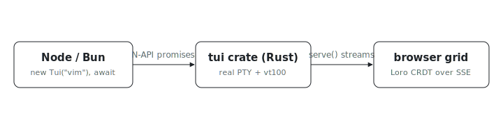

<p align="center"></p>

# tui (Node.js)

Need to drive vim, a shell, or a REPL from Node and read back the rendered
screen instead of an escape-code stream? These are the Node.js bindings for
the [`tui`](../tui) Rust crate: spawn any number of PTY-backed processes with
full VT100 emulation, drive them with plain promises, then watch them all in a
browser through a Loro-backed web dashboard.

This is a thin N-API binding built with [napi-rs]: the `tui` crate owns every
behavior, and this package only exposes it. It is the Node sibling of the Python
[`tui-py`](../tui-py) package and shares the same process-wide manager
semantics.

npm name: `@indexable/tui`. Native addon: `tui_node.node`.

## Quick start

```js
import { Tui, Key, waitFor } from "@indexable/tui";

const t = new Tui("vim", ["-u", "NONE", "file.txt"], { rows: 24, cols: 80 });
await waitFor(t, "~");
await t.write("ihello from node" + Key.ESC + ":wq" + Key.ENTER);
console.log("vim exit code:", await t.wait());
```

Every I/O method returns a `Promise` and runs on the tui actor, so it never
blocks the event loop. Identity (`id`, `command`, `rows`, ...) and instant state
(`isAlive()`, `exitCode()`) are synchronous.

## Process lifecycle

```js
const t = new Tui("bash", ["-c", "echo hi; exit 7"]);
console.log(await t.wait());   // 7  (null if killed by a signal)
console.log(t.isAlive());      // false
```

`kill()` sends `SIGKILL`, which a program that traps interrupts cannot ignore.
`close()` force-kills and drops the terminal from `Tui.listAll()` and the
dashboard. `resize(rows, cols)` delivers `SIGWINCH` and is visible from every
handle to the same process.

## Web dashboard

```js
import { serve } from "@indexable/tui";

const dash = await serve("127.0.0.1", 8080);
console.log(dash.url);   // open in a browser to see a live grid of every Tui
await dash.stop();
```

The server, the Loro CRDT document, and the SSE stream all live in Rust; the
browser imports updates with `loro-crdt` and paints each terminal's viewport.

## Build

The native addon and npm package are built by Nix (no `napi build`, no
`node-gyp`):

```sh
nix build .#tui-node     # npm package tree in result/: package.json, index.js, index.d.ts, native/
npm install ./result     # consume it as a path dependency
```

The build assumes a clone:

```sh
git clone https://github.com/indexable-inc/index
```

Linux-only, like [`tui-py`](../tui-py): the addon cdylib is carved from the
shared `cargo-unit` workspace graph, which does not thread macOS's
`-undefined dynamic_lookup` through to the link step. From a macOS checkout,
build it on a Linux builder with `nix build .#packages.x86_64-linux.tui-node`.
For local macOS iteration, plain `cargo build -p tui-node` produces a loadable
`.dylib` (napi-build sets the macOS link args).

[napi-rs]: https://napi.rs/
