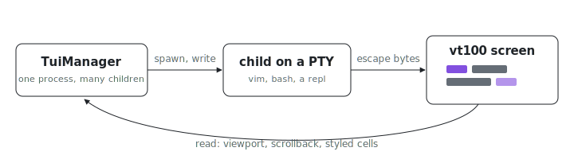

<p align="center"></p>

# tui

Ever tried to script vim, less, or a REPL through a pipe, and watched it
misbehave or spray raw escape sequences? `tui` spawns each child on a real
pseudo-terminal, so interactive programs behave exactly as they do in a normal
terminal, and feeds every byte through a [vt100] emulator, so you read back a
rendered screen (viewport, scrollback, per-cell styling) instead of a byte
stream. One `TuiManager` drives any number of children from one process.

## Usage

```rust
use std::time::Duration;
use tui::{SpawnConfig, TuiManager};

let manager = TuiManager::new();

// Spawn on an 80x24 PTY with 10,000 lines of scrollback (the defaults).
let term = manager.spawn("cat".into(), vec![], SpawnConfig::default())?;

term.write("hello\n")?;

// Block until the child paints something, then read the rendered screen.
for line in term.read_blocking(Duration::from_secs(1))? {
    println!("{line}");
}

let snapshot = term.read_full()?;        // scrollback + viewport together
let cells = term.read_styled_cells()?;   // per-cell char + color + attrs
# Ok::<(), tui::Error>(())
```

Every blocking method has an `_async` twin (`write_async`, `read_viewport_async`,
…) that returns a future instead of driving the runtime itself, for callers that
already run inside tokio.

## Getting it

`tui` is a library crate in the index Cargo workspace, with no standalone
mirror, so it is consumed through the workspace: inside the repo, depend on it
with `tui.workspace = true` in your crate's `Cargo.toml`. The multi-process
dashboard it feeds is runnable on its own:

```sh
nix run github:indexable-inc/index#dashboard
```

The `.#` commands in this README assume a clone:

```sh
git clone https://github.com/indexable-inc/index
```

## Design

- **`TuiManager`** owns one multi-threaded tokio runtime, spawns processes, and
  tracks the live ones (`list`, `get`). It shares a clone of its runtime into
  every handle it hands out.
- **`TuiInstance`** is the handle for one child. It carries every read/write
  method and a clone of the runtime, so it keeps working for as long as you hold
  it. Cloning a handle is cheap and all clones address the same process.
- A per-child **actor task** owns the PTY master. It is the only thing that
  touches the PTY and the vt100 parser, so reads and writes from many threads
  serialize through one mailbox (`tokio::sync::mpsc`) instead of locking.

The PTY master is non-blocking and driven with async I/O; the slave handed to
the child is a real terminal device, so signals, line discipline, and terminal
sizing all work.

## Reading the screen

- `read_viewport` returns the visible screen, one `String` per row.
- `read_scrollback` returns lines that have scrolled above the viewport, oldest
  first.
- `read_full` returns both as a [`FullOutput`].
- `read_blocking(timeout)` polls the viewport until it has content or the
  timeout elapses; it errors with `NoOutputAvailable` only if nothing arrives.
- `read_chars` returns a `rows x cols` grid of `char`.
- `read_styled_cells` returns an `ndarray::Array2<StyledCell>`; each
  [`StyledCell`] carries its character, typed `fg`/`bg` [`Color`], and the bold,
  italic, underline, and inverse flags.

`slice_2d` with `RowRange`/`ColRange` extracts a rectangular sub-region of a
`Vec<String>` (1-indexed, inclusive) when you only want part of the screen.

An empty screen reads back as an empty `Vec`, not an error; `read_blocking`
keeps the wait-for-first-paint behavior by polling until content appears.

## Process lifecycle

The actor owns the child, so a handle can observe and control it:

- `is_alive` / `exit_state` report whether the child is running or its exit
  code (`ExitState::Exited(Some(code))`, or `Exited(None)` when a signal killed
  it).
- `wait(timeout)` blocks until exit, returning `None` on timeout; `wait_async`
  is the future form.
- `kill` sends `SIGKILL`, which (unlike a cooperative Ctrl+C) a program cannot
  ignore. `TuiManager::remove` drops a handle from `list`.

A child that has exited keeps its final screen readable; writes return
`TuiNotFound`.

## Web dashboard

With the `dashboard` feature, `tui::serve(&manager, addr, poll)` starts a
read-only web grid of every live terminal. It mirrors each viewport into a
single [Loro] CRDT document and streams updates to browsers over Server-Sent
Events; the page imports them with `loro-crdt`. The returned `Dashboard` exposes
`url()` and stops on `stop()` or drop. This is the engine behind the Python
package's `serve()`.

[Loro]: https://loro.dev/

## Multi-process dashboard

`serve` renders one process. To watch many processes (several agents, each with
its own manager) in one grid, the producer and the viewer are split:

- **Producer** (`publish` feature): `tui::publish(&manager, path, poll)` binds a
  unix socket at `path` and streams the manager's terminals as NDJSON
  [`ProducerSnapshot`] pane lines. Use `tui::socket_path()` for a per-process
  path inside the discovery directory ([`discovery_dir`]). The socket, the wire
  serialization, and the fan-out live in `dashboard-core`; this crate only adapts
  a live manager into terminal panes, so a publishing process stays HTTP- and
  CRDT-free.
- **Aggregator** (the `dashboard` binary): run it by hand. It scans the discovery
  directory, connects to every producer socket, folds each producer's panes into
  one document under its own scope, and serves the same web canvas. No producer
  owns the server and exactly one process binds a TCP port, so any number of
  agents share one stable URL.

```sh
nix run .#dashboard           # serve http://127.0.0.1:8080/ for the discovery dir
nix run .#dashboard -- --help # --host, --port, --dir, --rescan-ms
nix run .#dashboard demo      # publish one terminal/html/data pane to exercise it
```

The two halves share [`serve_hub`], the page, and the SSE stream, so a single
process (`serve`) and the aggregator render through exactly the same code. The
discovery directory resolves to `$IX_DASH_DIR`, else `$XDG_RUNTIME_DIR/ix-dash`,
else `/tmp/ix-dash-<user>`, kept short for the macOS 104-byte socket-path limit.

[`ProducerSnapshot`]: ../dashboard-core/src/pane.rs
[`discovery_dir`]: ../dashboard-core/src/pane.rs
[`serve_hub`]: ../dashboard-core/src/dashboard/server.rs

## Configuration

Pass a [`SpawnConfig`] to set the terminal size and scrollback depth at spawn:

```rust
use tui::SpawnConfig;

let config = SpawnConfig { rows: 40, cols: 120, scrollback_lines: 50_000 };
```

Size is fixed for the life of the process; there is no runtime resize today.

## Errors

All fallible calls return `Result<T, Error>`, a `snafu`-derived enum:

- `ProcessSpawn`: the child failed to launch.
- `TuiNotFound`: the handle's actor has exited (the channel is closed).
- `WriteToTui` / `ReadFromTui`: a PTY I/O call failed.
- `NoOutputAvailable`: the screen is still empty.
- `InvalidRowRange` / `InvalidColRange` / `RowIndexOutOfBounds` /
  `ColIndexOutOfBounds`: bad arguments to `slice_2d`.
- `ArrayConversion`: building the styled-cell grid failed (carries the
  underlying `ndarray::ShapeError`).

## Known limitations

- Unix only: depends on PTY devices, so Linux and macOS, not Windows.
- No runtime resize. Size is fixed for the life of the process.

## Dependencies

[pty-process] for PTY creation, [tokio] for the async runtime, [vt100] for
terminal emulation, [ndarray] for the cell grid, `parking_lot` for the registry
lock, and `snafu` for errors.

[vt100]: https://docs.rs/vt100/
[pty-process]: https://docs.rs/pty-process/
[tokio]: https://tokio.rs/
[ndarray]: https://docs.rs/ndarray/
[`FullOutput`]: src/types.rs
[`StyledCell`]: src/types.rs
[`Color`]: src/types.rs
[`SpawnConfig`]: src/types.rs
