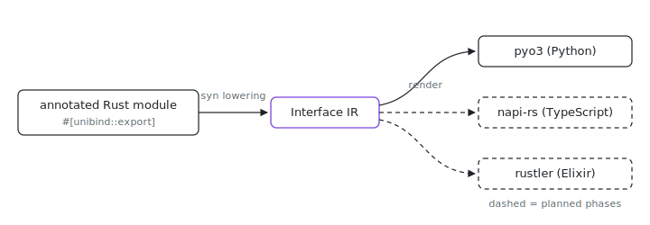

<p align="center"></p>

# unibind

Why should every language binding pay a C-ABI serialization tax when pyo3, napi-rs, and rustler already exist? unibind is one Rust attribute surface, one language-agnostic interface representation, and one code generator per target language: a crate annotates the functions, records, and errors it wants to expose, unibind lowers that surface into an IR at macro time, and each backend renders bindings through the incumbent binding library of its ecosystem.

## The bet

UniFFI-style tools settle for a C-ABI lowest common denominator: every value
crosses a serialization shim, and async, cancellation, and resource cleanup
are bolted on. unibind inverts that. The interface definition stays
write-once, but each backend emits code for the best binding library in its
ecosystem (pyo3 for Python, napi-rs for TypeScript, rustler for Elixir), so
every language gets native semantics: real exception hierarchies, native
async and cancellation, RAII-shaped resource cleanup, and types that flow end
to end with no RustBuffer tax.

## Use it

unibind is a proc-macro library consumed inside this workspace. Depend on it
with the backend you want as a feature, plus the binding library the backend
targets:

```toml
[dependencies]
unibind = { workspace = true, features = ["py"] }
pyo3 = { workspace = true, features = ["extension-module"] }
```

(`packages/code/scipql/py` is the reference consumer.) The workspace lives in
the monorepo: `git clone https://github.com/indexable-inc/index`. Cargo
unifies the macro crate's features across a workspace build, so once any
workspace member enables another backend, every export names its own
targets: `#[unibind::export(backends(py))]` (or `backends(ex)`); the
attribute without the option renders every enabled backend.

## Surface

There is no UDL or spec file. The Rust module is the source of truth:

```rust
#[unibind::export]
mod _mylib {
    /// Rows come back as native classes.
    #[unibind::record]
    #[derive(Clone)]
    pub struct Row {
        pub id: u64,
        pub name: String,
    }

    /// Everything the boundary raises.
    #[unibind::error(py(base = "ValueError"))]
    pub enum MyError {
        /// The store is gone.
        StoreGone { message: String },
    }

    /// Doc comments become docstrings.
    pub fn rows(store: &str, #[unibind(default = 10)] limit: usize) -> Result<Vec<Row>, MyError> {
        ...
    }
}
```

- `#[unibind::export]` on an inline module lowers every `pub fn` in it, plus
  the annotated types, into one interface value in a single parse. Private
  items pass through as plain Rust.
- `#[unibind::record]` marks a plain-data struct that crosses the boundary by
  value: a native class per language, one read-only attribute per field, and
  a positional constructor. Fields are `pub` and owned; the struct derives
  `Clone`.
- `#[unibind::error]` marks an error enum. Each variant becomes an exception
  class under one base class named after the enum; `py(base = "...")` picks
  the built-in the base extends. The enum implements `Display`, and the
  raised exception carries that text.
- `#[unibind::object]` marks a stateful handle: inherent methods (implicit
  `&self`) become methods on a native class, and `#[unibind(constructor)]`
  names the receiver-less constructor. `object(resource)` adds
  deterministic cleanup: a generated `close()`, `async with` support, and
  a `ResourceWarning` when the handle is dropped unclosed.
- `#[unibind(py(name = "..."))]` and `#[unibind(ts(name = "..."))]` rename a
  module, function, argument, field, or error variant per language.
  `#[unibind(default = ...)]` gives an argument a default; `Option` arguments
  default to `None` automatically.
- `#[unibind::export(backends(py))]` pins which backends render glue. Without
  it every feature-enabled backend renders, but a whole-workspace cargo build
  unifies unibind's features across every consumer, so a crate in a workspace
  that mixes backend features names its own (the ones whose runtime deps it
  declares).

## Pipeline

```
annotated module --syn lowering--> Interface IR --backend render--> binding code
     (macros)      (core)                           (backend-py, ...)
```

The `unibind` proc-macro crate parses the module once, `unibind-core` lowers
it to the IR and validates the surface, and each backend enabled by a cargo
feature renders code into the expansion. The serialized IR also lands in a
link section of the built artifact (`.unibind_ir`, `__DATA,__unibind_ir` on
Apple), wasm-bindgen style, so out-of-process generators in later phases can
read the interface without the Rust source: generated `.pyi` stubs and nix
glue are phase 1 (#1991), `.d.ts` and Elixir specs come with their backends.

Phase 1 ships that out-of-process half. `unibind-gen` (the `gen` crate) reads
the section back and renders host files through a small
`HostFile`/`HostEmitter` seam -- Python (`<module>.pyi`, `py.typed`, and a
wrapper `__init__.py` unless the package hands one in) and TypeScript
(`index.d.ts` plus the CommonJS `index.js` wrapper, `unibind-gen ts`); the
`.ex` (#1995) emitter implements the same seam. On the nix side,
`unibind.lib.build { crate; targets; }` (`ix.unibind` / `index.lib.unibind`,
packages/unibind/nix) glues it in. For `py`: the cdylib comes from the shared
workspace graph, the registry's `pyExtension = true` marker injects the
darwin `-undefined dynamic_lookup` link args (replacing per-crate build.rs),
and the outputs are the merged python site tree, a zuban/ruff strict gate,
the mcp-style importable module, and the Linux wheel;
`packages/code/scipql/py` is the proving consumer. For `ts`: the output is
the tui-node-shaped npm package (sanitized `native/<crate>.node` + generated
`index.js`/`index.d.ts` + a `cpu`/`libc`-stamped package.json, Linux-only);
`packages/unibind/conformance-ts` is the proving consumer, gated by a Node
end-to-end check.

Crates:

- `core`: the IR types (`Interface`, functions, records, enums, errors,
  objects, the boundary `Type`), the syn lowering, and the link-section
  embed. Phase 2 turned on async, streams, and
  objects; plain (non-error) enums still wait for their phase.
- `gen`: the `unibind-gen` binary. Reads the embedded IR out of a compiled
  artifact and emits the host-language files above (`py`, `ts`, and `ex`
  subcommands); run at build time by `unibind.lib.build`, never at macro
  time.
- `macros`: the `unibind` proc-macro crate. Parse once to IR, dispatch to
  the backends the consuming crate enabled through features (`py`, `ts`,
  `ex`). `#[unibind::export(backends(...))]` pins which enabled backends
  render: a whole-workspace cargo build unifies unibind's features across
  every consumer, so a crate in a workspace that mixes backend features
  names the backends whose runtime deps it declares.
- `backend-ex`: renders the IR into rustler 0.38 glue (`#[rustler::nif]`
  wrappers, `NifStruct` records, error-term structs, resource
  registrations) plus the Elixir host modules `unibind-gen ex` writes; see
  the Elixir section below.
- `ex-runtime`: BEAM-side support the generated glue calls into: the
  shared tokio runtime, async reply plumbing, demand-driven streams.
- `backend-py`: renders the IR into pyo3 0.28 (abi3-py311) code:
  `#[pyfunction]` wrappers with `#[pyo3(signature = ...)]` defaults,
  `#[pyclass]` records, `create_exception!` hierarchies plus a
  `From<YourError> for PyErr` impl, and one imperative `#[pymodule]` that
  registers everything and sets `__version__`. Doc comments become
  docstrings. The consuming crate depends on `pyo3` directly with
  `extension-module`.
- `backend-ts`: renders the IR into napi-rs 3 code: `#[napi]` wrappers
  (async ones take a trailing optional `AbortSignal` whose abort drops the
  Rust future via `tokio::select!`), `#[napi(object)]` records, error enums
  as `napi::Error` reasons under the machine-decodable
  `__unibind__:err:<Enum>:<Variant>:<message>` prefix, pull-stream handle
  classes (`next`/`close`), and object classes with napi constructors and an
  idempotent resource `close()` plus an unclosed-leak warning on drop. The
  consuming crate depends on `napi` (`napi6` + `tokio_rt`), `napi-derive`,
  `tokio` (`sync` + `macros`), and `unibind-runtime`, and builds a cdylib
  with `napi_build::setup()`. `blocking` renders as a plain sync export
  (there is no GIL to release). BigInt-only integers (u64, usize, isize) and
  integer-keyed maps reject at render time until BigInt lands.

## Type mapping (phase 0)

| Rust                  | IR              | Python        | TypeScript |
| --------------------- | --------------- | ------------- | ---------- |
| `bool`                | `Bool`          | `bool`        | `boolean`  |
| `i8..i64`, `u8..u32`  | `Int`           | `int`         | `number`   |
| `u64`, `usize`, `isize` | `Int`         | `int`         | rejected until BigInt lands (follow-up of #1993) |
| `f32`, `f64`          | `Float`         | `float`       | `number`   |
| `String` / `&str`     | `String`        | `str`         | `string`   |
| `PathBuf` / `&Path`   | `Path`          | accepts `str \| os.PathLike`, returns `str` | `string` |
| `Vec<u8>` / `&[u8]`   | `Bytes`         | `bytes`       | `Buffer` at the boundary; `number[]` inside records and containers |
| `Option<T>`           | `Option`        | `T \| None`   | `T \| null` (omission accepted) |
| `Vec<T>`              | `Vec`           | `list[T]`     | `Array<T>` |
| `HashMap<K, V>`       | `Map`           | `dict[K, V]`  | `Record<string, V>` (string keys only) |
| `#[unibind::record]`  | `Named`         | native class  | plain object via `napi(object)` |
| `#[unibind::object]`  | `Named` (return only) | wrapped handle class | wrapped handle class, `await using` on resources |
| `UniStream<T>` return | `Stream`        | async iterator | `UnibindStream<T>` (`AsyncIterable<T>` + `next`/`close`) |
| `async fn`            | `Asyncness::Async` | asyncio coroutine | `Promise<T>`, trailing optional `AbortSignal` |
| `Result<T, E>`        | `ret` + `throws`| `T`, raises `E`'s hierarchy | `T`, rejects with a decodable `__unibind__:err:` reason |

Borrowed forms (`&str`, `&Path`, `&[u8]`, including under `Option`) are
argument-only; returns and record fields own their data.

Phase 1 changes nothing in this table: the `.pyi` emitter renders these same
rules (argument vs return position included) from the untouched IR.

## Phase 2 surface

- `pub async fn` exports as a real asyncio coroutine on the shared tokio
  runtime. Cancellation is true cancellation: cancelling the Python task
  drops the in-flight Rust future, so guards, locks, and connections
  release immediately instead of leaking on a detached task.
- `fn ... -> UniStream<T>` (bare or behind `async fn`/`Result`) exports as
  an async iterator. It is pull-based: each `__anext__` polls exactly one
  item, so a consumer that stops early stops the producer with it.
- `#[unibind(blocking)]` runs the call with the GIL released, for
  CPU-bound or thread-sleeping work that must not stall the interpreter.
- `&[u8]` arguments cross through the buffer protocol with no copy:
  `bytes`, `bytearray`, and contiguous `memoryview` all alias the caller's
  memory for the duration of the call.
- A crate exporting async functions, streams, or objects adds
  `unibind-runtime` plus `unibind-py-runtime` next to its `unibind`
  dependency; sync-only crates (scipql-py) need neither. The split is
  load-bearing: features unify across a workspace build, so the pyo3 glue
  lives in its own crate instead of a `py` feature that would leak `Py*`
  symbols into every NIF in the workspace.

## The TypeScript surface

`unibind-gen ts --artifact <cdylib-or-.node> --addon <basename> --out <dir>`
emits the two host files next to the addon (`./native/<basename>.node`):

- `index.d.ts`: TSDoc from the IR's doc comments on every export; defaulted
  and `Option` arguments are optional; async exports take a trailing
  `signal?: AbortSignal` and return `Promise<T>`; stream returns are
  `UnibindStream<T>` (`AsyncIterable<T>` + `next()`/`close()`); objects are
  classes with real constructors (when declared) and, for resources,
  `close()` plus `[Symbol.asyncDispose]()`.
- `index.js` (CommonJS): decodes the glue's `__unibind__:` rejection reasons
  into real classes -- one `Error` subclass per error enum (each variant a
  subclass, `code` = the variant class name) and `__unibind__:aborted` into
  an `AbortError`-named `DOMException`. Stream handles become
  `AsyncIterable`s whose early exit (`break`) closes the Rust producer;
  object handles become classes whose `close()` is idempotent and whose
  `await using` disposal closes the resource. Exports are assigned one
  property at a time so cjs-module-lexer sees named exports from ESM.

Aborting a signal drops the Rust future (`tokio::select!` in the glue);
`close()`/disposal runs the resource's own Rust close exactly once, and
GC finalization drops the wrapped value (its `Drop` runs) with a leak
warning on stderr when a resource was never closed.
`packages/unibind/conformance-ts/tests/node/conformance.test.mjs` proves all
of it against the built addon, including backpressure through the pull
stream's bounded channel.

## Conformance suite

`packages/unibind/conformance` is the runtime proof for everything above:
a cdylib exporting the full phase-2 surface plus a stdlib-only `runner.py`
that asserts the semantics from Python with quantitative evidence, such as
live/dropped guard counts around `task.cancel()`, produced-vs-consumed
stream counters, exactly one `ResourceWarning` per leaked resource, and
`ctypes.addressof` equality for zero-copy buffers. It runs in CI as
`checks.<system>.unibind-conformance-run`. Its TypeScript twin,
`packages/unibind/conformance-ts`, mirrors those shapes with ts-compatible
types (the shared crate's `u64`/`usize` surface is BigInt-territory the ts
backend still rejects) and runs as
`checks.<system>.unibind-conformance-ts-node-conformance`.

`packages/unibind/conformance-ex` is the same idea for the Elixir backend:
a NIF crate mirroring that surface (minus binaries, an ex limitation) plus
a zero-dep ExUnit suite asserting the wire contracts below from the BEAM,
including caller-exit cancellation observed through a drop counter and
GC-run resource destructors. It runs in CI as
`checks.<system>.unibind-conformance-ex-run`.

## Phases

| Phase | Issue | Scope |
| ----- | ----- | ----- |
| 0     | #1990 | core IR, macro skeleton, pyo3 backend for sync functions, records, errors; proven by porting `packages/code/scipql/py` |
| 1     | #1991 | `unibind-gen`: host files (`.pyi`) from the embedded IR, `unibind.lib.build` nix glue |
| 2     | #1992 | async, cancellation, streams, resources/objects (Python backend); proven by `packages/unibind/conformance` |
| 3     | #1993 | TypeScript backend (napi-rs): render crate + `ts(name = ...)` renames, `unibind-gen ts` host files (`index.js`/`index.d.ts`), npm packaging in `unibind.lib.build`, Node conformance gate |
| 4     | #1994 | Rust client backend over a stable ABI |
| 5     | #1995 | Elixir backend (rustler, generated `.ex`, `@spec`); proven by `packages/unibind/conformance-ex` |
| 6     | #1996 | adopt for ix-sdk, delete sdk-py and sdk-ts |

## Phase 0 in the tree

`packages/code/scipql/py` is the proving port: the same five functions, the
same `_scipql` module name and cdylib layout the mcp interpreter bundles, but
the 169 lines of hand-written pyo3 conversion replaced by the annotated
module above plus record and error declarations. The exception surface
stays compatible (`ScipqlError` extends `ValueError`, which is what the
hand-written binding raised), and `packages/unibind/backend-py/tests`
snapshots the exact code the macro generates.

## Elixir backend (phase 5)

`unibind-backend-ex` renders the IR into rustler 0.38 glue plus the Elixir
host modules (`<Ns>.Native` NIF stubs and a typespec'd `<Ns>` wrapper, via
`host_files`). Records derive `NifStruct`, error enums cross as
`%<Ns>.<Error>{variant: atom, message: String.t()}` structs, and
`#[unibind::object]` structs register as BEAM resources (opaque
references; `Drop` runs on garbage collection). `#[unibind(blocking)]`
schedules a NIF on a dirty IO scheduler. `unibind-ex-runtime` carries the
pieces generated code cannot: one shared tokio runtime, async replies, and
demand-driven streams. Streams are the shared `UniStream<T>` from
`unibind-runtime` (the same type the Python backend iterates), legal only
as the whole return type of a plain (non-async) fn on this backend.

The wire protocol pairs every async call and stream with a caller-made
reference:

- async: `Native.f(ref, args...)` returns an in-flight handle; the reply is
  one `{:unibind, ref, {:ok, value} | {:error, error}}` message. The
  generated wrapper blocks on `receive` for it.
- stream: `Native.f(ref, args...)` returns a stream handle consumed as an
  `Enumerable`: the wrapper grants one credit per step through
  `Native.unibind_demand(handle, 1)` and receives
  `{:unibind_stream, ref, {:item, value}}` per item, then
  `{:unibind_stream, ref, :done}`. No items flow without demand. Stage 1
  emits no error leg: a throwing stream function fails before the stream
  exists (`{:error, _}` from the call itself).

Both spawns monitor the calling process and abort the tokio task when it
exits, so a crashed caller never leaks a future or a producer; the user
code observes cancellation only as its `Drop` impls running.

On the nix side, `unibind.lib.build { crate; targets.ex = { mixSource }; }`
assembles the mix-importable package from the crate's already-built NIF
library: generated `lib/<app>/native.ex` + `lib/<app>.ex`, the library at
`priv/native/lib<crate>.so` (one canonical name on both OSes; darwin link
flags come from the crate's build.rs), and the caller's hand-written mix
project (`mix.exs`, tests) overlaid. `packages/unibind/conformance-ex` is
the reference consumer and the CI gate.

Known limits of the backend today: binary payloads (`Vec<u8>` / `&[u8]`)
do not cross (carry text for now), object members must be sync (`&mut
self` never crosses on any backend: lowering rejects it), async fns cannot
return streams (drive the stream from a plain fn), and `object(resource)`
close()/with sugar stays Python-only; on the BEAM, cleanup is the
GC-driven `Drop`.
