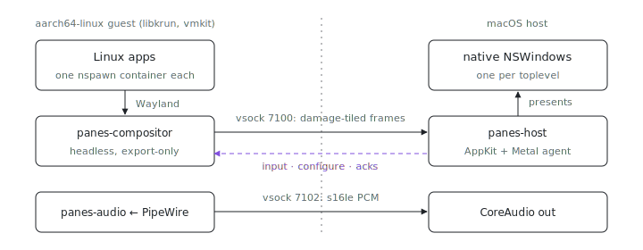

<p align="center"></p>

# panes: seamless guest-Linux windows on macOS

What if Linux GUI apps ran on your Mac as ordinary Mac windows, not one big
"VM screen"? `panes` runs them in a lightweight VM on Apple Silicon and gives
each app its own **native macOS window**, WSLg-style: a headless guest
Wayland compositor exports every toplevel over vsock, and a host agent
presents each one as a real `NSWindow` and forwards input back. Tracking
issue: [index#1686](https://github.com/indexable-inc/index/issues/1686).

## The pieces

- [`protocol/`](protocol/) (`panes-protocol`): the wire format. One duplex
  byte stream (guest vsock port 7100 to a host unix socket) carrying
  length-prefixed postcard frames: damage-tiled window contents up, input and
  configure events down, ack-driven pacing genlocked to the host display. The
  crate doc comments are the protocol spec. Minor 1 (v1.1) adds pointer lock
  for mouse-look apps (index#1724): `ToHost::PointerLock` when a surface's
  `zwp_locked_pointer_v1` (de)activates, `ToGuest::PointerRelative` for the
  raw deltas the host forwards while its cursor is captured; both are gated
  on the peer's Hello minor (postcard tolerates no unknown variants).
- [`compositor/`](compositor/) (`panes-compositor`): guest-side headless
  Wayland compositor. Each `xdg_toplevel` becomes a window on the host; no
  DRM output, no seat, no logind, it composites nothing and only exports.
- [`host/`](host/) (`panes-host`): macOS agent that owns the NSWindows and
  forwards input back; with `--audio-connect` it also plays the guest's PCM
  stream on the default CoreAudio output through a small jitter buffer.
- [`audio/`](audio/) (`panes-audio`): guest daemon pumping the PipeWire mix
  (raw s16le PCM from a `module-protocol-simple` tap) to the host over vsock
  port 7102. Its wire contract is the protocol crate's `audio` module: same
  framing, separate versioning, so the window protocol never changes.
- [`guest-image/`](guest-image/) (`panes-guest-image`): the bootable
  aarch64-linux NixOS raw-efi disk wiring it all up: the compositor as a
  systemd service plus one autostarted systemd-nspawn container per app.

## The guest image

Built like `packages/vm/chrome-vm-image`: systemd-repart assembles the disk in
the nix sandbox (no qemu/kvm needed on the builder), systemd-boot at the EFI
removable path boots a UKI, and libkrun-efi's OVMF firmware boots the disk.

```sh
nix build .#packages.aarch64-linux.panes-guest-image
# The store image is minimized (no free space); copy it out and enlarge it,
# the guest grows the root partition + filesystem into the new space at boot
# (boot.growPartition + autoResize).
cp --sparse=always ./result /tmp/panes-guest.raw && chmod +w /tmp/panes-guest.raw
truncate -s 8G /tmp/panes-guest.raw
# Optional but recommended: a persistent data disk for /var/lib/minecraft
# (~700 MB of MC downloads), so a new image does not mean re-downloading.
# A blank file is enough; the guest formats it on first use (autoFormat) and
# mounts it nofail, so booting without it still works.
truncate -s 10G /tmp/panes-data.raw
nix run .#vmkit -- boot-linux --disk /tmp/panes-guest.raw --disk /tmp/panes-data.raw \
  --gpu --net --memory-mib 6144 --cpus 6 --timeout-secs 0 \
  --vsock-port 7100:/tmp/panes.sock --vsock-port 7102:/tmp/panes-audio.sock
# Then, on the host:
nix run .#panes-host -- --connect /tmp/panes.sock --audio-connect /tmp/panes-audio.sock
```

`--disk` is repeatable: the first is the boot disk (guest `/dev/vda`), each
further one attaches in order (`/dev/vdb`, ...); the image mounts `/dev/vdb`
at `/var/lib/minecraft`. Size the guest for Minecraft: it OOMs under ~4 GiB of
guest RAM and crawls on 2 vCPUs; `--memory-mib 6144 --cpus 6` is the validated
boot line.

## Iterating on the guest

A `nixos.nix`/`apps.nix` tweak does not need a new image + fresh-disk boot
(which wipes anything not on the data disk). The image runs sshd, and gvproxy
(`--net`) forwards host `127.0.0.1:2222` to guest `:22` by default (its
`-ssh-port` flag; the guest holds gvproxy's static DHCP lease,
`192.168.127.2`). The stock image bakes **no authorized key** (a repo-built,
cacheable image must not ship a static root credential), so pass your own
public key at build time through the `sshAuthorizedKey` package arg. One
option is the host's nix-darwin linux-builder keypair
`/etc/nix/builder_ed25519` (shown below; its private half is root-owned,
hence the `sudo`), but any ssh key works.

```sh
# Bake your key into the image you boot (and into each toplevel you push).
# `git+file://`, not `path:`/`toString ./.`: the repo's packages filter
# sources with lib.fileset.gitTracked, which needs the git metadata a plain
# path copy loses. Nix evaluates the COMMITTED tree, so commit each tweak
# before building.
build_with_key() {
  nix build --impure --expr '((builtins.getFlake ("git+file://" + toString ./.))
    .packages.aarch64-linux.panes-guest-image.override {
      sshAuthorizedKey = builtins.readFile /etc/nix/builder_ed25519.pub;
    })'"$1" -o "$2"
}
build_with_key "" result-image   # boot this as above; then, per iteration:
build_with_key .toplevel result-toplevel
# The guest's host key changes with every fresh disk, hence the known-hosts
# opt-outs.
guest_ssh="sudo ssh -i /etc/nix/builder_ed25519 -p 2222 \
  -o StrictHostKeyChecking=no -o UserKnownHostsFile=/dev/null"
sudo env NIX_SSHOPTS="-i /etc/nix/builder_ed25519 -p 2222 \
  -o StrictHostKeyChecking=no -o UserKnownHostsFile=/dev/null" \
  nix copy --no-check-sigs --to ssh://root@localhost "$(readlink result-toplevel)"
$guest_ssh root@localhost "$(readlink result-toplevel)/bin/switch-to-configuration test"
```

Do not hand ssh a manual `--port ...:22` forward instead: vmkit's gvproxy
expose API binds forwards on **all** host interfaces (`"local": ":port"`),
unlike the built-in loopback-only 2222 (which a `--port 2222:22` would also
collide with).

`test` activates the configuration now (services restart, containers pick up
new store paths) without touching the boot entry, which is right here: the
bootloader + UKI are baked into the ESP by repart, so a reboot deliberately
returns to the shipped image (`switch` would only add a warning that no
bootloader is configured). The guest can receive closures because the image
registers its baked closure in the nix db at first boot
(`/nix-path-registration` + `nix-store --load-db`, the make-disk-image
pattern).

GPU: `--gpu` attaches libkrun's virtio-gpu **venus** device (Vulkan on the
Mac's GPU via MoltenVK). The image loads `virtio_gpu`, ships mesa's venus ICD
through `/run/opengl-driver`, and logs `vulkaninfo --summary` to the serial
console at boot (the `panes-venus-smoke` oneshot): with `--gpu` it must show a
`Virtio-GPU Venus` device, lavapipe-only output means the venus path is
broken. Minecraft (Java 26.2+) uses its first-party Vulkan renderer directly
on venus, no zink and no mods; the image pre-seeds its `options.txt` with
`preferredGraphicsBackend:"vulkan"`.
Details: [`vmkit/docs/linux-libkrun.md`](../vmkit/docs/linux-libkrun.md).

> **Gap**: the shipped `pkgs.panes-compositor` builds without the `gpu` cargo
> feature (the unit graph has no feature knob yet), so no linux-dmabuf global
> is advertised and Vulkan/GL clients fall back to shm or software. The venus
> plumbing above (16K kernel, ICD, `/dev/dri` binds) is ready; enabling the
> feature in the guest-image build is the remaining step for accelerated
> window content (index#1686).

## Audio

Sound from guest apps plays on the Mac (index#1686). libkrun has no usable
sound device on macOS (1.19.3's virtio-snd is PipeWire-host-only, absent from
the `efi` feature set, and deleted upstream in 2.0), so audio rides a second
vsock port instead, end to end:

```
app (openal, ALSOFT_DRIVERS=pipewire)
  -> pipewire (system-wide) null sink "panes-sink"     guest mixer
  -> module-protocol-simple tap (raw s16le, tcp:127.0.0.1:7103)
  -> panes-audio (frames PCM, vsock port 7102)
  -> panes-host --audio-connect (jitter buffer ~24 ms -> CoreAudio)
```

Boot with `--vsock-port 7102:/tmp/panes-audio.sock` and point
`panes-host --audio-connect` at that socket (see the boot line above); both
ends reconnect with backoff, and a host without `--audio-connect` (or a guest
without the daemon) just runs silent. Latency budget: ~10.7 ms PipeWire
quantum + 24 ms host jitter-buffer target + ~10 ms CoreAudio output buffer,
under 50 ms end to end; the jitter buffer trades continuity for latency
(underrun plays silence and re-primes, overrun drops the oldest audio) as
game sound wants. On the serial console, `panes-boot-report` prints the
PipeWire node list (`panes-sink` must appear; `PANES-AUDIO-NODES-ABSENT`
means the audio graph is down).

Networking: `--net` runs gvproxy (`192.168.127.0/24`); the image DHCPs its
NIC. App containers share the host network namespace, so e.g. Minecraft can
download its assets on first launch.

## Adding an app

Apps are data, not modules: add an entry to
[`guest-image/apps.nix`](guest-image/apps.nix) with a `command`, optional
`env`, and optional persistent `binds`. The machinery in
[`guest-image/nixos.nix`](guest-image/nixos.nix) renders each entry into an
autostarted nspawn container that bind-mounts the compositor socket
(`/run/panes/wayland-1`) and `/dev/dri`, and exports
`WAYLAND_DISPLAY`/`XDG_RUNTIME_DIR`. One entry, one container, one window.

## Status

All five pieces are implemented and boot end to end: the compositor exports
damage-tiled LZ4 frames and honors pointer lock, the host presents at the
panel rate (measured 120 acks/s on ProMotion) with lockstep acks, and audio
plays through the jitter buffer. Remaining gaps live where the work is:
[`compositor/`](compositor/) lists its v1 protocol gaps (popups and
subsurfaces are not exported, client cursors are not serialized), and the
shipped guest image still builds the compositor without the `gpu` cargo
feature (see the gap note above), so window content is shm-rendered.
