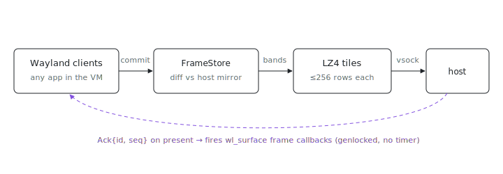

<p align="center"></p>

# panes-compositor

How does a Wayland app inside a VM become a native Mac window? This is the
guest half: a headless Wayland compositor for the aarch64-linux panes guest.
Apps connect to it as a completely ordinary Wayland compositor; every
`xdg_toplevel` they map is exported over one byte stream to
[`panes-host`](../host), which presents each one as a native NSWindow on the
macOS side. It composites nothing and renders nothing: it only diffs, packs,
and ships. The wire contract lives in [`../protocol`](../protocol) (postcard
frames, damage tiles, ack pacing); context in
[index#1686](https://github.com/indexable-inc/index/issues/1686).

## Install

Guest-side only (`aarch64-linux`); it ships inside the
[`panes-guest-image`](../guest-image) as a systemd service, which is how you
normally get it. To build the binary alone from a clone
(`git clone https://github.com/indexable-inc/index`):

```sh
nix build .#packages.aarch64-linux.panes-compositor
```

## Architecture

Built on smithay 0.7 with its calloop event loop. There is no rendering, no
output device, and no scene graph: the single `wl_output` is virtual (its
refresh/scale come from the host's `Hello`), and windows have no positions
because the host owns layout entirely.


- `src/frame.rs`: the pure core. Per window a `FrameStore` keeps the latest
  committed pixels plus a mirror of what the host currently holds.
  `take_frame` diffs the two into full-width bands capped at 256 rows (so a
  later version can parallelize per-tile LZ4), tightens each band to its
  changed rows, and encodes each tile as LZ4, falling back to `Raw` when
  compression saves less than 10%. No Wayland types, unit-tested on any
  platform.
- `src/compositor/`: smithay state and handlers (Linux-only). Commits copy
  the client buffer (shm formats ARGB8888/XRGB8888; both are already BGRA
  bytes in little-endian memory) into the `FrameStore` and release the
  buffer immediately. Title/app_id/min-max changes map to `WindowTitle` /
  `WindowMinMax`; map/unmap/destroy to `WindowNew`/`WindowGone`.
  xdg-decoration is forced to server-side: the NSWindow draws the chrome.
- `src/compositor/transport.rs`: one host connection at a time, accepted on
  AF_VSOCK port 7100 by default (`--listen-unix`/`--listen-tcp` for off-VM
  development). Blocking reader/writer threads bridge into calloop through a
  channel; a generation counter makes stale-connection events inert. On
  disconnect the compositor keeps running and re-announces every window
  (with a full frame) to the next connection.
- `src/compositor/input.rs`: `ToGuest` pointer/key messages drive one seat.
  Coordinates are surface-local, so pointer focus is handed to smithay
  explicitly per event. Keys are evdev codes fed through an xkb keymap
  (`--xkb-layout`, "us" default); the host never forwards OS auto-repeats,
  clients repeat from `wl_keyboard.repeat_info`, whose rate/delay come from
  the host's macOS System Settings (`ToGuest::KeyRepeat`, protocol 1.2;
  macOS factory defaults until a 1.2 host sends it). Pointer lock (index#1724):
  `zwp_pointer_constraints_v1` + `zwp_relative_pointer_manager_v1` are
  advertised; a locked-pointer constraint activates when its surface holds
  pointer focus, the host is told via `ToHost::PointerLock` (gated on its
  Hello minor >= 1), and the `ToGuest::PointerRelative` deltas it then
  forwards feed `pointer.relative_motion`. Lock state is reconciled after
  every input message and every commit, which is where a client destroying
  its lock (GLFW's ungrab) surfaces.

## Pacing (no timer)

The compositor never runs a frame timer. At most one `WindowFrame` per
window is in flight; commits that land meanwhile only update the
`FrameStore`. When the host presents a frame it sends `Ack{id, seq}`
(cumulative: the host coalesces per display tick and acks only the newest
presented seq, so any `seq >= awaited` satisfies the wait), and the
compositor then (1) fires the window's wl_surface frame callbacks, which
is the client's "draw again" signal, and (2) immediately sends the coalesced
delta if more commits arrived. The guest is thereby genlocked to the host's
CAMetalDisplayLink (ProMotion and all) with backpressure for free: a slow
link degrades to fewer, bigger deltas instead of a growing queue.

Three escape hatches keep clients from wedging when no ack can come: a
commit that produces nothing to send fires its callbacks immediately (as do
the commit paths that never reach a pump: popups, cursor surfaces, and the
pre-configure commit), a 10 Hz fallback ticker fires callbacks for all
windows while no host is connected (popup surfaces, which never carry wire
frames, always tick), and a watchdog force-releases pacing after ~1s if an
in-flight frame's ack never arrives (the mirror is invalidated so the next
frame ships full).

## GPU vs shm mode

`wl_shm` is the first-class path and needs nothing but the CPU. GL/Vulkan
clients produce dmabufs instead; with the `gpu` cargo feature the
compositor imports each dmabuf into a GLES texture through a *surfaceless*
EGL context on a DRM render node (`/dev/dri/renderD128`, no DRM master, no
KMS) and reads it back with `ExportMem::copy_texture` as BGRA. The
linux-dmabuf global is only created when that GPU stack actually
initializes, so on a machine without `/dev/dri` (CI, first integration) the
binary runs shm-only and GL clients fall back to shm by themselves. EGL is
dlopen'd at runtime; even a `gpu`-featured build links no GL libraries.

Readback is a GPU->CPU copy per frame. It is the pragmatic v1; a later
version can keep damage on the GPU or hand dmabufs to a guest encoder.

## Running

```
panes-compositor                          # vsock :7100, WAYLAND_DISPLAY=wayland-1
panes-compositor --listen-tcp 127.0.0.1:7100 --socket-name wayland-9
WAYLAND_DISPLAY=wayland-1 foot            # any client, in another shell
```

## Known gaps (v1)

- Subsurface and popup content is not exported: only the toplevel's own
  buffer ships. Popups get their initial configure so menus do not deadlock
  clients, but they are invisible on the host. Exporting popups needs a
  protocol addition (a window kind + parent/offset on `WindowNew`).
- `app_id` changes after the window is announced cannot be forwarded; the
  wire only carries app_id in `WindowNew`.
- `Configure.scale` is accepted but not applied per-window (wl_output scale
  is global); needs wp_fractional_scale or per-surface preferred scale.
- Cursor: `ToHost::Cursor` is always sent with `image: None` (host keeps its
  native cursor); serializing the client cursor surface is a TODO.
- `zwp_confined_pointer` constraints are accepted but never activated: the
  host cannot fence its cursor to an NSWindow, and a fake activation would
  tell the client its pointer is confined when it is not. Only locked
  pointers (all a mouse-look app needs) are honored.
- The whole-buffer memcmp diff is simple and fast enough for v1; client
  damage hints could bound it later.
